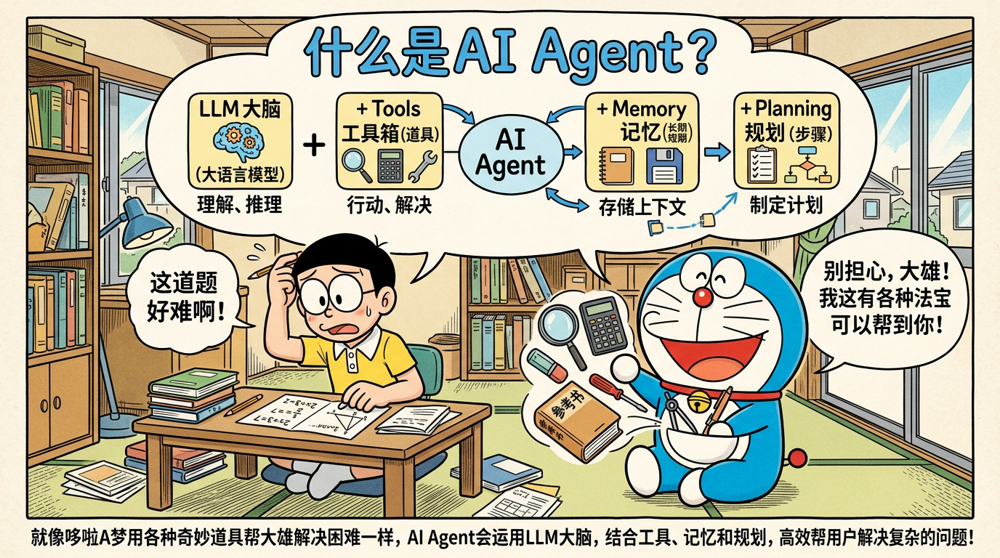

# 01 · AI Agent 基础概念（面试八股文）



> 面向零基础读者的系统梳理：每个知识点均包含「概念 + 原理 + 面试问答 + 追问 + 代码（如适用）」。建议配合动手写一个小 Agent 循环加深理解。

---

## 目录

1. [什么是 AI Agent](#1-什么是-ai-agent)
2. [Agent vs LLM Chain vs ChatBot](#2-agent-vs-llm-chain-vs-chatbot)
3. [Agent 的核心组成](#3-agent-的核心组成)
4. [Agent 的工作流程](#4-agent-的工作流程)
5. [Agent 的分类](#5-agent-的分类)
6. [Agent 的应用场景](#6-agent-的应用场景)
7. [Agent 的挑战与局限](#7-agent-的挑战与局限)
8. [综合面试题库（15+ 题）](#8-综合面试题库15-题)

---

## 1. 什么是 AI Agent

### 1.1 概念解释（通俗易懂，带类比）

**AI Agent（智能体）**可以类比为：**一位能上网、能记笔记、会拆任务的「数字员工」**。  
它不只「接一句话、回一段话」，而是能在多步任务里**自己决定下一步做什么**：先想清楚计划，再查资料、调工具，把中间结果记下来，最后汇总成答案。

业界常用一句概括：

> **Agent ≈ LLM + Planning（规划）+ Memory（记忆）+ Tools（工具）**

- **LLM**：大脑，负责理解、推理、生成自然语言与结构化计划。  
- **Planning**：把模糊目标拆成可执行步骤，并在执行中动态调整。  
- **Memory**：短期上下文 + 长期知识，避免「说完就忘」或重复劳动。  
- **Tools**：手脚，如搜索、数据库、代码执行、API 调用等。

### 1.2 原理详解（技术细节）

1. **与「普通 LLM 单次调用」的区别**  
   - 普通调用：输入 Prompt → 模型输出文本，**没有**与外部环境闭环。  
   - Agent：输出往往是 **「下一步动作」**（例如：调用某工具、更新记忆、结束），环境返回 **Observation（观察结果）**，再进入下一轮推理，形成 **多轮控制循环**。

2. **自主决策能力体现在哪里**  
   - 在**动作空间**中选下一步（选哪个工具、传什么参数、是否结束）。  
   - 在**信息不完整**时决定先澄清还是先假设再验证。  
   - 在**失败**时重试、换策略或请求人工介入（视系统设计而定）。

3. **核心循环（典型 ReAct / Tool-use 范式）**  
   抽象为：**Thought（推理）→ Action（行动）→ Observation（观察）→ … → Final Answer**。  
   实现上常由「编排层（Orchestrator）」驱动：解析模型输出、执行工具、把结果写回上下文，直到满足停止条件。

### 1.3 面试问题（Q）与标准答案（A）

**Q1：一句话说明什么是 AI Agent？**  
**A：** AI Agent 是以大模型为认知核心，结合规划、记忆与工具调用，能在多步交互中根据环境反馈持续决策并完成任务的系统；其本质是 **闭环的感知—思考—行动** 循环，而不仅是单次文本生成。

**Q1 · SoulBuddy 实现：** SoulBuddy 就是一个「本地桌面编码 Agent」：用户提出编码任务 → `SoulAgent.run()` 驱动真 LLM tool-calling 循环 → 模型自主选择 `read_file / write_file / bash / grep` 等工具 → 工具结果回灌进下一轮 → 直到模型不再请求工具或达到 `MAX_TURNS=40`。它把「单次文本生成」升级成了「想—做—看结果—再想」的闭环，是完整的 Agent 而非 ChatBot。

**Q2：为什么说 Agent = LLM + Planning + Memory + Tools？缺一块会怎样？**  
**A：**  
- 缺 **Planning**：容易变成「只会接话」的聊天，长任务易跑偏或一步登天完不成。  
- 缺 **Memory**：长对话会丢线索，多会话无法延续用户偏好与任务状态。  
- 缺 **Tools**：只能「空谈」，无法查实时信息、执行代码、改系统状态。  
- **LLM** 仍是中枢，但单靠 LLM 没有外环则不是完整 Agent。

**Q2 · SoulBuddy 实现：** SoulBuddy 四块齐全，且每一块都有明确代码位置：
- **LLM**：`providers/` 适配层（DeepSeek / Anthropic / OpenAI / offline 四家归一）。
- **Planning**：没有独立 Planner 模块，规划嵌入在**首轮强制推理守卫**里 —— `agent.py::_check_first_turn_reasoning` 要求模型在第一次调工具前，必须先输出任务分类（简单/复杂）+ 计划/委托意图，否则注入引导消息重试（`FIRST_TURN_REASONING_MIN_LEN=20`）。此外还有 `task` 工具委派 sub-agent。
- **Memory**：`memory/` 三层记忆（workspace / user / cloud）+ `context/compact.py` 上下文压缩产生 durable 事实块。
- **Tools**：`tools/` 注册表 15 个内置工具 + `mcp/` 动态接入的外部工具（`mcp__<connector>__<tool>`），全部走同一条受管分发路径。

### 1.4 可能的追问及应对

- **追问：Agent 的「自主」是不是不受控？**  
  **应对：** 强调 **策略与护栏**：工具白名单、参数校验、人在回路（HITL）、预算与步数上限、输出审核；自主是在**约束空间内**的决策。

- **追问：和 AutoGPT 那种有什么区别？**  
  **应对：** AutoGPT 是早期「目标导向 + 工具」的一种产品形态；面试应抽象到 **循环架构与组件**（规划/记忆/工具），避免绑定单一产品名。

**1.4 · SoulBuddy 实现：**
- 「自主是否不受控」：SoulBuddy 的自主被多层护栏约束 —— 独立顶层 `permissions/` 权限包（规则表有 8 条，`hard_deny → 越界 deny → 读 allow → 写 allow（带安全路径守卫）→ bash ask → 默认 deny`）、`MAX_TURNS=40` 硬上限、同一 `(tool, args)` 单 run 内重复 ≥3 次转 DENY、以及可回滚的文件历史快照。
- 「和 AutoGPT 的区别」：SoulBuddy 不绑定某个产品形态，抽象上就是「LLM + 权限门 + 工具注册表 + 事件流 + 记忆」的循环体，不靠正则意图匹配（已明确把旧的 `_plan()` 正则方案替换为真模型循环）。

### 1.5 代码示例：最小「思考—行动—观察」循环（Python 伪代码）

```python
def run_agent(user_goal: str, tools: dict, llm, max_steps: int = 8):
    messages = [{"role": "system", "content": "你是可调用工具的 Agent。"},
                {"role": "user", "content": user_goal}]
    for _ in range(max_steps):
        plan = llm.chat(messages)  # 模型决定：结束 or 调用某工具
        action = parse_tool_call(plan)  # 从模型输出解析结构化动作
        if action.name == "finish":
            return action.args["answer"]
        obs = tools[action.name](**action.args)
        messages.append({"role": "assistant", "content": plan})
        messages.append({"role": "user", "content": f"工具结果：{obs}"})
    return "超过最大步数，未完成。"
```

---

## 2. Agent vs LLM Chain vs ChatBot

### 2.1 概念解释（通俗易懂，带类比）

- **ChatBot（聊天机器人）**：像 **前台接待**——以对话为主，核心是「接话与回复」，通常不强调多步任务闭环与工具编排。  
- **LLM Chain（链）**：像 **流水线工人**——**人（开发者）预先写好步骤顺序**：A 做完接 B，再接 C；路径相对固定。  
- **Agent**：像 **项目经理**——步骤不是完全写死的，模型根据**当前观察**决定下一步，可分支、可重试、可换工具。

### 2.2 原理详解（技术细节）

| 维度 | ChatBot | LLM Chain | Agent |
|------|---------|-----------|-------|
| 控制流 | 多为线性对话 | 开发者定义的 DAG/序列 | 模型驱动的分支与循环 |
| 工具 | 可有可无 | 可嵌入固定节点 | 动态选择与多轮调用 |
| 状态 | 主要会话上下文 | 链各节点显式传递 | 记忆 + 环境观察 |
| 适用 | 问答、闲聊、简单引导 | ETL 式固定流程 | 开放问题、研究、自动化任务 |

**本质区别一句话：**  
- **Chain**：控制流在**代码里**。  
- **Agent**：控制流在**模型决策 + 环境反馈**里（仍可由代码设边界）。

### 2.3 面试问题（Q）与标准答案（A）

**Q3：Agent 和 Prompt Chain 有什么本质区别？**  
**A：** Prompt Chain 的拓扑与顺序主要由工程侧固定；Agent 在运行时在**动作空间**中做选择，并依赖 **Observation** 更新信念，适合输入与路径不确定的任务。二者可结合：链负责稳定流程，Agent 负责链内某段的灵活分支。

**Q3 · SoulBuddy 实现：** SoulBuddy 是 **Agent 而非 Chain**：主循环 `for turn in range(1, MAX_TURNS+1)` 里，每轮都要重新「组装 system prompt → 调 provider → 看模型是否 `wants_tools`」，走哪条分支完全由模型决策。但它在局部用了「链」的确定性编排：上下文压缩是固定 `L1 截断 → L2 去重 → L3/L4 摘要` 的分层管线；RAG 索引是 `解析 → 分块 → 向量化 → 入库` 的固定流水线。这正是「链负责稳定流程，Agent 负责灵活分支」的混合形态。

**Q4：ChatBot 加上插件是不是就变成 Agent 了？**  
**A：** 不一定。若插件调用由**固定规则**触发（例如关键词路由），更像「带工具的 Bot」。若由模型在多步推理中**自主选择工具与参数**，并形成闭环迭代，则更贴近 Agent。关键在**是否具备多步自主决策与反馈闭环**。

**Q4 · SoulBuddy 实现：** 属于后者。工具调用完全由模型在多步推理里决定，没有任何关键词路由；`ToolRegistry.specs()` 每轮现查，MCP 工具连上后「某一轮突然出现」模型就能用。SoulBuddy 的前身 `learn-workbuddy` 恰是「正则意图匹配的 Bot」，本项目明确用真 LLM tool-calling loop 替换掉了它，正是这个区别的落地体现。

### 2.4 可能的追问及应对

- **追问：RAG + Chat 算不算 Agent？**  
  **应对：** 单次检索再回答，偏「增强型 Chat」。若有多轮检索策略（查不到换查询、分解子问题、交叉验证），则具备 Agent 特征。名称不重要，**讲清架构**即可。

**2.4 · SoulBuddy 实现：** SoulBuddy 的资料库问答是 **agentic 检索**而非全量注入 —— `search_knowledge` 是一个普通工具，由模型自己判断何时查（且只对「绑定了专家 + 绑定了资料库 + 检索链路可用」的会话暴露）。检索本身是 dense 向量 + BM25 稀疏 → RRF 融合的混合检索，并回传「文档名 > 章节 > 分数」出处三元组供模型引用。也就是说它已越过「单次检索再回答」的边界，具备 Agent 特征。

### 2.5 架构差异图（文字描述）

```
[用户]
  │
  ▼
┌──────────────────────────────────────┐
│ ChatBot：对话管理 +（可选）知识检索   │
│ 输出：自然语言回复                    │
└──────────────────────────────────────┘

[用户]
  │
  ▼
┌─── 步骤1 ───►┌─── 步骤2 ───►┌─── 步骤3 ───► 输出
│  LLM/解析    │  LLM/转换    │  工具/API    │
└─────────────┴─────────────┴──────────────┘
        LLM Chain（控制流在代码中编排）

[用户]
  │
  ▼
┌──────────────────────────────────────┐
│ Agent 编排器                          │
│  loop: LLM 规划 → 选工具 → 环境反馈    │
│        → 写入记忆 → 直到终止条件       │
└──────────────────────────────────────┘
  │                    ▲
  ▼                    │
[工具/API/数据库/浏览器/代码执行环境]
```

---

## 3. Agent 的核心组成

### 3.1 概念解释（各部分做什么）

1. **感知（Perception）**  
   把多模态输入（文本、文件、接口返回、页面结构等）转成模型可用的表示，并抽取**任务相关状态**。

2. **规划（Planning）**  
   把目标拆成子目标与步骤；可以是 **一次性计划** 或 **每步重规划（re-plan）**。

3. **记忆（Memory）**  
   - **短期**：当前会话上下文、工具轨迹。  
   - **长期**：用户画像、文档知识、向量库、图数据库等。

4. **工具（Tools）**  
   对外部世界可执行的操作抽象：需有清晰 **schema**（名称、描述、参数 JSON Schema）。

5. **执行（Action）**  
   真正调用工具或触发环境变化，并处理超时、重试、幂等等工程问题。

6. **反思（Reflection）**  
   对失败或质量不佳的结果进行**自省**：纠错、换策略、生成检查清单（常与「自我批评 / 验证器」配合）。

### 3.2 原理详解（技术细节）

- **感知**常与 **结构化抽取**、**OCR**、**HTML 解析**、**日志解析** 结合；关键是减少噪声进上下文。  
- **规划**常见实现：**CoT / ReAct**、**Planner-Executor 双模块**、**树搜索（LATS）**、**任务图**。  
- **记忆**工程要点：**摘要压缩**、**引用溯源**、**记忆冲突解决**、**权限与隐私**。  
- **工具**要点：**最小权限**、**参数校验**、**错误信息回灌模型**。  
- **反思**可做成独立子调用：「列出本次推理的三处风险并修正」。

### 3.3 面试问题（Q）与标准答案（A）

**Q5：Agent 的记忆一般怎么设计？**  
**A：** 分层设计最常见：**工作记忆**（当前轨迹与关键结论）+ **会话记忆**（摘要滚动）+ **长期记忆**（向量检索/结构化库）。写入要区分「事实」与「推断」，并带时间戳与来源，便于更新与撤销。

**Q5 · SoulBuddy 实现：** SoulBuddy 是「分层 + 分维度」的记忆：
- **工作记忆**：`messages` 列表（对话轨迹），由 `context/compact.py` 做分层压缩。
- **会话摘要**：`CompactController` 的 L4 层用当前 provider 生成摘要 + **durable 事实块**（`durable_block` 物理隔离在控制器上，注册为 priority 95 的 system prompt 段，L1–L4 永远碰不到，保证「有损摘要」不伤「无损事实」）。
- **长期记忆**：`memory/` 三层 —— `workspace`（项目事实日志）、`user`（用户偏好/身份块）、`cloud`（远端 profile recall）。冲突优先级为 `user > workspace > cloud`，被覆盖的条目记 `memory_conflict_resolved` 审计。
- **写入途径**：通过 `save_user_preference` / `write_workspace_fact` 两个工具，只写 `~/.soul_buddy` 下的本地 DB，不碰工作区，且每次写入都带会话溯源审计。

**Q6：规划和执行要不要拆开两个模型？**  
**A：** 视任务而定。**Planner-Executor** 拆分可提升可控性（强模型规划、快模型执行）；单模型端到端更简单但易在长链路漂移。可混合：规划用强模型，执行层做确定性校验。

**Q6 · SoulBuddy 实现：** **不拆分模型**，单模型端到端。但用两道机制替代了「拆模型」想达到的可控性：
1. **首轮推理守卫**（强制先规划再动手，等价于「规划段」）；
2. **P6 runtime rubric 验收阶段**：模型说「我做完了」时，harness 用客观信号（事件流里有没有成功的 write、有没有残留 `is_error`）+ LLM judge 打分，不达标就把证据塞回去让它重修（`RUBRIC_MAX_RETRIES=1`）。这是「执行层做确定性校验」的落地。

### 3.4 可能的追问及应对

- **追问：反思是不是必须？**  
  **应对：** 不是必须，但对**高 stakes 或易错工具**场景收益大；成本是额外延迟与 Token。

**3.4 · SoulBuddy 实现：** SoulBuddy 把「反思」做成了**可选闭环**（默认 `RUBRIC_MODE=off`，逐字节向后兼容；可切 `advisory` 只评分不重修，或 `enforce` 才真正重修）。另外「错误后换策略」也是 rubric 的质量维度 Q3（`is_error` 后 2 轮内是否换了策略而非原样重试）。所以反思在此不是硬性必须，而是按需开启、且成本受硬上限约束的能力。

### 3.5 代码示例：工具 Schema（OpenAI 风格示意）

```python
tools = [
  {
    "type": "function",
    "function": {
      "name": "search_kb",
      "description": "在公司知识库中按关键词搜索",
      "parameters": {
        "type": "object",
        "properties": {
          "query": {"type": "string"},
          "top_k": {"type": "integer", "default": 5}
        },
        "required": ["query"]
      }
    }
  }
]
```

---

## 4. Agent 的工作流程

### 4.1 概念解释

可理解为：**听懂 → 拆活 → 动手 → 对账 → 交卷**。

### 4.2 原理详解（逐步）

1. **输入处理**  
   意图识别、指代消解、安全过滤、加载相关记忆与文档。

2. **任务分解**  
   生成子任务列表或决策树；复杂任务可配合 **Human-in-the-loop** 确认里程碑。

3. **工具选择与调用**  
   由模型或路由模块选择工具；执行器做鉴权、限流与结果规范化。

4. **结果整合**  
   合并多源信息，解决冲突（例如时间更新的数据优先）。

5. **输出生成**  
   面向用户的自然语言答案 + 可选 **引用与操作轨迹**（便于审计）。

### 4.3 面试问题（Q）与标准答案（A）

**Q7：如何避免 Agent 在工具调用间「迷失」？**  
**A：**  
- 明确 **停止条件** 与 **最大步数**；  
- 维护 **任务清单（todo）** 与 **当前子目标**；  
- 对每步输出要求 **结构化**（JSON）；  
- 关键步骤 **强制验证**（单元测试式检查、二次 LLM 审核）。

**Q7 · SoulBuddy 实现：**
- **停止条件/最大步数**：`MAX_TURNS=40`，第 32 轮（80%）发 `turn_budget_warning`；达到上限保留副作用、不自动回滚，返回 `RunResult(truncated=True, reason="max_turns")`。
- **循环保护**：同一 `(tool_name, args_hash)` 在单 run 内 ≥3 次（`REPEAT_CALL_LIMIT`）转 DENY，作为错误信息回灌给模型。
- **结构化**：工具调用走各厂商原生 tool-calling（`ToolCall`），不是解析自由文本；每步都落 `FUNCTION_CALL` / `FUNCTION_CALL_RESULT` 事件。
- **强制验证**：首轮强制推理守卫 + P6 rubric 验收（G1/G2/G3 硬门槛，其中 G3 就是「无未处理残留错误」—— 收尾前最后的工具结果必须不带 `is_error`）。
- **上下文不爆**：每轮前 `compact_if_needed`（L1–L4 分层压缩）+ `check_hard_limit` 硬上限预检，明知超窗的请求不发出去。

### 4.4 可能的追问及应对

- **追问：结果冲突怎么整合？**  
  **应对：** 优先级规则（权威源 > 时间新 > 多源一致）、让模型显式输出「冲突说明」、必要时触发人工。

**4.4 · SoulBuddy 实现：** 记忆层有明确的冲突优先级 `user > workspace > cloud`，被覆盖的条目记 `memory_conflict_resolved` 审计（不静默丢弃）。另外在一致性上，`file_history.py` 用「改前快照 → 改后快照」记录每次写入，回滚指针可追溯；而 `compact.py` 的 `_supersede_old_reads` 会把同一文件被后一次读取取代的旧 `tool_result` 内容改成 `[superseded by a later read of the same file]`，避免模型读到过期版本 —— 这都是「冲突/陈旧信息」的工程化处理。

### 4.5 代码示例：简单「任务清单」状态

```python
state = {
  "goal": "生成上季度销售报告",
  "todos": [
    {"id": 1, "task": "拉取销售数据", "done": False},
    {"id": 2, "task": "计算同比", "done": False},
    {"id": 3, "task": "写成摘要", "done": False},
  ],
  "notes": []
}
```

---

## 5. Agent 的分类

### 5.1 概念解释（经典 AI 教材视角）

分类来自智能体理论，可与 LLM Agent 对照理解：

| 类型 | 通俗理解 |
|------|----------|
| **反应式（Reactive）** | 类似反射：输入→动作，几乎不维护复杂内部模型。 |
| **基于模型（Model-based）** | 脑中有「世界模型」，能预测行动后果。 |
| **基于目标（Goal-based）** | 明确要达成什么状态，能选路径。 |
| **基于效用（Utility-based）** | 多目标权衡，选**期望效用最大**的行动。 |
| **学习型（Learning）** | 从反馈中更新策略或模型。 |

### 5.2 原理详解（与 LLM Agent 的映射）

- **反应式**：适合低延迟、规则清晰；LLM 只做轻量分类/路由。  
- **基于模型**：显式维护状态机、仿真环境或知识图谱。  
- **目标 / 效用**：用 **奖励函数、约束优化、多指标打分** 指导规划。  
- **学习型**：**RLHF、在线反馈、Bandit** 选工具；注意样本效率与安全。

### 5.3 面试问题（Q）与标准答案（A）

**Q8：基于效用的 Agent 和基于目标的有什么区别？**  
**A：** 目标型关注「是否达成」；效用型在**多个冲突目标**间做权衡（成本、时延、风险、用户偏好），选综合最优而非单点达成。

**Q8 · SoulBuddy 实现：** SoulBuddy 介于两者之间。它是**目标型**为主（任务是否完成、文件是否落地），但在 **rubric 聚合层**引入了效用思想：6 个质量维度（Q1 工具使用质量 / Q2 效率 / Q3 自纠错 / Q4 交付规范 / Q5 代码质量 / Q6 沟通表达）各有权重，且 `not_applicable` 的维度会**重新归一化权重**（纯问答任务不会因为「没有代码质量可评」而白扣 20 分），最终 `total = 100 × Σ(wᵢsᵢ)/Σ(3wᵢ)` 与阈值比较。这是「多目标加权权衡」而非单点达成判定。

**Q9：反应式 Agent 有什么优缺点？**  
**A：** 优点：快、可解释、易测试。缺点：对长程依赖与复杂推理弱；遇到未见输入可能失效。常与分层架构结合。

**Q9 · SoulBuddy 实现：** SoulBuddy 的**权限层**是典型的反应式/规则式组件：`permissions/policy.py` 是一张**顺序敏感**的规则表，输入 `PermissionRequest` 直接给出 ALLOW/ASK/DENY，快、可解释、可单测（`tests/test_permissions.py` / `test_bash_scan.py`）。但它不承载推理，长程任务仍由上层 LLM 循环负责 —— 正好是「反应式模块 + 分层架构」的组合。

### 5.4 可能的追问及应对

- **追问：LLM Agent 一般算哪一类？**  
  **应对：** 常是**混合型**：底层是模型推理，上层可接目标/效用（打分选路径）+ 记忆（世界状态）+ 学习（反馈更新）。

**5.4 · SoulBuddy 实现：** 典型混合型 —— 底层 LLM 推理 + 记忆（三层记忆 + durable 事实）+ 效用（rubric 加权打分）。「学习」这块 SoulBuddy **不涉及在线学习**（不更新权重），只做了离线聚合（`script/rubric_report.py` 汇总落盘报告得到任务完成率等指标），供人工调阈值使用。

---

## 6. Agent 的应用场景

### 6.1 概念解释

结合「高频、可工具化、可评估」的场景优先落地。

### 6.2 原理详解（场景与要点）

1. **智能客服**  
   工单查询、订单状态、退换货政策；需 **知识库对齐**、**身份鉴权**、**升级人工** 策略。

2. **代码助手**  
   读仓库、跑测试、提 PR；需 **沙箱**、**diff 审查**、**最小权限**。

3. **数据分析**  
   NL2SQL、制图、解读；需 **数据治理**、**行级权限**、**结果校验**。

4. **自动化运维**  
   查日志、重启服务、开单；需 **审批流**、**灰度**、**回滚**。

5. **知识管理**  
   摘要、标签、关联检索；需 **溯源**、**版本**、**权限**。

### 6.3 面试问题（Q）与标准答案（A）

**Q10：企业内部落地 Agent，你最先关心哪三个非功能需求？**  
**A：** **安全与合规**（权限、审计）、**可控性**（人在回路、工具白名单）、**可观测性**（轨迹、指标、回放）。

**Q10 · SoulBuddy 实现：** 三块都有实体：
- **安全与合规**：`permissions/` 顶层权限包（唯一信任边界，所有新执行路径如 MCP/skill 必须先过此门）+ `audit.py` 防篡改哈希链审计 + `normalize.py` 的 NFKC/小写/分隔符归一分段扫描（防绕过）。
- **可控性**：`PermissionGate`（ASK 挂起 + 300s 超时转 DENY）、`deny_rest`（一次拒绝后续全拒）、目录级记忆放行（仅 write/edit，30 天过期，bash 与 hard_deny 永不记忆）。
- **可观测性**：JSONL transcript 为唯一真相源 + SSE 事件流（`context_usage` / `function_call` / `permission_*` / `rubric_*`）+ LangSmith trace + `final_prompt` 事件落盘（记录每轮真实发给 LLM 的拼接提示）。

### 6.4 可能的追问及应对

- **追问：客服场景如何降低幻觉？**  
  **应对：** 强 RAG 溯源、禁止无引用断言、模板化答复、未知则转人工。

**6.4 · SoulBuddy 实现：** SoulBuddy 的「专家 + 资料库」正是这一套：system prompt 注入专家段与资料库使用说明 → `search_knowledge` 返回带「文档名 > 章节 > 相关度」出处的片段 → 提示词要求模型回答时引用出处；空结果时工具明确回「资料库中没有找到相关内容」，提示词要求模型声明「这不在你的资料库范围内」，避免假装读过。

---

## 7. Agent 的挑战与局限

### 7.1 概念解释

Agent 把能力做强的同时，把 **错误放大** 到多步；工程上要「限步、限权、可观测、可回滚」。

### 7.2 原理详解

1. **幻觉**  
   模型编造事实或工具参数；对策：**检索 grounding**、**约束解码**、**验证器**。

2. **安全性**  
   Prompt 注入、工具滥用、数据外泄；对策：**分层信任域**、**输出过滤**、**秘密不入模型上下文**。

3. **成本控制**  
   长链路 × 大上下文；对策：**摘要**、**小模型路由**、**缓存**、**批处理工具**。

4. **可解释性**  
   提供 **轨迹**、**引用**、**决策日志**；关键操作 **可回放**。

5. **评估困难**  
   单轮 BLEU 不适用；需 **过程指标**（工具是否正确）、**结果指标**（任务是否完成）、**人工抽检**。

### 7.3 面试问题（Q）与标准答案（A）

**Q11：怎么评估一个 Agent 的好坏？**  
**A：** 分层评估：**任务成功率**、**平均步数/成本**、**工具错误率**、**用户满意度**、**安全事件数**；基准可包括静态数据集 + 仿真环境 + 线上 A/B。

**Q11 · SoulBuddy 实现：** `rubric/` 包给出了分层评估的实际落地：Gating（G1 安全性未破防 / G2 任务实际完成 / G3 无未处理残留错误，纯规则、零 token）+ Quality（Q1–Q4 规则、Q5/Q6 LLM judge）。离线用 `script/rubric_report.py` 把落盘报告聚合成指标（任务完成率 = G2 通过率、工具参数正确率 = `1 - is_error 率`、工具选择正确率 = `Q1 ≥ 2` 占比、注入防护 = G1 违反次数**必须为 0**）。测试侧还有 `tests/` 下 25 个测试文件、162 个用例，且 rubric 用 `offline` provider 脚本化（零 token、确定性）。

**Q12：Agent 的最大风险是什么？**  
**A：** **复合错误与权限滥用**——单步小错在多步放大，或工具被诱导执行高危操作；因此必须 **最小权限 + 强审计 + 人在回路**。

**Q12 · SoulBuddy 实现：** 复合错误方面，用「每步工具结果转 `ToolResult`、异常永不穿透崩 loop（BR-19）」「同调用重复 ≥3 次熔断」「rubric G3 残留错误检查」来抑制放大；权限滥用方面，用「顶层 permissions 包 + hard_deny 永不 ASK + bash 内路径二次扫描 + MCP 双层权限（trust ≠ grant，无通配符）」来约束。**风险点是明确设计过的**：`docs/security-audit-2026-09-13.md` 就是一次针对性的安全审计。

### 7.4 可能的追问及应对

- **追问：如何防止 Prompt 注入？**  
  **应对：** 工具层鉴权与用户身份绑定、结构化分隔用户内容与指令、敏感操作二次确认、输出侧 DLP。

**7.4 · SoulBuddy 实现：** SoulBuddy 有多层防御：
- **指令/数据分离**：MCP 返回内容、文件内容都作为 tool_result（数据），不是 system 指令；
- **权限约束**：`hard_deny` 正则（危险命令）永不 ASK；bash 命令内的越界路径直接 DENY；含变量/子壳/通配的命令无法静态判定时转 ASK 且禁止记忆放行；
- **路径守卫**：`WorkspaceScope.safe_path` 做 `Path.resolve()` + `is_relative_to(workspace_root)`，越界一律 DENY；
- **技能只能收窄权限**（D1 不变式）：`authorize_skill_tool` 第一个判断就是 `harness_allows`，人工授权也跳不过。SoulBuddy 未单独实现输出侧 DLP/PII 过滤（这块不涉及）。

---

## 8. 综合面试题库（15+ 题）

下列题目覆盖定义、对比、架构、工程与治理；每题含 **标准答案** 与 **追问提示**。

---

### Q13：请用你自己的话定义 LLM Agent，并说明与单次调用的差异。

**A：** LLM Agent 是以大语言模型为推理核心，在 **多轮** 中与外部环境交互，通过 **规划、记忆与工具** 完成复杂任务的系统。与单次调用的差异在于：单次调用是 **开环生成**；Agent 是 **闭环决策**，每步可依据工具返回更新状态，直到终止条件。

**追问：** 若没有外部工具，还能叫 Agent 吗？  
**应对：** 可称为「弱环境」Agent，仅有对话记忆与推理；但仍可有 **内环多步 CoT** 与 **自我验证」。面试中强调 **是否存在「行动—观察」循环** 更清晰。

**Q13 · SoulBuddy 实现：** SoulBuddy 是**有强环境**的 Agent：`SoulAgent.run()` 里每轮调 provider 拿到 `ModelTurn`，若有 `tool_calls` 就执行并把结果作为 tool_result 追加进 `messages`，下一轮再请求模型 —— 这就是显式的「行动 → 观察」循环。与单次调用的差异体现得很直接：单次调用只有一次 provider 往返，SoulBuddy 一次 run 最多可往返 `MAX_TURNS=40` 轮，且每轮都会重新做上下文压缩、用量估算、快照等。

---

### Q14：ReAct 框架里三个字母代表什么？解决什么问题？

**A：** **Reasoning + Acting**：在生成中交替进行 **推理（Thought）** 与 **行动（Action）**，并接收 **观察（Observation）**。它解决的是：模型仅「空想」容易偏离事实；通过 **显式推理 + 工具反馈** 把推理锚定在真实环境上。

---

### Q15：你会如何设计 Agent 的停止条件？

**A：** 组合使用：**模型声明 finish**、**任务清单全部完成**、**达到步数/预算上限**、**超时**、**连续无进展检测**、**外部成功信号**（如测试通过）。生产环境必须有 **硬上限** 防止死循环。

---

### Q16：工具描述（tool description）为什么非常重要？

**A：** 模型靠描述做 **工具选择**；描述不清会导致 **选错工具、参数幻觉**。好的描述包含：**何时用、何时不用、参数含义、错误示例、返回格式**。

---

### Q17：Memory 用向量库就够了吗？

**A：** 不够。**向量检索擅长相似度**，但弱于精确约束与关系推理。工程上常见 **向量 + 关键词/结构化库 + 图谱（按需）**，并维护 **元数据与权限**。

---

### Q18：多 Agent 协作和单 Agent 多工具怎么选？

**A：**  
- **单 Agent 多工具**：实现简单、延迟低，适合任务边界清晰。  
- **多 Agent**：角色分工、并行探索、对抗审查（如「批评者 Agent」）；但带来 **协调成本与一致性** 问题。  
选型看 **任务分解结构、组织边界、延迟与成本**。

---

### Q19：如何做「人在回路」又不打断体验？

**A：** **分级**：低风险自动执行；中风险 **异步审批**；高风险 **实时确认**。产品上 **预授权**（例如仅本次会话可读某目录）、**可撤销**、**默认最小权限**。

---

### Q20：Agent 日志应记录什么？

**A：** 用户输入（脱敏）、模型原始输出、解析后的工具调用、工具返回摘要、耗时与 Token、版本号（模型与 Prompt）、**追踪 ID**，便于复盘与合规审计。

---

### Q21：为什么「让模型自己选工具」可能不如「路由器 + 规则」？

**A：** 在 **域窄、路径稳定** 的场景，路由器更 **省成本、可测试、行为确定**；全模型路由在 **开放域** 更灵活。最佳实践常是 **混合**：易分类走规则，难例走模型。

---

### Q22：简述 Planner-Executor 架构及优缺点。

**A：** **Planner** 产出步骤或 DAG；**Executor** 逐步执行并可把结果反馈给 Planner **重规划**。优点：结构清晰、易加校验；缺点：规划一次可能不准，需 **迭代重规划**；两阶段可能增加延迟。

---

### Q23：Agent 如何做版本管理与灰度？

**A：** Prompt/工具/schema **版本化**；**影子模式**（只记录建议不执行）；**金丝雀** 用户群；关键指标对比（成功率、成本、违规数）；一键回滚。

---

### Q24：举一个「不是 Agent 但常被误认为 Agent」的例子。

**A：** **固定三步的 RAG 流水线**（query 改写 → 检索 → 生成），若无 **基于观察的再决策循环**，更像 Chain；若加入 **多轮检索策略与失败分支** 则接近 Agent。

---

### Q25：你如何向非技术经理解释 Agent 的风险？

**A：** 用 **「能办事的实习生」** 类比：能力强但可能 **记错、被误导、误操作**；所以我们要 **权限卡、审批、监控录像（日志）**，重要操作 **双人复核**——对应最小权限、人在回路、审计。

---

### Q26：上下文窗口越来越大，还需要外部记忆吗？

**A：** 需要。**长窗口 ≠ 低成本**，也不等于 **可检索、可治理、可遗忘**。外部记忆解决 **跨会话持久化、结构化权限、版本与溯源**；窗口内更适合 **热工作集**。

---

### Q27：如何测试 Agent？

**A：** **单元测工具**、**模拟环境**、**回归集**（固定任务与期望轨迹范围）、**对抗用例**（注入、越权）、**线上金丝雀**；避免只测最终答案而忽略 **过程正确性**。

---

### 8.x · SoulBuddy 实现（专题题库 Q14–Q27）

**Q14（ReAct）：** SoulBuddy 不设独立 ReAct 模块，用**原生 tool-calling** 实现等价闭环 —— 推理走 `reasoning`/`text`（emit `REASONING`、`MESSAGE`），行动是原生 `tool_calls`，观察是 `FUNCTION_CALL_RESULT`。相比「固定前缀文本 + 正则解析」的经典 ReAct，它不做文本解析，因而不受格式漂移影响。

**Q15（停止条件）：** SoulBuddy 组合了多种停止条件：模型不再 `wants_tools`（正常收尾）、`MAX_TURNS=40` 硬上限、上下文硬上限（`context_limit_exceeded` 受控终止）、单 run 内同一 `(tool, args)` 重复 ≥3 次熔断。达轮次上限时**保留已产生的副作用、不自动回滚**（可手动 `rollback_session`）。

**Q16（工具描述）：** SoulBuddy 的 `ToolSpec` 每个都带 `name/description/parameters(JSON Schema)`，经 provider 适配层归一后送模型；MCP 工具的 spec 直接取自远端 `inputSchema`。还有关键一环：`search_knowledge` **只对绑定了资料库的会话出现在 `tools_specs` 里**，未绑定的会话根本看不到该工具（handler 校验只是兜底）—— 用「可见性」而非仅靠描述来减少误选。

**Q17（Memory 用向量库够吗）：** SoulBuddy 不是「纯向量库」路线。长期记忆是三层结构化存储（`workspace` 事实日志 / `user` 偏好身份块 / `cloud` profile），冲突按 `user > workspace > cloud` 解决；会话内不靠向量，而是「messages + 分层压缩 + durable 事实块」。向量检索只用在**资料库 RAG** 上，且是 dense + BM25 混合 + RRF 融合，不是单纯向量。

**Q18（多 Agent vs 单 Agent 多工具）：** SoulBuddy 是**单 Agent 多工具为主 + 受控子代理**。主 Agent 通过 `task` 工具把「需要 3–4 次以上工具调用的探索类子任务」委托给 sub-agent（如 `explore`）；sub-agent 在**隔离上下文**里跑（独立 messages、独立收窄的 ToolRegistry、不发布 SSE、不写 transcript、ASK 降级为 DENY），只把结构化 JSON 摘要回给主 Agent。这是「单 Agent 主导、子代理分担」而非对等多 Agent 组织。

**Q19（人在回路不打断体验）：** SoulBuddy 用**分级 + 超时兜底**：读/写（工作区内）/present/rollback/memory 类自动放行；bash 与 MCP 走 ASK，且 `PermissionGate` 支持「本次允许 / 始终允许（目录级记忆，30 天过期可撤销）/ 拒绝 / 拒绝本次 run 后续（`deny_rest`）」；ASK 超时 300s 自动转 DENY 且**绝不事后补执行**。MCP 调用是「永不记忆」的逐次批准。

**Q20（日志记什么）：** SoulBuddy 的 JSONL transcript 记录了：用户输入、模型原始输出（`raw_assistant`）、`reasoning`、逐条 `function_call` / `function_call_result`、每轮 `context_usage`（含分段 token）、`final_prompt`（真实拼接提示）、`request_id` 贯穿单次请求；另有 `audit.py` 的防篡改哈希链审计和 `~/.soul_buddy/logs/sidecar.log` 结构化日志。

**Q21（模型选工具 vs 路由器+规则）：** SoulBuddy 的观点是**混合**：绝大多数情况由模型在完整 tool list 里自主选（开放域、灵活）；但**权限判定完全走确定性规则表**（`permissions/policy.py`），不经模型；技能 `read_when` 是子串触发的静态规则自动加载。也就是说「安全性/高风险动作」用规则，「任务分解/工具选择」用模型。

**Q22（Planner-Executor）：** SoulBuddy 不显式拆 Planner/Executor，但等价机制是：**首轮强制推理守卫**扮演 Planner（要求先输出任务分类 + 计划/委托判断，不达标则注入引导重试），**主循环 + rubric 验收**扮演 Executor+校验。区别在于没有独立的 DAG 计划产出，而是「短规划 + 逐步执行 + 收尾验收」。

**Q23（版本管理与灰度）：** SoulBuddy 里**可版本化的东西是 Prompt 与配置**：系统提示词存 `prompts/SYSTEM_PROMPT.md`，用户可在 `~/.soul_buddy/system_prompt.md` 覆盖；`RUBRIC_MODE` 天然提供了三级灰度 —— `off`（默认，逐字节向后兼容）→ `advisory`（只评分落盘发事件、**不重修**，用于先收集真实分布校准阈值）→ `enforce`（不达标才重修）。模型/工具 schema 的多版本灰度与影子流量 SoulBuddy **不涉及**。

**Q24（不是 Agent 却像 Agent）：** SoulBuddy 资料库的**索引管线**就是这样的例子：`解析 → 分块 → embedding → 写入 Milvus`（`pending → parsing → chunking → embedding → indexing → ready`）是一条固定的异步流水线，没有「基于观察再决策」的循环，属于 Chain。而**查询侧**的 `search_knowledge` 由模型自主决定何时调用，才具备 Agent 特征 —— 同一个系统里「链」和「Agent」并存。

**Q25（向非技术经理解释风险）：** 可以直接用 SoulBuddy 的真实护栏类比：Agent 像「在你项目目录里干活的实习生」，我们给了它三样东西 —— **权限卡**（`permissions` 规则表，危险命令直接拒、越界路径直接拒）、**监控录像**（JSONL transcript + 防篡改审计链 + LangSmith trace）、**一键还原**（每次写文件前自动快照，`rollback_file` / `rollback_session`）。

**Q26（长窗口还要外部记忆吗）：** SoulBuddy 的答案是「要」，而且做得很具体：即便有压缩，`compact.py` 仍把**关键事实抽成 durable 块**单独存在 system prompt 段里（物理隔离、不被 L1–L4 触碰），会话内数据有明确的**分域**（workspace / user / cloud）与**冲突优先级**，并支持「撤销记忆」。长窗口解决不了「跨会话、可治理、可遗忘」这三件事。

**Q27（如何测试 Agent）：** SoulBuddy 分三层：
- **单元**：`tests/test_permissions.py` / `test_bash_scan.py`（权限规则表、路径扫描）、`test_audit.py`（哈希链）等；
- **集成/回归**：`tests/test_agent_loop.py`、`test_context.py`、`test_providers.py`、`test_rubric.py`（53 条，全部用 `offline` 脚本化 provider，**零 token、确定性**）；
- **过程正确性**：不只看最终答案 —— 断言「压缩后 `tool_use`/`tool_result` 仍成对（INV-5）」「`RUBRIC_MODE=off` 时事件序列逐字节不变（INV-21）」等；
- **端到端自检**：`script/rubric_smoke.py` 跑 5 个场景的真实 `SoulAgent.run()`，退出码可直接当发布门禁。全量约 162 个用例 / 25 个测试文件。对抗用例（注入、越权）目前以权限相关的沙箱拦截用例形式存在，专门的注入用例集**不涉及**。

---

## 附：知识点速查表

| 主题 | 一句话 |
|------|--------|
| 定义 | LLM + 规划 + 记忆 + 工具，闭环决策 |
| vs Chain | 控制流在代码 vs 在模型+环境反馈 |
| vs ChatBot | 对话为主 vs 任务闭环与工具编排 |
| 组成 | 感知、规划、记忆、工具、执行、反思 |
| 流程 | 输入→分解→调用→整合→输出 |
| 分类 | 反应式、模型、目标、效用、学习 |
| 场景 | 客服、代码、数据、运维、知识管理 |
| 挑战 | 幻觉、安全、成本、可解释、评估 |

---

**学习建议：** 读完本文后，尝试用 200 行内实现一个「带假工具」的循环 Agent，并刻意制造 **工具失败** 与 **注入攻击** 用例，观察系统行为，再对照本文的治理手段逐项加约束。
