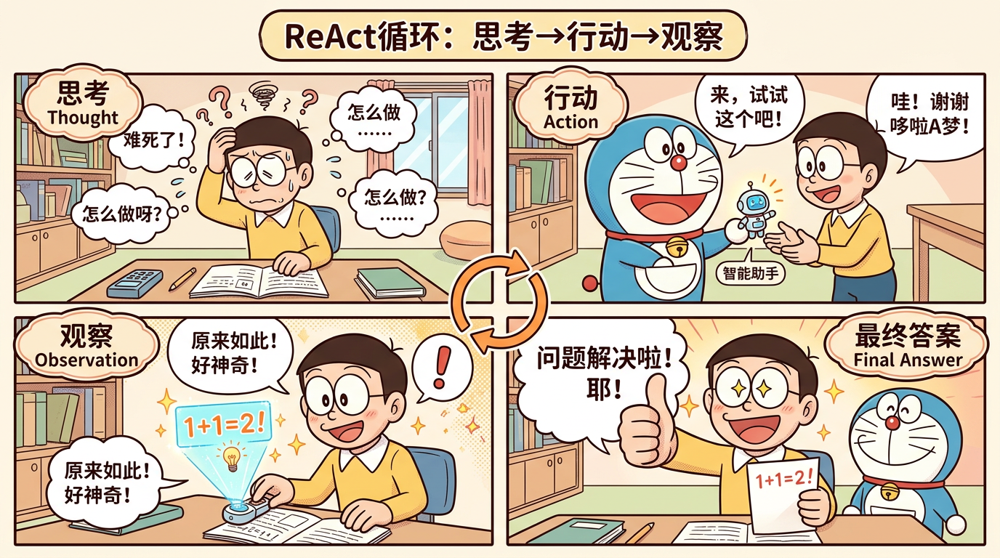

# 核心框架（AI Agent 面试八股文 · 模块二）



> 面向零基础读者：本模块系统梳理主流 Agent「推理—行动—编排」框架。建议先理解 **ReAct** 的「一步想、一步做」，再对比 **Plan-and-Execute** 的「先想全局、再分步做」，最后把 **LangChain / LangGraph / 多 Agent** 当作「工程落地方式」来记忆。

---

## 目录

1. [ReAct 框架](#1-react-框架重点中的重点)
2. [Plan-and-Execute 框架](#2-plan-and-execute-框架)
3. [Reflexion 框架](#3-reflexion-框架)
4. [LATS（Language Agent Tree Search）](#4-latslanguage-agent-tree-search)
5. [LangChain Agent 实现](#5-langchain-agent-实现)
6. [LangGraph 状态机](#6-langgraph-状态机)
7. [AutoGen / CrewAI 等多 Agent 框架](#7-autogen-crewai-等多-agent-框架)
8. [模块综合：15+ 道高频面试题速查](#8-模块综合15-道高频面试题速查)

---

## 1. ReAct 框架（重点中的重点）

### 1.1 概念解释（通俗易懂）

**ReAct** 的全称是 **Reasoning + Acting**（推理 + 行动）。可以把它想象成：一个会做题的学生，不是一口气写完答案，而是 **边想边做**——先在心里说一句「我接下来要干什么」（推理），然后真的去查资料、用计算器、调 API（行动），看到结果后再继续想下一步。

和传统「只输出最终答案」的提示不同，ReAct 要求模型在文本里 **显式交替** 写出：

- **推理（Thought）**：为什么要这么做、下一步选什么工具、预期看到什么。
- **行动（Action）**：调用某个工具（如搜索、代码执行），并给出参数。
- **观察（Observation）**：环境/工具返回的结果。

循环多次，直到模型给出 **Final Answer**。

一句话：**ReAct = 把「思考过程」和「工具使用」写进同一条轨迹里，让推理可监督、可纠错、可复现。**

---

### 1.2 原理详解（技术细节）

#### 1.2.1 核心思想：交替推理与行动

单轮问答时，模型容易「幻觉」事实；ReAct 通过 **行动** 把模型锚定在外部证据上。其关键不是「更会想」，而是 **想与做的闭环**：

```
用户问题
  → Thought：拆解子目标
  → Action：选择工具并执行
  → Observation：获得外部反馈
  → Thought：根据观察修正计划
  → …
  → Final Answer
```

#### 1.2.2 标准工作流程（伪代码）

```text
输入: question, tools, llm, max_steps
初始化: trajectory = []

for step in 1..max_steps:
    prompt = build_react_prompt(question, tools, trajectory)
    text = llm.generate(prompt)

    if "Final Answer:" in text:
        return extract_final_answer(text)

    thought = parse_thought(text)      # 从 Thought: ... 解析
    action = parse_action(text)        # 从 Action: tool[arg] 解析
    obs = tools.execute(action)        # 真实环境反馈
    trajectory.append((thought, action, obs))

return "达到最大步数仍未结束" 或 强制总结
```

**解析要点（面试常问）**：

- **Thought / Action / Observation** 通常用 **固定前缀** 或 **结构化格式**（如 JSON）便于程序解析。
- **Observation 只能来自工具**，不能由模型自己编造（工程上要校验）。
- **停止条件**：出现 Final Answer，或步数上限，或检测到重复无效循环。

#### 1.2.3 Prompt 模板设计（完整示例）

下面是一个 **可直接用于教学** 的英文模板（业界常用英文工具名；面试时说明「中文任务可把指令改为中文」即可）。

```text
You are a helpful assistant that can use tools to answer questions.

You must follow this format strictly:

Question: the input question you must answer
Thought: think step by step about what you should do next
Action: the action to take, must be one of [{tool_names}]
Action Input: the input to the action
Observation: the result of the action
... (this Thought/Action/Action Input/Observation can repeat)
Thought: I now know the final answer
Final Answer: the final answer to the original question

Begin!

Question: {question}
Thought: {optional_seed_thought}
```

若采用 **单段 Action 行**（不少论文与开源实现风格）：

```text
Use the following format:

Question: ...
Thought: ...
Action: Search[query]
Observation: ...

Thought: ...
Action: Calculator[expression]
Observation: ...

Thought: ...
Final Answer: ...
```

**设计要点**：

- **工具清单与参数格式**要写清，减少模型胡写工具名。
- **强调「Observation 由系统填充」**，避免模型在提示里自己续写假 Observation。
- **Few-shot**：给 1～3 个完整轨迹示例，能显著提高格式遵从率。

---

### 1.3 面试问题（Q）+ 标准答案（A）

**Q1：ReAct 和「普通 CoT 提示」有什么本质区别？**

**A：** 普通 CoT 只在模型内部展开推理链，**不强制与外部环境交互**；ReAct 把推理与 **可执行行动** 绑定，每一步行动后都有 **真实 Observation** 反馈，从而用工具结果约束生成，降低闭卷幻觉。

**Q1 · SoulBuddy 实现：** SoulBuddy 用**原生 tool-calling 加真环境反馈**实现了 ReAct 的核心承诺（推理与行动绑定、每步有真实 Observation）。但有一处刻意的差异：它**不要求模型把 Thought/Action 写成固定文本再由程序解析**，而是直接用厂商的 `tool_calls`。代价是失去了「轨迹里显式可读的 Thought 文本」这一可解释性优势，所以它用 `REASONING` 事件 + `final_prompt` 事件把推理与真实请求单独落盘来补偿。此外首轮强制推理守卫（`_check_first_turn_reasoning`）强制模型在第一次调工具前先输出任务分类 + 计划，正是「CoT 先想再动」的落地点。

---

**Q2：ReAct 为什么要显式写出 Thought？**

**A：** 显式 Thought 有三类价值：**可解释性**（便于人类审计）、**可调试性**（定位哪一步选错工具）、**学习信号**（可做监督微调或评估中间步骤质量）。在工程上，Thought 也帮助模型在下一步更稳定地选择 Action。

**Q2 · SoulBuddy 实现：** SoulBuddy 把「可解释性/可调试性」做成了**事件与落盘**：`model_turn.reasoning` 会 emit `REASONING`（流式 `REASONING_DELTA` 不持久化、完整内容事后持久化），模型文本 emit `MESSAGE`；工具调用逐条 emit `FUNCTION_CALL`。**还有一个很实用的细节**：如果模型调了工具却没给任何文字解释，harness 会基于 `action_map`（如 `write_file → 创建 xxx.txt`）注入一句自然语言说明给前端，解决「第一步直接调工具、用户看不到思考」的体验问题（但**不改 `raw_assistant`**，保持 LLM 原样输出）。「学习信号」这块 SoulBuddy 不涉及（不做 SFT）。

---

### 1.4 追问及应对

| 追问 | 应对要点 |
|------|----------|
| Observation 造假怎么办？ | 由 **执行器** 生成 Observation，模型只负责 Thought/Action；可加校验与重试。 |
| 成本高吗？ | 每步一次 LLM 调用 + 工具调用，延迟与费用随步数上升；可用 **步数上限**、**小模型路由**、**工具结果缓存** 控制。 |
| 适合哪些任务？ | 需要 **外部知识** 或 **可执行验证** 的任务（搜索、数学、代码、数据库）。 |

**1.4 · SoulBuddy 实现：**
- **Observation 造假**：Observation 一律来自 `tools.dispatch()` 的真实返回，工具异常也**转成 `ToolResult`** 而非让模型编造；`sanitize_tool_messages` 在每轮请求前强制「有 `tool_calls` 必有对应 tool_result」，防孤儿调用。
- **成本**：`MAX_TURNS=40` + 第 32 轮 budget warning；每轮 `context_usage` 估算（估算值用官方 `prompt_tokens` 按比例校准）；`memory.record_usage()` 记 token 与 cost 到 SQLite（未知模型 cost 记 `null`，不猜）。小模型路由与工具结果缓存 SoulBuddy **不涉及**。
- **适合任务**：SoulBuddy 正是「编码 / 文件操作 / 命令执行」这类需要外部知识（读文件、grep）和可执行验证（跑测试）的任务。

---

### 1.5 代码示例（Python，简化版 ReAct 循环）

```python
from dataclasses import dataclass
from typing import Callable, Dict, List, Tuple

@dataclass
class Tool:
    name: str
    run: Callable[[str], str]

def build_prompt(question: str, history: List[Tuple[str, str, str]], tool_names: str) -> str:
    lines = [
        "You solve tasks with tools. Use EXACTLY this format each turn:",
        "Thought: ...",
        f"Action: one of {tool_names}",
        "Action Input: ...",
        "Stop when you can answer:",
        "Final Answer: ...",
        "",
        f"Tools available: {tool_names}",
        "",
        f"Question: {question}",
        "",
    ]
    for thought, action, obs in history:
        lines += [f"Thought: {thought}", f"Action: {action}", f"Observation: {obs}", ""]
    return "\n".join(lines)

def parse_action(text: str) -> Tuple[str | None, str | None]:
    # 极简解析：生产环境请用更稳健的正则/JSON
    action = None
    action_input = None
    for line in text.splitlines():
        if line.startswith("Action:"):
            action = line.split("Action:", 1)[1].strip()
        if line.startswith("Action Input:"):
            action_input = line.split("Action Input:", 1)[1].strip()
    return action, action_input

def react_loop(
    question: str,
    tools: Dict[str, Tool],
    llm: Callable[[str], str],
    max_steps: int = 6,
) -> str:
    tool_names = "[" + ", ".join(tools.keys()) + "]"
    history: List[Tuple[str, str, str]] = []

    for _ in range(max_steps):
        prompt = build_prompt(question, history, tool_names)
        out = llm(prompt)

        if "Final Answer:" in out:
            return out.split("Final Answer:", 1)[1].strip()

        thought = ""
        for line in out.splitlines():
            if line.startswith("Thought:"):
                thought = line.split("Thought:", 1)[1].strip()

        action, action_input = parse_action(out)
        if not action or action not in tools:
            obs = f"ERROR: invalid Action. Must be one of {list(tools.keys())}."
        else:
            obs = tools[action].run(action_input or "")

        history.append((thought, f"{action}[{action_input}]", obs))

    return "Failed: max steps exceeded."

# 用法示例（llm 替换为真实 API 调用）
if __name__ == "__main__":
    def fake_llm(prompt: str) -> str:
        # 仅演示：真实场景接 OpenAI/Claude/本地模型
        return (
            "Thought: I need to add numbers.\n"
            "Action: calculator\n"
            "Action Input: 21+21\n"
        )

    tools = {
        "calculator": Tool("calculator", lambda s: str(eval(s)) if s else "NaN"),
    }
    print(react_loop("What is 21+21?", tools, fake_llm))
```

---

### 1.6 优缺点分析

**优点**

- **可解释**：轨迹可读，便于调试与评测中间步骤。
- **接地**：通过工具把答案锚定在可验证数据上。
- **通用**：与具体工具解耦，易于替换搜索/代码/SQL 等。

**缺点**

- **多轮调用**：成本高、延迟大。
- **格式脆弱**：模型若偏离模板，需要解析器与重试策略。
- **规划能力有限**：逐步贪心，复杂任务上可能缺「全局最优计划」（对比 Plan-and-Execute）。

---

### 1.7 与 Chain-of-Thought（CoT）的区别

| 维度 | CoT | ReAct |
|------|-----|--------|
| 是否有外部环境 | 通常无 | 有（工具/Observation） |
| 输出内容 | 推理文字为主 | Thought + Action + Observation 交替 |
| 纠错方式 | 主要靠模型自省 | 主要靠 **外部反馈** |
| 典型目标 | 提升推理深度 | **推理 + 行动闭环** |

**一句话总结：** CoT 让模型「更会想」；ReAct 让模型「在想的同时能动手，并用真实结果纠正自己」。

---

## 2. Plan-and-Execute 框架

### 2.1 概念解释（通俗易懂）

**Plan-and-Execute** 是 **两阶段**：先 **制定计划**（Planner），再 **逐步执行**（Executor）。像旅行前先列行程单，再按天去玩；执行中若发现「景点关门」，再 **改行程**（Re-planning）。

它与 ReAct 的差别可以记成：ReAct 常常是「走一步看一步」；Plan-and-Execute 先有一张「总蓝图」，再落地，适合步骤多、依赖关系清晰的任务。

---

### 2.2 原理详解（技术细节）

#### 2.2.1 两阶段模式

```text
输入任务
  → Planner：输出计划 P = [step1, step2, ...]
  → Executor：for each step:
        执行（可调用工具/子 Agent）
        更新状态 state
        若失败或信息不足 → 触发 Re-planning
  → 输出最终结果
```

#### 2.2.2 Planner 组件设计（要点）

- **输入**：用户目标、约束（时间/预算/格式）、当前已知上下文。
- **输出**：结构化计划（步骤列表、每步子目标、依赖、所需工具类型）。
- **技巧**：计划 **粒度适中**；过细易 brittle，过粗难执行。

**伪代码：**

```text
plan = LLM_planner(task, constraints)
validate_plan(plan)  # 可选：检查是否包含非法步骤/循环依赖
```

#### 2.2.3 Executor 组件设计（要点）

- **输入**：当前步骤、state（已完成结果、中间变量）。
- **输出**：步骤产物 + 新 state。
- **工具路由**：每一步可选用不同工具（搜索、代码、数据库）。

**伪代码：**

```text
state = {}
for step in plan:
    out = execute_step(step, state, tools)
    state[step.id] = out
    if needs_replan(state):
        plan = replanner(task, plan, state)
```

#### 2.2.4 重规划（Re-planning）机制

触发条件常见有：

- 工具失败、返回空、超时；
- Observation 与假设冲突；
- 新信息使原计划步骤多余或顺序错误。

**Re-planning 做法：**

- **局部修复**：只替换失败步骤之后的子计划；
- **全局重规划**：回到目标重新生成计划（成本高但更稳）。

```text
if error or inconsistency:
    new_plan = LLM_replanner(original_task, old_plan, state, error_trace)
    continue with new_plan
```

---

### 2.3 面试问题（Q）+ 标准答案（A）

**Q3：Plan-and-Execute 相比 ReAct 什么时候更占优？**

**A：** 当任务 **步骤多、结构清晰、需要全局分解**（如多文件代码改动、数据分析流水线、复杂调研提纲）时，Planner 先给出路线图能减少「短视」；ReAct 更擅长 **动态工具交互**、逐步探索。

**Q3 · SoulBuddy 实现：** SoulBuddy 主循环是 **ReAct 式逐步推进**（走一步看一步），但用两个机制补了「全局分解」的短板：① 首轮强制推理守卫要求先输出任务分类（简单单步 / 复杂多步）和计划；② 系统提示词明确约定「如果一个任务需要 3–4 次以上工具调用，就委托给 sub-agent」，把长探索任务从主上下文里剥离。所以它更偏 ReAct，但对「复杂多步」做了显式的分解引导。

---

**Q4：Re-planning 会不会导致「计划抖动」？怎么缓解？**

**A：** 会。频繁重规划可能让执行轨迹不稳定。缓解方式包括：**限制重规划次数**、**局部重规划优先**、在 state 中保留已验证事实、对计划变更加 **一致性检查**（新旧计划差异说明）。

**Q4 · SoulBuddy 实现：** SoulBuddy 用**硬上限**防抖动：`RUBRIC_MAX_RETRIES=1`（默认只重修一次，且要求剩余轮次 `MAX_TURNS - turn >= RUBRIC_MIN_TURNS_LEFT(=3)`），`FIRST_TURN_REASONING_MAX_RETRIES` 限制首轮推理重试次数；上下文压缩也刻意压到窗口 50% 而非刚好过线，避免「压一点点、下一轮立刻又触发」的抖动（thrashing）。「已验证事实」用 durable 事实块跨轮保留。

### 2.4 追问及应对

| 追问 | 应对要点 |
|------|----------|
| Planner 输出不可靠？ | 加 **结构化输出**（JSON schema）、自检清单、必要时用更强模型只做规划。 |
| 和「分层 Agent」关系？ | Plan-and-Execute 常作为上层模式；Executor 内部可再接 ReAct 或子 Agent。 |

**2.4 · SoulBuddy 实现：** SoulBuddy **不单独产出结构化计划 JSON**（所以「Planner 输出不可靠」这个具体风险它不涉及）；它的「分层」体现为**主 Agent + sub-agent**：主 Agent 负责路由与最终交付，sub-agent 在隔离上下文里跑自己的精简循环（有自己的 `max_turns`、`max_time_s`、独立压缩控制器、收窄的工具集），返回结构化 JSON 摘要（`status/summary/artifacts/findings/next_steps`）。

---

### 2.4 追问及应对

| 追问 | 应对要点 |
|------|----------|
| Planner 输出不可靠？ | 加 **结构化输出**（JSON schema）、自检清单、必要时用更强模型只做规划。 |
| 和「分层 Agent」关系？ | Plan-and-Execute 常作为上层模式；Executor 内部可再接 ReAct 或子 Agent。 |

---

### 2.5 代码示例（Python，极简 Planner + Executor）

```python
from typing import Any, Dict, List

def plan(task: str, llm) -> List[str]:
    prompt = f"""
    Break the task into 3-7 concrete steps. Return ONE step per line.
    Task: {task}
    """
    text = llm(prompt)
    steps = [s.strip("- ").strip() for s in text.splitlines() if s.strip()]
    return steps

def execute_step(step: str, state: Dict[str, Any], tools, llm) -> str:
    # 这里可把 ReAct 当作单步执行器
    prompt = f"Step: {step}\nContext: {state}\nAnswer succinctly."
    return llm(prompt)

def plan_and_execute(task: str, llm, tools, max_replans: int = 2) -> str:
    steps = plan(task, llm)
    state: Dict[str, Any] = {}

    for _ in range(max_replans + 1):
        for i, st in enumerate(steps):
            try:
                out = execute_step(st, state, tools, llm)
                state[f"step_{i}"] = out
            except Exception as e:
                # 触发重规划（演示）
                replan_prompt = f"Task: {task}\nFailed step: {st}\nError: {e}\nGive a new plan."
                text = llm(replan_prompt)
                steps = [s.strip("- ").strip() for s in text.splitlines() if s.strip()]
                break
        else:
            return llm(f"Summarize final result based on: {state}")

    return "Failed after replanning."
```

---

### 2.6 与 ReAct 的对比与适用场景

| 维度 | ReAct | Plan-and-Execute |
|------|--------|-------------------|
| 规划 | 隐式、逐步 | 显式、先全局后局部 |
| 灵活性 | 高（随时改工具） | 中（依赖重规划机制） |
| 成本 | 步数多时可很高 | 规划一次可能省执行盲目性 |
| 风险 | 短视 | 计划错误会波及全局 |

**适用场景小结：**

- **ReAct**：工具交互密集、环境反馈关键、路径不确定。
- **Plan-and-Execute**：任务可分解、流程强、需要可审计的计划书。

---

## 3. Reflexion 框架

### 3.1 概念解释（通俗易懂）

**Reflexion** 的核心是：**做完不等于结束**——还要 **评估做得好不好**，把 **教训** 记下来，下次 **带着教训重试**。像考试做错后写错题本，而不是盲目刷同一道题。

它强调 **语言化反思**（自然语言反思条目），而不是只改参数；反思作为 **记忆**，影响后续尝试的策略。

---

### 3.2 原理详解（技术细节）

#### 3.2.1 自我反思机制

典型角色分工（概念上）：

- **Actor**：生成行动/答案（可接工具）。
- **Evaluator**：给反馈（对/错、评分、缺失项）。
- **Reflector**：根据反馈写 **反思文本**（指出错误原因与改进策略）。

反思不是泛泛的「我要更仔细」，而是 **可执行** 的指导，例如：「应先确认单位换算」「应先检索最新数据而非凭记忆」。

#### 3.2.2 反思记忆的存储与使用

常见存储形式：

- **短期**：同一任务多轮尝试中维护 `reflections: List[str]`。
- **长期**：写入向量库/键值库，按任务类型检索相似反思（进阶）。

使用方式：

```text
attempt_k:
  prompt = task + "\nPast reflections:\n" + "\n".join(reflections)
  output = Actor(prompt)
  score, feedback = Evaluator(output)
  reflections.append(Reflector(feedback))
```

#### 3.2.3 工作流程：Action → Evaluation → Reflection → Retry

```text
初始化 reflections = []

repeat until success or max_trials:
    Action: 基于任务 + reflections 生成输出（可含工具）
    Evaluation: 规则/模型评估（可给二元成功或细粒度批评）
    Reflection: 生成改进建议文本
    将 reflection 追加到 memory
```

---

### 3.3 面试问题（Q）+ 标准答案（A）

**Q5：Reflexion 和「让模型自己检查一遍」有什么不同？**

**A：** 自检往往是一次性的；Reflexion 把评估与反思 **显式化、结构化**，并 **跨尝试复用** 反思文本，形成可累积的「策略记忆」。工程上更易控制与评测。

**Q5 · SoulBuddy 实现：** SoulBuddy 的 P6 rubric 是「结构化自检」而非完整 Reflexion：评估**显式化**（`rubric/` 包三层：Gating 规则 → Quality 规则 + LLM judge → 聚合门槛），不达标时 `render_feedback` 把**具体扣分证据**渲染成指令注入回模型重修（`RUBRIC_RETRY` 事件）。但重修**不跨尝试复用反思文本**（`RUBRIC_MAX_RETRIES=1`，修一次就交付），所以「可累积的策略记忆」这一点 SoulBuddy 不涉及。

---

### 3.4 追问及应对

| 追问 | 应对要点 |
|------|----------|
| Evaluator 从哪来？ | 规则、更强模型、单元测试、外部工具验证（因任务而异）。 |
| 反思会不会冗长？ | 限制条数与长度；合并相似反思；只保留高信息密度条目。 |

**3.4 · SoulBuddy 实现：**
- **Evaluator 从哪来**：SoulBuddy 是**规则 + LLM judge 混合**。Gating（G1 安全 / G2 完成 / G3 无残留错误）与 Q1–Q4 **全规则判定**（零 token、可脱机单测）；Q5 代码质量 / Q6 沟通表达 用 **LLM judge**（复用当前 provider，严格 JSON 输出，任何异常降级为 `not_applicable`）。所有硬性维度**只认客观信号，不接受模型的「我做到了」**。
- **反思冗长**：SoulBuddy 的对应设计是「**只有 4 档评分**（0–3）」「锚点必须给行为描述而非形容词」「送审材料只给 diff + 任务 + 最终答复，不含完整 transcript」，从源头控制长度与噪声。

---

### 3.5 代码示例（Python）

```python
def reflexion_loop(task: str, actor, evaluator, reflector, max_trials: int = 3) -> str:
    reflections: list[str] = []

    for t in range(max_trials):
        mem = "\n".join(f"- {r}" for r in reflections) or "(none)"
        out = actor(f"Task: {task}\nReflections:\n{mem}\n")
        score, feedback = evaluator(out)  # 例如 (0.0~1.0, str)

        if score >= 0.9:
            return out

        r = reflector(f"Output:\n{out}\nFeedback:\n{feedback}\nWrite concise lessons.")
        reflections.append(r)

    return out
```

---

### 3.6 适用场景

- **可验证任务**：代码、数学、有测试用例的生成。
- **易犯系统性错误** 的任务：格式、约束、工具选择。
- **预算允许多轮尝试** 的场景（反思会增加调用次数）。

---

## 4. LATS（Language Agent Tree Search）

### 4.1 概念解释（通俗易懂）

**LATS** 把 Agent 的决策看成在 **树** 上搜索：每个节点是一种「状态/中间思路」，分支是不同行动。任务复杂、存在多条可能路径时，与其一次走到底，不如 **探索多条路**，用评估函数判断哪条路更有希望。

它常与 **蒙特卡洛树搜索（MCTS）** 思想结合：通过 **选择—扩展—模拟—回传** 在探索与利用之间折中，把「语言推理」嵌进搜索节点。

---

### 4.2 原理详解（技术细节）

#### 4.2.1 树搜索 + Agent

- **节点**：包含当前上下文、已执行动作历史、可选下一步。
- **边**：一次 Thought/Action 或一个子目标步骤。
- **叶节点评估**：是否完成任务、奖励分数、是否需继续扩展。

#### 4.2.2 MCTS 思想（与 Agent 结合的直觉）

经典 MCTS 四步（可简化为面试版描述）：

```text
while budget remains:
    Select: 从根沿策略选到叶（UCB 等平衡探索/利用）
    Expand: 生成若干可能的下一步（语言分支）
    Simulate/Rollout: 用启发式或模型快速评估结果潜力
    Backpropagate: 把评估回报回传到路径上的节点统计量
```

在 LATS 中，「扩展」常由 LLM 生成多个候选行动；「模拟」可用更便宜模型或短 rollouts。

---

### 4.3 面试问题（Q）+ 标准答案（A）

**Q6：LATS 相比单次 ReAct 多在哪里成本？换来什么收益？**

**A：** 成本主要来自 **多分支扩展** 与 **多次评估/模拟**。收益是 **更系统的探索**，降低「一条路径走到黑」的局部最优风险，适合决策点多的任务。

**Q6 · SoulBuddy 实现：** **SoulBuddy 不涉及 LATS/树搜索**。它的主循环是单轨迹贪心推进（一条路径走到底），没有多分支扩展与价值回传。唯一的「多候选」是「同一工具重复调用被熔断后换策略」（rubric Q3 自纠错维度会检查这点），但那不是树搜索。

---

### 4.4 追问及应对

| 追问 | 应对要点 |
|------|----------|
| 和束搜索（Beam Search）区别？ | Beam 偏序列生成；LATS/MCTS 更强调 **节点价值估计** 与 **探索策略**（UCB）。 |
| 工程难点？ | 分支爆炸、评估器设计、延迟控制；需要强剪枝与缓存。 |

**4.4 · SoulBuddy 实现：** **SoulBuddy 不涉及树搜索/分支扩展**，因此「分支爆炸、剪枝、缓存」这些问题在这里不适用。它在相邻方向（**线性上下文**）做了很强的工程优化：分层压缩（L1 截断 → L2 去重 → L3/L4 摘要）、成对保护（`tool_use`/`tool_result` 永不拆散）、早停（廉价层够用就不剪历史）。

---

### 4.5 代码示例（Python，极度简化的「多候选一步扩展」）

```python
import random
from typing import List

def expand_candidates(state: str, llm, k: int = 3) -> List[str]:
    prompt = f"State:\n{state}\nPropose {k} distinct next actions (one line each)."
    text = llm(prompt)
    return [line.strip("- ") for line in text.splitlines() if line.strip()][:k]

def score_action(state: str, action: str, scorer) -> float:
    return scorer(state, action)  # 可用启发式或小型模型

def lats_one_step(state: str, llm, scorer) -> str:
    cands = expand_candidates(state, llm, k=3)
    best = max(cands, key=lambda a: score_action(state, a, scorer))
    return best
```

---

### 4.6 适用于需要探索多条路径的复杂任务

- 策略游戏、规划 puzzle、代码修复（多方案补丁）。
- 研究型问题：需要先提出多种假设再验证。

---

## 5. LangChain Agent 实现

### 5.1 概念解释（通俗易懂）

**LangChain** 把 LLM、提示模板、工具、记忆、解析器等拼成可运行程序。**Agent** 在这里通常指：由 **LLM 决定下一步调用哪个工具** 的循环执行体；**AgentExecutor** 负责「跑这个循环直到结束」。

---

### 5.2 原理详解（技术细节）

#### 5.2.1 LangChain 中与 Agent 相关的核心抽象（面试口径）

不同版本命名略有变化，但面试常考概念层：

- **Tools**：对外部能力的封装（name、description、args schema、执行函数）。
- **LLM / ChatModel**：生成下一步决策与内容。
- **Agent（推理策略）**：如何把工具、提示、中间步骤组合起来（ReAct、OpenAI tools 等）。
- **AgentExecutor**：驱动循环：调用 Agent → 若有 tool_calls 则执行工具 → 回填消息 → 直到停止。

#### 5.2.2 AgentExecutor 工作原理（流程）

```text
inputs → AgentExecutor
  loop:
    agent.plan(messages/tools) -> next message / tool_calls
    if final answer: return
    else: run tools -> append tool messages
    (optional) trim memory / handle parsing errors
```

**关键点**：**停止条件**（达到最终答案）、**解析错误处理**、**最大迭代次数**。

#### 5.2.3 自定义 Agent 的步骤（通用 checklist）

1. 定义 **Tools**（清晰 description 与 schema）。
2. 选择 **提示模板**（ReAct JSON / OpenAI tool calling）。
3. 选择 **模型** 与 **输出解析器**（防止格式漂移）。
4. 组装 **Agent + AgentExecutor**（设置 `max_iterations`、`handle_parsing_errors`）。
5. 评测与加固（日志、重试、工具超时）。

---

### 5.3 面试问题（Q）+ 标准答案（A）

**Q7：LangChain 里 AgentExecutor 解决的核心问题是什么？**

**A：** 把「模型决策 → 工具执行 → 结果回填 → 再决策」的 **控制流** 标准化，统一处理 **迭代限制**、**错误处理**、**中间消息结构**，让开发者专注工具与提示。

**Q7 · SoulBuddy 实现：** **SoulBuddy 不用 LangChain/LangGraph 任何 Agent 框架**，而是**自研**了等价的编排器 `SoulAgent.run()`。它承担的正是 AgentExecutor 的职责：`MAX_TURNS` 迭代限制、工具异常转 `ToolResult`（不崩循环）、每步落盘为事件、回填 tool_result 后再决策。选型动机是「可控性」—— 自研才能把权限门、审计、文件快照、上下文压缩、rubric 验收这些横切逻辑插进同一循环，而不用被框架的抽象层限制。它**只用 LangSmith 做可观测性**（`@traceable` 包 `SoulAgent.run` 作根 trace，`wrap_openai`/`wrap_anthropic` 包客户端，未开启时全为 no-op）。

---

**Q8：工具描述为什么重要？**

**A：** Agent 依赖描述进行 **工具选择**；描述不清会导致错选工具或参数幻觉。应包含 **用途、输入输出、边界条件、示例**。

**Q8 · SoulBuddy 实现：** SoulBuddy 的每个工具 spec 都带 `name/description/parameters(JSON Schema)`，并且**用可见性进一步降低误选**：`search_knowledge` 只对绑定了资料库的会话出现在工具列表里；MCP 工具的 spec 直接取自远端 `inputSchema`，并额外在 system prompt 里注入一段 `_mcp_block()`（按连接器分组、说明「联网操作优先用 `mcp__` 工具」），让模型理解「何时用」而不只是「有什么工具」。

---

### 5.4 追问及应对

| 追问 | 应对要点 |
|------|----------|
| LangChain Agent 和自写 ReAct 差别？ | LangChain 提供 **工程封装** 与生态整合；底层仍是提示+解析+循环。 |
| 版本迁移问题？ | 面试中强调理解 **Executor 循环** 与 **tool calling** 模式即可，不必背每个 API 名。 |

**5.4 · SoulBuddy 实现：** SoulBuddy 直接选择了「自写循环」而不是 LangChain AgentExecutor —— 差别在于它把 AgentExecutor 的通用职责**具体化成了本项目的治理需求**：权限门（`permissions`）、审计链（`audit.py`）、文件快照与回滚（`file_history.py`）、成本记账（`memory.record_usage`）、上下文压缩（`context.compact`）、rubric 验收。因此不存在「LangChain 版本迁移」问题。它唯一引入的 LangChain 生态组件是 LangSmith（可观测性），且是可选依赖。

---

### 5.5 代码示例（Python，示意：以「工具调用风格」组织循环）

> 说明：LangChain 具体 import 路径随版本变化较大，下列示例用「结构与流程」表达面试要点；落地时请对照你项目锁定的 LangChain 版本文档。

```python
# 示意代码：突出 AgentExecutor 的“循环本质”

def simple_agent_executor(llm, tools, user_input: str, max_iterations: int = 5):
    messages = [{"role": "user", "content": user_input}]

    for _ in range(max_iterations):
        resp = llm.chat(messages, tools=tools)  # 伪 API

        if resp.final_text and not resp.tool_calls:
            return resp.final_text

        for call in resp.tool_calls:
            name = call.name
            args = call.args
            tool_fn = next(t for t in tools if t.name == name)
            observation = tool_fn.invoke(args)
            messages.append({"role": "assistant", "tool_calls": [call]})
            messages.append({"role": "tool", "name": name, "content": observation})

    return "Stopped: max iterations."
```

---

## 6. LangGraph 状态机

### 6.1 概念解释（通俗易懂）

如果把 LangChain Agent 看成「一套默认的循环」，**LangGraph** 则是把 Agent 工作流画成 **图**：**节点**是处理步骤（调用模型、调工具、审核），**边**是流转关系。复杂业务往往需要分支、循环、人工确认——用图更直观。

---

### 6.2 原理详解（技术细节）

#### 6.2.1 基于图的 Agent 编排

- **Graph / StateGraph**：节点函数读取共享 state，返回 state 更新。
- **编排优势**：显式控制 **并行**、**条件分支**、**回退**、**人机协同**。

#### 6.2.2 节点（Node）和边（Edge）

- **Node**：`state -> partial_state_update`。
- **Edge**：`A -> B` 表示执行完 A 后执行 B。

#### 6.2.3 条件边（Conditional Edge）

根据 state 决定下一步去哪个节点，例如：

```text
if needs_human_review(state): goto human
elif tool_error(state): goto repair
else: goto continue
```

#### 6.2.4 状态管理

- 通常定义 `TypedDict` 或 dataclass 描述 state schema。
- 多个节点可 **增量合并** 更新（reducer），避免全局覆盖冲突（具体机制依实现）。

#### 6.2.5 与 LangChain Agent 的区别（面试高频）

| 维度 | LangChain Agent | LangGraph |
|------|------------------|-----------|
| 控制流 | 偏固定循环 | **显式图**、分支/循环更自然 |
| 可观测性 | 日志为主 | **结构化的节点轨迹** |
| 人机协同 | 需要额外封装 | 容易加 `human` 节点 |
| 适用 | 标准工具 Agent | 复杂业务流程、审查、重试拓扑 |

---

### 6.3 面试问题（Q）+ 标准答案（A）

**Q9：什么时候选 LangGraph 而不是 AgentExecutor？**

**A：** 当流程不是「单一工具循环」，而是需要 **多阶段流水线**、**条件路由**、**回环修复**、**人工审核节点**、**并行任务** 时，用图编排更清晰可维护。

**Q9 · SoulBuddy 实现：** SoulBuddy **不用 LangGraph**，但它的需求恰好覆盖了「什么时候会想用图编排」的几项：条件路由（模型是否 wants_tools → 执行工具 or 收尾验收）、**回环修复**（rubric 不达标 → 注入反馈 → `continue` 重修）、**人工审核节点**（PermissionGate 的 ASK 挂起）。它没用图，而是用**命令式代码里的 `continue` / 分支**实现了同样的拓扑 —— 因为它只有一个主循环、没有并行分支，图的显式化收益不足以抵掉引入框架的成本。

**Q10 · SoulBuddy 实现：** SoulBuddy 的「状态」不是单一 state dict，而是**分层管理**：`messages`（对话历史，由 compact 就地修改）、`_call_counter`（单 run 的重复调用计数）、`rubric.retries_used`（本次 run 的重修次数）、`CompactController.durable_block`（跨轮持久事实）。这种**每个状态各归其位**的做法避免了「多节点写同一字段冲突」的问题 —— 也正是 LangGraph 里要小心设计 reducer 的同一个坑。

---

**Q10：LangGraph 的状态更新为什么要谨慎设计？**

**A：** 多节点写入同一字段可能冲突；需要 **schema 约束**、**归约策略**（append vs replace）、明确每个节点的写入职责。

---

### 6.4 追问及应对

| 追问 | 应对要点 |
|------|----------|
| 图会不会变复杂？ | 用子图/模块化节点；把业务阶段分层。 |
| 调试怎么做？ | 节点级日志、导出每一步 state、可视化执行路径。 |

**6.4 · SoulBuddy 实现：** SoulBuddy **不涉及图**，所以没有「图变复杂」的问题，但它的调试手段值得借鉴 —— 不靠 state 快照，而是靠**事件流**：`final_prompt` 事件把每轮真实发给 LLM 的 system + messages 落盘（调试/审计用）、`context_usage` 事件给出分段 token、`function_call`/`function_call_result` 给出每步轨迹、外加 `~/.soul_buddy/logs/sidecar.log`。整条链可用 `request_id` 串起来。

---

### 6.5 代码示例（Python，最小状态机草图）

```python
from typing import TypedDict, Literal

class AgentState(TypedDict):
    task: str
    notes: str
    route: str

def planner_node(state: AgentState) -> AgentState:
    return {**state, "notes": "plan: step1...", "route": "exec"}

def exec_node(state: AgentState) -> AgentState:
    return {**state, "notes": state["notes"] + " | executed", "route": "end"}

def route_fn(state: AgentState) -> Literal["exec", "end"]:
    return "exec" if state["route"] == "exec" else "end"

# 伪代码：LangGraph 中会把 node/route_fn 注册到 StateGraph
# graph.add_node("planner", planner_node)
# graph.add_node("exec", exec_node)
# graph.add_conditional_edges("planner", route_fn, {"exec": "exec", "end": "__end__"})
```

---

## 7. AutoGen / CrewAI 等多 Agent 框架

### 7.1 概念解释（通俗易懂）

**多 Agent 框架**把任务拆给多个「角色」：有人负责写代码，有人负责审查，有人负责检索。它们通过 **对话** 或 **结构化消息** 协作。AutoGen 偏 **可编程的对话与工具**；CrewAI 偏 **角色驱动的团队流程（Crew）**。

---

### 7.2 原理详解（技术细节）

#### 7.2.1 核心设计理念

- **分权**：降低单模型负载，让角色专注子任务。
- **对抗/互补**：审查者发现生成者问题，提高质量。
- **可组合**：工作流可由对话路由或 DAG/图编排。

#### 7.2.2 角色定义与对话

- **角色（Role）**：system prompt + 工具权限 + 目标。
- **对话拓扑**：一对一、群聊、星型（manager）、分层。

**极简伪代码：**

```text
agents = [Researcher, Writer, Reviewer]
for round in 1..N:
    msg = Researcher.step(thread)
    msg = Writer.step(thread)
    msg = Reviewer.step(thread)
    if Reviewer.approved: break
```

#### 7.2.3 适用场景

- 内容生产流水线（调研→写作→校对）。
- 软件工程（需求→设计→实现→Code review）。
- 需要 **强分工** 与 **过程质量控制** 的组织化任务。

---

### 7.3 面试问题（Q）+ 标准答案（A）

**Q11：多 Agent 一定比单 Agent 更强吗？**

**A：** 不一定。更多 Agent 可能带来 **协调成本、错误级联、对话冗长**。当任务可清晰分工且有评估机制时收益大；否则单 Agent + 强工具可能更简单高效。

**Q11 · SoulBuddy 实现：** SoulBuddy **不用 AutoGen / CrewAI**，也不做**对等多 Agent 讨论**。它只有「**主 Agent + 按需委托的 sub-agent**」：主 Agent 通过 `task` 工具把探索类子任务委托给 sub-agent，sub-agent **同步阻塞执行、不与其他 sub-agent 通讯、不参与多轮讨论**，只返回一份结构化 JSON 摘要。这是一种「层级式（Boss-Worker 的极简形态）」，而不是多角色协作。

---

**Q12：如何避免多 Agent「互相附和」？**

**A：** 引入 **独立审查角色**、**基于规则的检查**、**外部工具验证**（测试、检索），并明确 **停止条件** 与 **异议处理流程**。

**Q12 · SoulBuddy 实现：** SoulBuddy **没有多 Agent 讨论**，因此「互相附和」不适用。但它的**独立审查**思想体现在 rubric 的 **LLM judge**：judge 只看 diff + 任务原文 + 最终答复（不含完整 transcript），并在提示词里用从 `policy.py` 常量渲染的锚点表；且 **Gating 硬门槛是纯规则判定**（不接受模型自述），从机制上隔离了「模型自我背书」。rubric 也明确规定「**报告落盘 + 未达标必显式声明**（不静默通过）」。

---

### 7.4 追问及应对

| 追问 | 应对要点 |
|------|----------|
| AutoGen vs CrewAI 怎么选？ | 看团队更偏 **对话编排/代码优先**（AutoGen 系生态印象）还是 **角色/任务流水线**（Crew 风格）；最终以项目 PoC 为准。 |
| 成本？ | 多角色多轮对话显著增加 token；需要缓存、摘要、限轮。 |

**7.4 · SoulBuddy 实现：** 框架选型问题对 SoulBuddy **不涉及** —— 它既不选 AutoGen 也不选 CrewAI，而是自研单循环 + 受控子代理。成本控制上：sub-agent 有自己的 `max_turns` / `max_time_s` 硬上限、独立压缩控制器（`keep_recent_turns=4`，比主循环的 8 更激进），且**中间工具调用不进主上下文**（只有最终 JSON 摘要进主上下文），这正是「避免上下文爆炸」的落地。

---

### 7.5 代码示例（Python，概念演示：多角色轮询）

```python
def run_crew(task: str, roles: dict, llm, rounds: int = 2) -> str:
    thread = f"Task: {task}\n"
    order = ["researcher", "writer", "reviewer"]

    for _ in range(rounds):
        for r in order:
            prompt = roles[r] + "\n\n" + thread
            reply = llm(prompt)
            thread += f"\n[{r}]:\n{reply}\n"

    return thread
```

---

## 8. 模块综合：15+ 道高频面试题速查

> 下列题目覆盖全模块，可在复习时自问自答；每题后附 **标准答法要点**。

**Q13：请用一句话解释 ReAct。**  
**A：** 让模型交替输出推理与可执行行动，并用工具返回的 Observation 闭环纠错，从而把推理接地到外部环境。

---

**Q14：ReAct 轨迹里，哪一部分必须由系统生成？为什么？**  
**A：** **Observation** 必须由工具/环境生成，防止模型伪造证据导致「看似合理但错误」的答案。

---

**Q15：Plan-and-Execute 的最大风险是什么？如何缓解？**  
**A：** 风险是 **错误计划污染全局**；缓解是 **可验证子步骤**、**重规划**、**强 Planner 约束输出** 与 **执行期监控**。

---

**Q16：Reflexion 的关键产出是什么？它如何提升下一轮？**  
**A：** 关键是 **高质量反思文本**；它作为记忆进入下一轮提示，指导 Actor 改变策略而非重复错误。

---

**Q17：LATS 与 ReAct 在「探索能力」上如何对比？**  
**A：** ReAct 通常主路径贪心推进；LATS/MCTS 通过 **多分支搜索与价值回传** 更系统探索决策空间（成本更高）。

---

**Q18：LangChain AgentExecutor 中为什么要限制 max_iterations？**  
**A：** 防止工具循环、解析失败导致的 **无限循环**，并控制成本与延迟。

---

**Q19：描述 LangGraph 的条件边解决的业务问题。**  
**A：** 根据中间状态动态路由，例如失败重试、需要人工审核、不同客户等级走不同流程。

---

**Q20：什么时候更建议「单 Agent + 强工具」，而不是多 Agent？**  
**A：** 任务边界清晰、无需组织化分工、协调成本可能大于收益时；或延迟/成本敏感场景。

---

**Q21：多 Agent 系统的「评估器」可以有哪些实现？**  
**A：** 单元测试/静态规则、更强模型评审、人工审核节点、外部检索核对事实等。

---

**Q22：ReAct Prompt 为什么要给 few-shot 示例？**  
**A：** 提升模型对 **固定格式** 的遵从度，降低解析失败率，稳定工具调用。

---

**Q23：Re-planning 与 Reflexion 都「改正错误」，区别是什么？**  
**A：** Re-planning 偏 **计划结构** 的调整（下一步怎么走）；Reflexion 偏 **策略/经验** 的语言化总结并跨轮复用。

---

**Q24：LangGraph 相比普通脚本编排的核心收益？**  
**A：** 把流程 **显式化** 为图，分支/回环/人机节点一等公民，更易维护与观测。

---

**Q25：如果工具返回噪声很大，ReAct 可能出什么问题？怎么改进？**  
**A：** 模型可能被噪声误导；改进包括 **工具侧清洗/结构化输出**、**二次检索**、在 Thought 里强制 **引用证据片段**、增加 **校验工具**。

---

**Q26：你如何为一个企业场景选择 ReAct vs Plan-and-Execute？**  
**A：** 看任务是否 **强流程**、是否需要 **可审计计划书**、是否允许 **前期规划成本**；需要强工具交互与动态环境用 ReAct，强分解与多步骤交付用 Plan-and-Execute。

---

**Q27：为什么说「工具描述」是 Agent 的接口设计？**  
**A：** LLM 靠描述做路由与填参；描述就是 **人机接口**，直接影响成功率。

---

### 8.x · SoulBuddy 实现（综合题库 Q13–Q27）

**Q13（一句话 ReAct）：** SoulBuddy 的实现是「原生 tool-calling 循环」：每轮 provider 往返里推理（`reasoning`/`text`）+ 行动（`tool_calls`）+ 观察（`FUNCTION_CALL_RESULT`）交替，用真实工具结果约束下一步。

**Q14（Observation 必须系统生成）：** SoulBuddy 的 Observation **只能**来自 `tools.dispatch()`；`sanitize_tool_messages` 每轮强制 `tool_calls` 与 tool_result 配对，杜绝 model 自己续写假 Observation。

**Q15（Plan-and-Execute 最大风险）：** SoulBuddy 无独立 Planner，因此不涉及「错误计划污染全局」；最接近风险的是 rubric 的重修上限（`RUBRIC_MAX_RETRIES=1`）。缓解手段是「可验证子步骤（G2/G3 规则校验）+ 预算联动（剩余轮次不足不重修）」。

**Q16（Reflexion 关键产出）：** SoulBuddy 有**反思指令**（`render_feedback` 把扣分项渲染成重修指令），但**不跨 run 累积**（修一次即交付），所以「反思作为记忆进入下一轮」这点只在本 run 内成立，跨 run 复用**不涉及**。

**Q17（LATS vs ReAct 探索）：** SoulBuddy **不涉及树搜索**，是单轨迹贪心；对应能力被替换为「重复调用熔断 + rubric Q3 自纠错（错误后换策略）」这类线性纠错。

**Q18（max_iterations）：** SoulBuddy 的对应物是 `MAX_TURNS=40`（80% 处发 warning）+ 同调用重复 ≥3 次熔断，防死循环并控成本。

**Q19（条件边）：** SoulBuddy **不用图**，但等价的条件路由是命令式分支：`wants_tools` 为真 → 执行工具；为假 → 进 rubric 验收；权限 ASK → 挂起等用户；rubric 不达标 → `continue` 重修。

**Q20（何时单 Agent + 强工具）：** SoulBuddy 本身就是这个选择 —— 单 Agent + 15 个内置工具 + 动态 MCP 工具，只在「需要 3–4 次以上工具调用的探索任务」时才委托 sub-agent。

**Q21（评估器实现）：** SoulBuddy 的评估器是「规则（Gating/Q1–Q4）+ LLM judge（Q5/Q6）」，judge 复用当前 provider，异常降级 `not_applicable` 且**绝不 raise**。

**Q22（few-shot 示例）：** SoulBuddy **不依赖 few-shot 轨迹示例**来稳定格式 —— 因为用原生 tool-calling，格式由协议保证而非提示词模仿，所以这一点**不涉及**。

**Q23（Re-planning vs Reflexion）：** SoulBuddy 两者都只做了「单轮内」的版本：无显式重规划（不涉及计划结构调整），rubric 重修是「策略/经验反馈」但不跨 run 复用。

**Q24（LangGraph 核心收益）：** SoulBuddy **不用图**，用事件流 + 命令式分支替代「显式化流程」的收益；它的可观测性靠 `request_id` 串联的 JSONL 事件 + LangSmith trace。

**Q25（工具返回噪声大）：** SoulBuddy 有针对性处理：`context/compact.py` 的 L1 层会**截断超长 tool_result（4000 字符）**、L2 层 `supersede 旧文件读`（把被后读取代的旧内容改成短备注）；`Externalizer` 把超大工具结果外置为文件（`tool-results/`），只回传句柄。这些都能抑制「噪声/陈旧内容误导模型」。

**Q26（企业场景选型）：** SoulBuddy 选了 ReAct 式「强工具交互 + 动态环境」路线，并补了可审计性（final_prompt 落盘、审计链、事件流），因此不需要为了「可审计计划书」而改用 Plan-and-Execute。

**Q27（工具描述即接口）：** SoulBuddy 把「接口设计」做得更硬：不仅靠 description，还用**工具可见性过滤**（未绑定资料库就看不到 `search_knowledge`）+ MCP 工具在 system prompt 里的**自然语言使用说明块**（`_mcp_block`），从「有什么」和「何时用」两个层面把接口讲清楚。

---

## 附录：对比速记表

| 框架/概念 | 关键词 | 典型循环 |
|-----------|--------|----------|
| ReAct | 推理+行动交替 | Thought→Action→Observation |
| Plan-and-Execute | 先计划后执行 | Plan→Execute→(Replan) |
| Reflexion | 反思记忆 | Act→Eval→Reflect→Retry |
| LATS | 树搜索 / MCTS | Select→Expand→Evaluate→Backprop |
| LangChain Agent | Executor 循环 | decide→tool→observe |
| LangGraph | 图编排 | node→conditional edge |
| 多 Agent | 角色协作 | 对话/流水线 |

---

*文档版本：面向入门详解；落地代码请以你所使用的库版本官方文档为准。*
