# Agent 循环全景图（Loop Deep-Dive）

> 基线：`main@e0fc357`，2026-09-13 梳理。
> 本文回答一个问题：**从用户按下回车到 Run 结束，代码里所有可能发生的事、所有循环、所有分支、所有退出路径是什么。**
> 代码入口：`soul_buddy/agent.py`（`SoulAgent.run`）；配套：`permissions/`、`tools/registry.py`、`context/compact.py`、`subagents/runner.py`、`api/routers/runs.py`。

## 0. 文件 → 职责速查

| 文件 | 在循环中的角色 |
|---|---|
| `api/routers/runs.py` | 入口：启动 Run（B10 单会话单 Run 守卫）、中止 Run |
| `api/runtime.py` | 装配：每次 run 重建 agent（scope/policy/provider/context/skills/subagents） |
| `agent.py` `run()` | 主循环本体（`agent.py:85`），40 轮上限 |
| `agent.py` `_execute_governed()` | 单个工具调用的受控执行（`agent.py:413`） |
| `permissions/policy.py` | 纯函数规则表：ALLOW / ASK / DENY |
| `permissions/gate.py` | ASK 的异步等待：FIFO、300s 超时、deny_rest/allow_rest、abort 唤醒 |
| `tools/registry.py` | 参数校验 + dispatch，**异常一律转 ToolResult**（BR-19） |
| `context/compact.py` | L1→L4 压缩管线 + 硬上限预检，**绝不 raise**（A12） |
| `subagents/runner.py` | `task` 工具触发的嵌套循环（精简版主循环） |
| `providers/base.py` | `create/astream` 抽象 + `sanitize_tool_messages`（孤儿 tool_call 补位） |
| `storage.py` `bootstrap_messages` | 每次从 JSONL transcript 回放重建 messages（唯一事实） |
| `mcp/bridge.py` + `connector.py` | `mcp__conn__tool` 动态注册 + grant 二次校验 |

---

## 1. 总览思维导图

> 写作说明：用 `flowchart LR` 模拟思维导图（根节点在左，分支向右展开），而不是 `mindmap` 语法——`mindmap` 需要 mermaid ≥9.3，旧渲染器（如 8.8.3）会报语法错误。

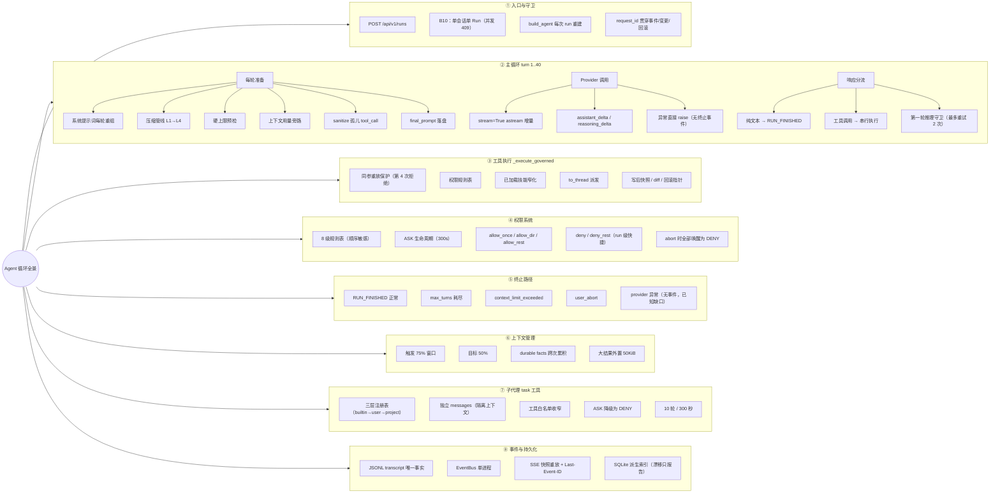

---

## 2. 系统架构图（循环相关组件）

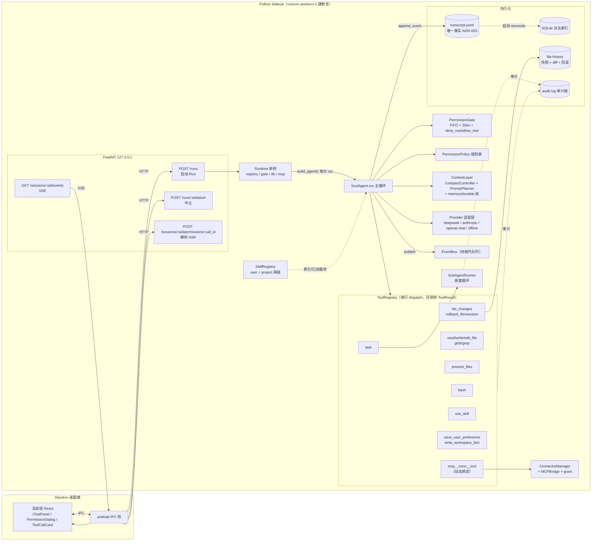

要点：
- **ToolRegistry 是运行期可变的**——MCP 连接成功后由 `MCPBridge.bind` 动态注册 `mcp__*` 工具；`build_agent` 每次把可用 sub-agent 类型注入 `task` 的 schema 描述。
- **Provider 调用、压缩、工具 dispatch 都走 `anyio.to_thread`**——同步阻塞不能卡住事件循环，否则 SSE 断流、Electron 看门狗误判后端崩溃。
- JSONL 是唯一事实；SQLite 只是派生索引，启动时 reconcile，**漂移只报告不自动修**（DB 打不开才自动重建）。

---

## 3. 一次 Run 的生命周期（状态机）

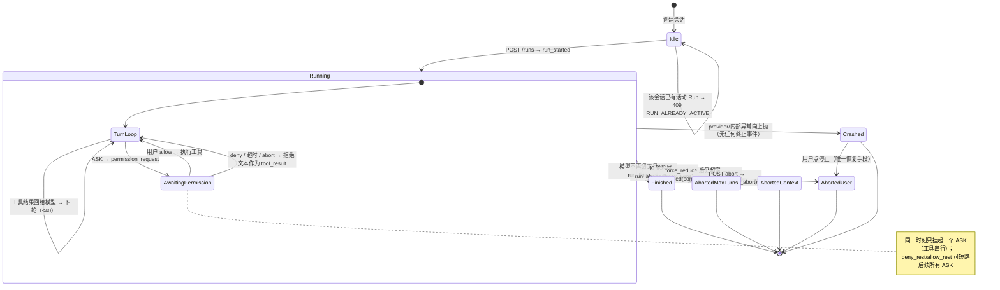

> 前端没有"是否运行中"的独立接口，`running` 状态靠历史事件推断：最后一个 `run_started` 是否已被 `run_finished/run_aborted` 覆盖（`App.tsx:141`）。

---

## 4. 主循环详细流程图（`SoulAgent.run`）

编号对应 `agent.py` 的执行顺序。

```mermaid
flowchart TD
    S1(["POST /runs"]) --> S2{"该会话已有活动 Run？"}
    S2 -- 是 --> S3["409 RUN_ALREADY_ACTIVE"]
    S2 -- 否 --> S4["build_agent：scope/policy/provider/<br/>context/skills/subagents/runner_factory"]
    S4 --> S5["asyncio.create_task(_run)"]

    subgraph INIT["① Run 初始化（agent.py:87-116）"]
        I1["清零：_call_counter / modified_files / turns_used<br/>approver.reset_run_flags()（清 deny_rest/allow_rest）"]
        I2["request_id = new_id()<br/>messages = bootstrap_messages（JSONL 回放）<br/>+ initial_user_message(text)"]
        I3["emit MESSAGE(user) → emit RUN_STARTED"]
        I4{"skills.match(text)<br/>read_when 触发词命中？"}
        I5["load 技能全文<br/>emit SKILL_LOADED(auto)"]
        I1 --> I2 --> I3 --> I4
        I4 -- 是 --> I5
        I4 -- 否 --> LOOP
        I5 --> LOOP
    end

    S5 --> INIT

    subgraph TURN["② 每轮准备（agent.py:118-199）"]
        T1{"turn == 32？"}
        T1b["emit TURN_BUDGET_WARNING<br/>（80% 预算预警）"]
        T2["组装 tools_specs + 系统提示词（每轮重组：<br/>role/tools/memory/durable/skills/subagents/MCP/root）"]
        T3["to_thread: compact_if_needed（绝不 raise）"]
        T4{"check_hard_limit 超窗？"}
        T5["force_reduce：截断 tool_result<br/>只留 system+leading+最后一组"]
        T6{"复检仍超窗？"}
        T7["emit CONTEXT_LIMIT_EXCEEDED<br/>+ MESSAGE(终止说明) + RUN_ABORTED<br/>return（truncated）"]
        T8["旁路：emit CONTEXT_USAGE（估算，异常吞掉）"]
        T9["sanitize_tool_messages：<br/>孤儿 tool_call 注入占位结果"]
        T10["emit FINAL_PROMPT<br/>（本轮真实请求快照，调试/审计）"]
        T1 -- 是 --> T1b --> T2
        T1 -- 否 --> T2
        T2 --> T3 --> T4
        T4 -- 是 --> T5 --> T6
        T4 -- 否 --> T8
        T6 -- 否 --> T8
        T6 -- 是 --> T7
        T8 --> T9 --> T10
    end

    subgraph CALL["③ Provider 调用（agent.py:200-233）"]
        C1{"stream？"}
        C2["astream(req, on_delta, on_reasoning_delta)<br/>assistant_delta / reasoning_delta<br/>（sequence=0，只发总线不落盘）"]
        C3["to_thread: provider.create(req)"]
        C4["异常：log + raise（冒泡，无终止事件）"]
        C5["官方 usage 非估算？<br/>→ calibrate → emit CONTEXT_USAGE"]
        C1 -- 是 --> C2
        C1 -- 否 --> C3
        C2 -- 异常 --> C4
        C3 -- 异常 --> C4
        C2 --> C5
        C3 --> C5
    end

    T10 --> C1

    subgraph RESP["④ 响应分流（agent.py:235-306）"]
        R1a{"turn==1 且 wants_tools<br/>且 retries<2？"}
        R1b{"第一轮推理合格？<br/>长度≥20 且含任务分类词<br/>且含计划/委托词"}
        R1c["注入引导 user 消息（分析任务/列步骤/是否委托）<br/>丢弃本轮 raw_assistant，不 emit 任何工具事件<br/>continue → 回主循环"]
        R2{"wants_tools 且文本为空？"}
        R3["emit_text = '我来xx…'<br/>（只改 emit，raw_assistant 保持原样）"]
        R4["messages += raw_assistant<br/>record_usage（SQLite，无 usage 则估算+计价）<br/>reasoning? → emit REASONING<br/>emit MESSAGE(assistant)<br/>逐个 emit FUNCTION_CALL"]
        R5{"wants_tools？"}
        R6["emit RUN_FINISHED(turns)<br/>return RunResult(text)"]
        R1a -- 是 --> R1b
        R1b -- 否 --> R1c
        R1b -- 是 --> R2
        R1a -- 否 --> R2
        R2 -- 是 --> R3 --> R4
        R2 -- 否 --> R4
        R4 --> R5
        R5 -- 否 --> R6
    end

    C5 --> R1a

    subgraph EXEC["⑤ 工具串行执行（agent.py:308-403）"]
        E1["for call in tool_calls"]
        E2{"写类工具？<br/>write_file/edit_file"}
        E3["emit FILE_HISTORY_SNAPSHOT(pre)<br/>（改前基线 isSnapshotUpdate=false）"]
        E4["_execute_governed（见第 5 节）<br/>外层 try/except 兜底转 ToolResult"]
        E5{"写成功？"}
        E6["emit FILE_HISTORY_SNAPSHOT(post)<br/>file_history.append_change（diff+索引+回滚指针）<br/>modified_files 追加"]
        E7["messages += tool_result<br/>emit FUNCTION_CALL_RESULT"]
        E8{"present_files 成功？"}
        E9["emit ARTIFACT_PRESENTED<br/>（前端渲染交付卡片+自动预览）"]
        E10{"还有未执行的 call？"}
        E1 --> E2
        E2 -- 是 --> E3 --> E4
        E2 -- 否 --> E4
        E4 --> E5
        E5 -- 是 --> E6 --> E7
        E5 -- 否 --> E7
        E7 --> E8
        E8 -- 是 --> E9 --> E10
        E8 -- 否 --> E10
        E10 -- 是 --> E1
    end

    R5 -- 是 --> E1
    E10 -- 否 --> LOOP

    LOOP{"for turn in 1..40"}
    LOOP --> T1

    R6 --> DONE(["Run 正常结束"])
    T7 --> DONE
    LOOP -- "40 轮自然耗尽" --> MAXT["emit RUN_ABORTED(max_turns)<br/>return（truncated，副作用保留不回滚）"] --> DONE
    C4 --> CRASH(["任务异常结束<br/>已执行副作用保留；无 run_aborted（已知缺口）"])
```

---

## 5. 单个工具调用的受控子流程（`_execute_governed`）

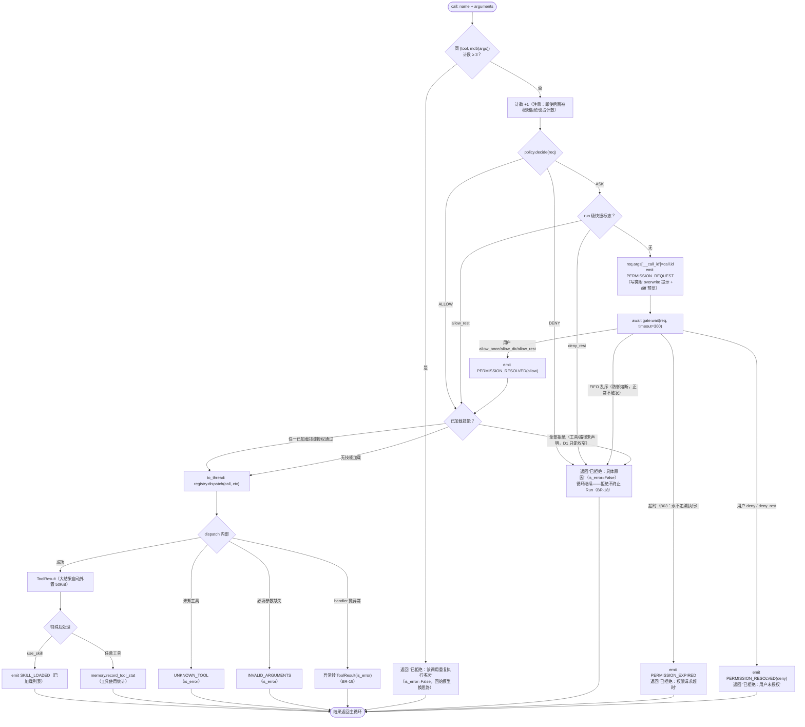

> 被权限/重放拒绝的 `ToolResult` **不标记 `is_error`**——只有真实执行失败才标。二者都会作为 tool_result 文本回给模型，由模型决定换路径还是结束。

---

## 6. 权限规则决策树（`PermissionPolicy.decide`，顺序敏感）

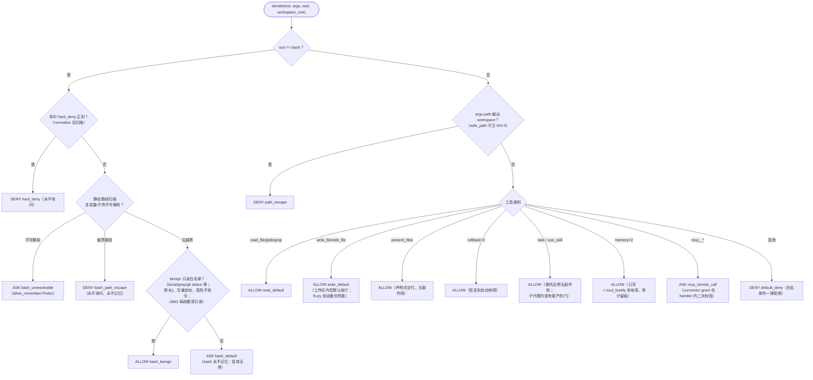

AS：以上是**静态规则**。`ask_remember`（`allow_dir` 记住目录 30 天）在数据层已实现（`permissions/memory.py`），但见第 12 节：目前没有接线。

---

## 7. 关键时序图

### 7.1 正常的一轮（含流式）

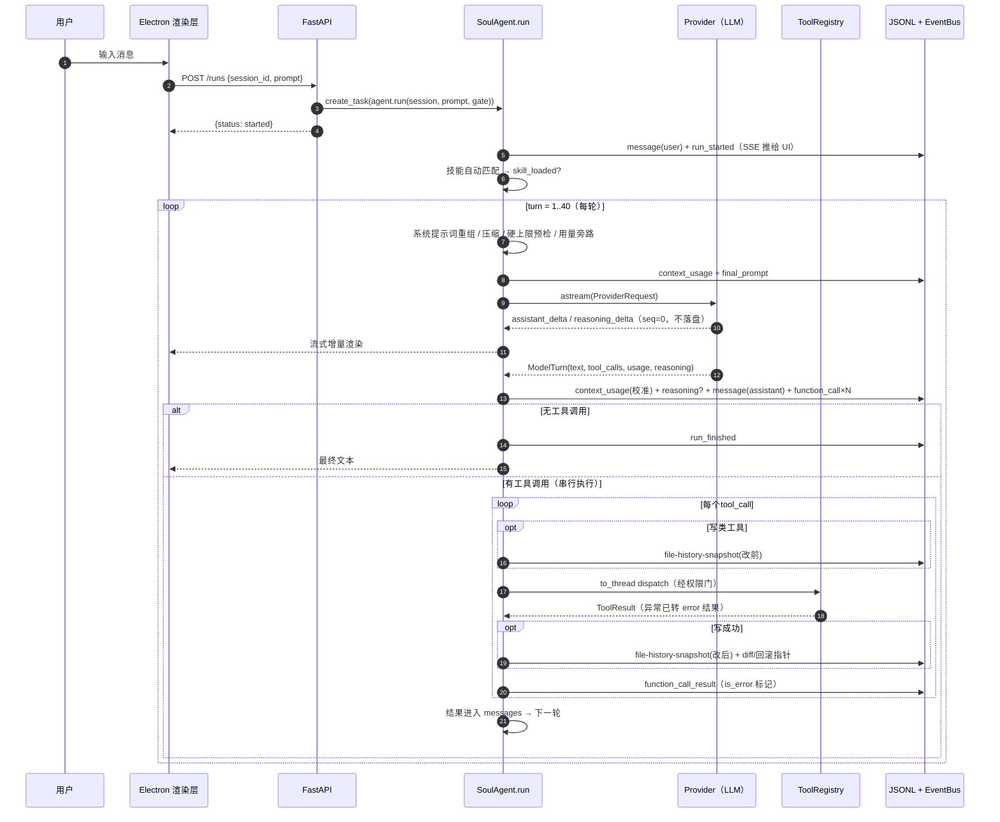

### 7.2 权限 ASK → 用户决策 / 超时

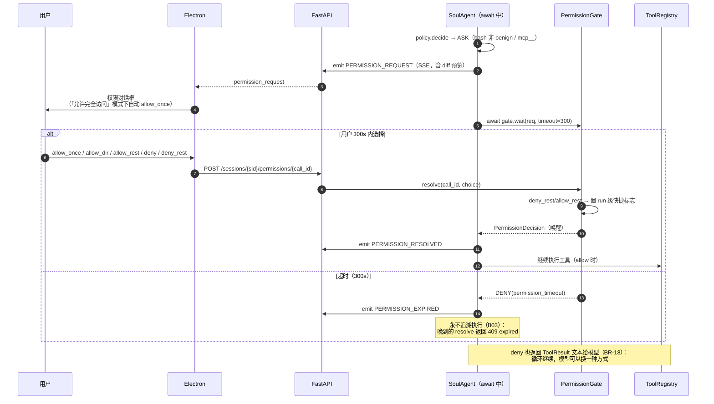

### 7.3 用户中止（abort）

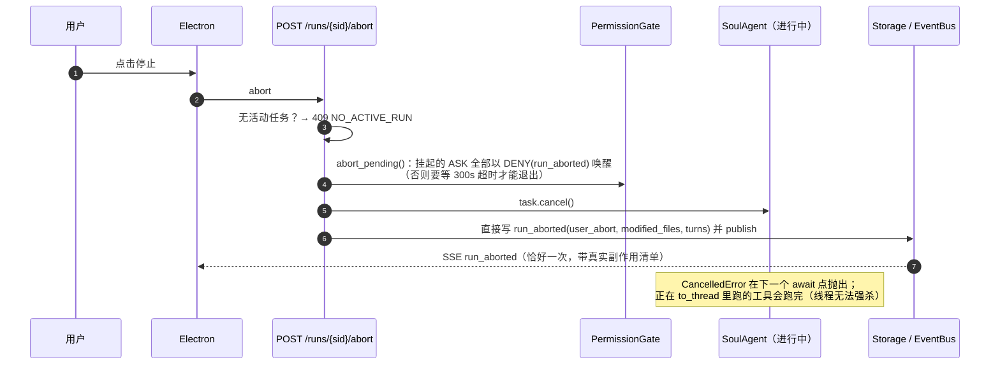

### 7.4 task 子代理委托（嵌套循环）

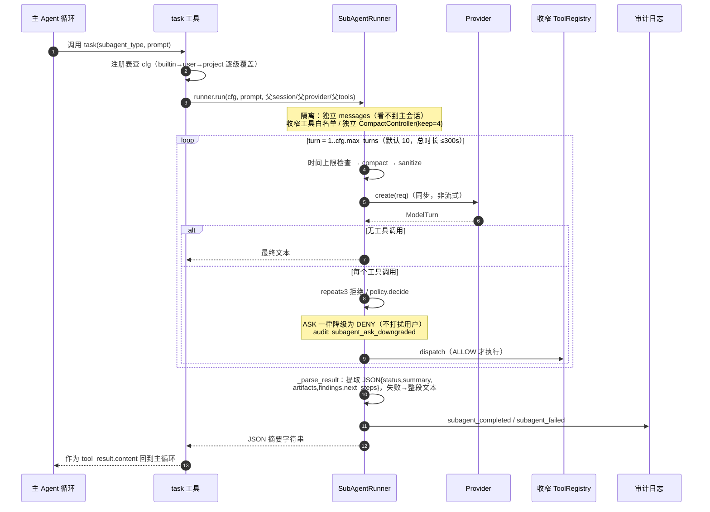

---

## 8. 子代理嵌套循环（分支视图）

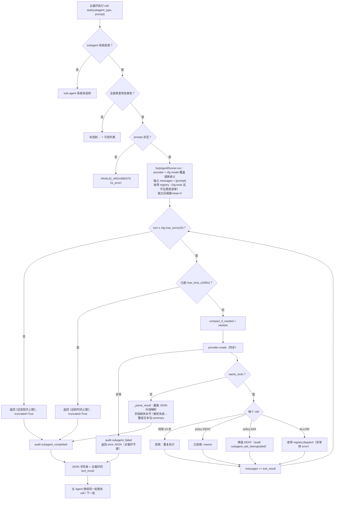

**禁用工具清单**（`SUBAGENT_FORBIDDEN_TOOLS`，即使 cfg.tools 声明也会剔除）：
`task`（不可递归）、`present_files`、`rollback_file/session`、`list_changes`、`save_user_preference`、`write_workspace_fact`（记忆写入是主会话语义）。

---

## 9. 上下文压缩管线（`CompactController`，每轮 provider 调用前）

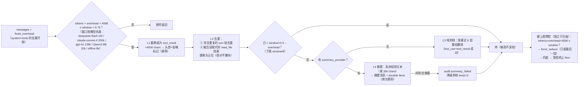

设计不变量：**压缩绝不 raise**——内部任何异常都转 audit 事件后原样返回，硬上限预检 + MAX_TURNS 是最后防线。durable facts 存在 controller 上并作为系统提示词独立段渲染，不受有损压缩影响（P1-7）。

---

## 10. 会话恢复：`bootstrap_messages`（每次 Run 从 JSONL 重建）

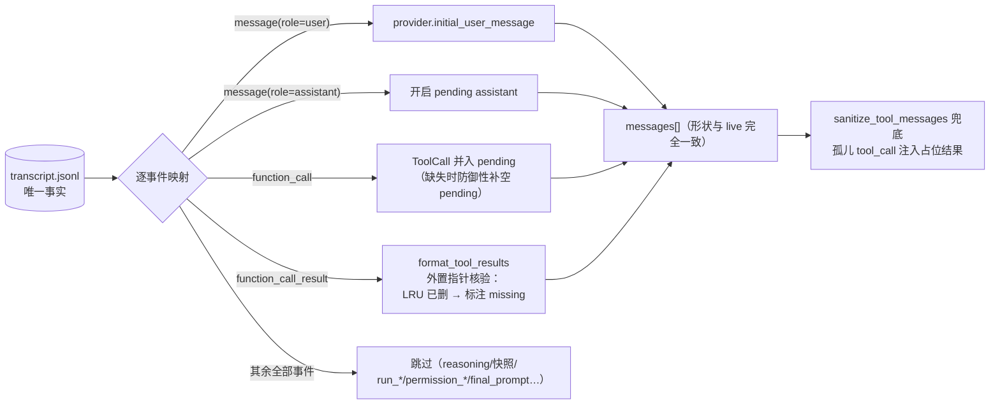

> 加上主循环里每次 provider 调用前的 `sanitize`，保证 **"assistant 声明了 tool_call → 必有配对 tool_result"**，否则 OpenAI/DeepSeek 直接 400 拒单。半写的最后一行 JSON 由 `_recover_tail` 截断。

---

## 11. 汇总清单

### 11.1 所有循环

| # | 循环 | 位置 | 上限 / 出口 |
|---|---|---|---|
| 1 | **主 turn 循环** | `agent.py:118` `for turn in 1..40` | 无工具调用→完成；40 耗尽→abort；硬超窗→abort；异常→冒泡 |
| 2 | **单轮工具串行循环** | `agent.py:308` `for call in tool_calls` | 固定遍历本轮全部 tool_calls（不并发，避免写冲突/审计乱序） |
| 3 | **第一轮推理重试** | `agent.py:241` `continue` 回主循环 | 最多 2 次，第 3 次的 tool_calls 放行 |
| 4 | **权限等待** | `gate.wait`（单挂起，FIFO） | 用户 resolve / 300s 超时 / abort 唤醒 / run 级快捷短路 |
| 5 | **子代理嵌套循环** | `runner.py:234` `for turn in 1..cfg.max_turns` | 无工具调用→返回；10 轮 / 300s → truncated；异常→error JSON |
| 6 | **压缩早停链** | `compact.py:_compact` | L1→L2→达标即停→L4/剪枝 |
| 7 | **SSE 订阅循环** | `events.py:_generator` `while True` | 客户端断开；`Last-Event-ID` 重放由 events 端点处理 |
| 8 | **bootstrap 回放** | `storage.py:236` | 一次性遍历事件流 |
| 9 | **MCP 自动连接**（启动期） | `runtime.py:123` | 每个配置的 connector 一次，失败只记审计不阻断 |

### 11.2 所有护栏（防失控机制）

| 护栏 | 值 / 规则 | 代码 |
|---|---|---|
| 轮次上限 | MAX_TURNS=40，第 32 轮预警 | `config.py:14` |
| 同参重放保护 | 同 (tool, md5(args)) 第 4 次起拒绝（每 Run 域） | `agent.py:416` |
| 第一轮推理守卫 | 文本≥20 字符且含分类词+计划词，最多重试 2 次 | `agent.py:495` |
| 权限超时 | 300s（BR-13），超时永不追溯执行（B03） | `gate.py:18` |
| 权限 FIFO | 只允许一个挂起 ASK；乱序直接 DENY（防御熔断） | `gate.py:50` |
| run 级快捷 | deny_rest / allow_rest，每次 Run 开头重置 | `gate.py:89` |
| bash 硬拒绝 | hard_deny 正则（normalize 后） | `normalize.py` |
| bash 路径逃逸 | 静态扫描，越界 DENY（不问不记） | `bash_scan.py` |
| bash 白名单 | benign 只读命令自动放行；`$()`、写重定向、危险子命令、curl -o / wget 均升级 ASK | `policy.py:88` |
| 工具路径守卫 | `safe_path` 越界 DENY（INV-6） | `policy.py:241` |
| bash 超时 | 60s（上限 300，不暴露给模型 schema） | `config.py:50` |
| 技能窄化 | 已加载技能只能**收窄** harness 策略（D1） | `skills/registry.py:126` |
| 子代理禁用工具 | task/present/rollback×2/list_changes/memory×2 | `config.py:104` |
| 子代理上限 | 10 轮 / 300s / keep_recent_turns=4 | `config.py:102` |
| 压缩安全 | 绝不 raise；失败降级纯剪枝（A12） | `compact.py:268` |
| 硬上限预检 | 超窗请求不发出去；force_reduce 后仍超则受控终止（P0-4） | `agent.py:139` |
| tool_result 配对 | 每个调用必有结果消息 + sanitize 占位（防 400） | `agent.py:325`、`base.py:117` |
| 工具异常转数据 | dispatch 异常转 ToolResult，不崩循环（BR-19） | `registry.py:279` |
| 单会话单 Run | 活动任务存在 → 409 RUN_ALREADY_ACTIVE（B10） | `runs.py:25` |
| 大结果外置 | >50KiB 落盘，上下文只留指针+预览；配额 200MB/500 文件每会话 | `config.py:37` |
| sidecar 安全 | 只绑 127.0.0.1；bootstrap token 一次性 60s；workers=1 断言 | `config.py`、`runtime.py:328` |

### 11.3 所有终止 / 退出路径

| # | 路径 | 事件序列 | RunResult | 副作用 |
|---|---|---|---|---|
| 1 | 正常完成（模型不再调工具） | `run_finished` | truncated=False | 保留 |
| 2 | 40 轮耗尽 | `run_aborted(max_turns)` | truncated=True | 保留（BR-28 不自动回滚） |
| 3 | 硬超窗（force_reduce 后仍超） | `context_limit_exceeded` + `message(终止说明)` + `run_aborted` | truncated=True | 保留 |
| 4 | 用户中止 | `run_aborted(user_abort)`（API 层直接写，恰一次） | —（任务被 cancel） | 保留；响应带 modified_files |
| 5 | provider / 内部异常 | **无任何事件**（`runs.py` 只 log） | 任务异常结束 | 已执行部分保留 |
| 6 | 删除会话 | 先 abort+cancel，再 `rmtree` 会话目录 | — | 全部删除（尽力而为，文件锁则失败） |

### 11.4 单次 Run 的完整事件时序（发射顺序）

| 阶段 | 事件 | 条件 | 落盘 |
|---|---|---|---|
| 启动 | `message(role=user)` → `run_started` | 每次 | ✅ |
| 启动 | `skill_loaded(auto)` | read_when 命中 | ✅ |
| 每轮 | `turn_budget_warning` | turn==32 | ✅ |
| 每轮 | `context_usage`（估算） | 每轮 | ✅ |
| 每轮 | `final_prompt`（真实请求快照） | 每轮 | ✅ |
| 流式 | `assistant_delta` / `reasoning_delta` | stream 模式 | ❌ seq=0 仅总线 |
| 每轮 | `context_usage`（官方 usage 校准） | usage 非估算 | ✅ |
| 每轮 | `reasoning` | 模型返回 reasoning | ✅（不映射回 LLM） |
| 每轮 | `message(role=assistant)` → `function_call`×N | 每轮 | ✅ |
| 每工具 | `file-history-snapshot`(改前) | 写类工具 | ✅ |
| 每工具 | `permission_request` → `permission_resolved` / `permission_expired` | ASK 时 | ✅ |
| 每工具 | `function_call_result` | 每个 call | ✅ |
| 每工具 | `file-history-snapshot`(改后) | 写成功 | ✅ |
| 每工具 | `artifact_presented` | present_files 成功 | ✅ |
| 每工具 | `skill_loaded` | use_skill 成功 | ✅ |
| 结束 | `run_finished` / `run_aborted` | 见 11.3 | ✅ |

---

## 12. 边缘路径与已知缺口（阅读代码时值得注意的"非常规行为"）

1. **provider 异常无终止事件**：`agent.py:215` provider 调用失败直接 `raise`，`runs.py:_run` 只 log；`RUN_STARTED` 之后再无任何事件落盘。前端 `running` 状态悬挂，直到切换会话重新拉历史。这是当前最明显的缺口。
2. **`allow_dir` 记忆未接线**：`PermissionMemory.remember/match`（30 天 TTL）已实现，但运行时没有任何调用方——`gate.resolve` 算出 `allow_remember` 无人消费，`policy.decide` 也不查已记住的规则。选择"允许本目录"实际只对当次调用生效。
3. **`MAX_CONCURRENT_RUNS=4`（BR-34）未强制**：只有单会话 B10 守卫，跨会话并发无上限。
4. **取消不能中断已在跑的工具**：`task.cancel()` 只在 await 点生效；`to_thread` 中的 bash/写文件会跑完。abort 响应里的 `modified_files` 是**截至取消时刻**的快照，可能偏少。
5. **重放计数先于权限判断递增**：被权限拒绝的调用也占 `REPEAT_CALL_LIMIT` 名额——同参调用 3 次全被拒后，第 4 次直接被重放保护拒绝（文案不同）。
6. **流式中断丢增量**：`assistant_delta` sequence=0 永不落盘，SSE 断线重连只重放 `sequence > last_id` 的持久事件，正在流式的半截文本不会补发；完整文本最终随 `message` 事件落盘。
7. **第一轮推理守卫会丢弃模型第一次的 tool_calls**（不落盘、不执行），注入引导消息重试；被丢弃的输出只存在于 debug 日志之外 nowhere——这是设计行为，但意味着首轮流式 delta 可能与最终落盘内容不一致。
8. **`emit_text` 与 `raw_assistant` 可能不同**：模型只调工具不说话时，聊天流显示合成的"我来读取 xxx …"，LLM 缓冲区保持原样。回放重建用的是 raw 侧数据，不受影响。
9. **`registry` 是跨会话共享单例**：`build_agent` 会改写 `registry._specs["task"]`（注入可用类型），MCP 绑定也落在同一个 registry 上——单用户桌面场景成立，多用户/多进程需重构。
10. **SQLite 漂移只报告不修**：`check_index` 发现缺事件 → health degraded + 审计留痕，绝不自动补；只有 DB 完全打不开才从 JSONL 重建。
