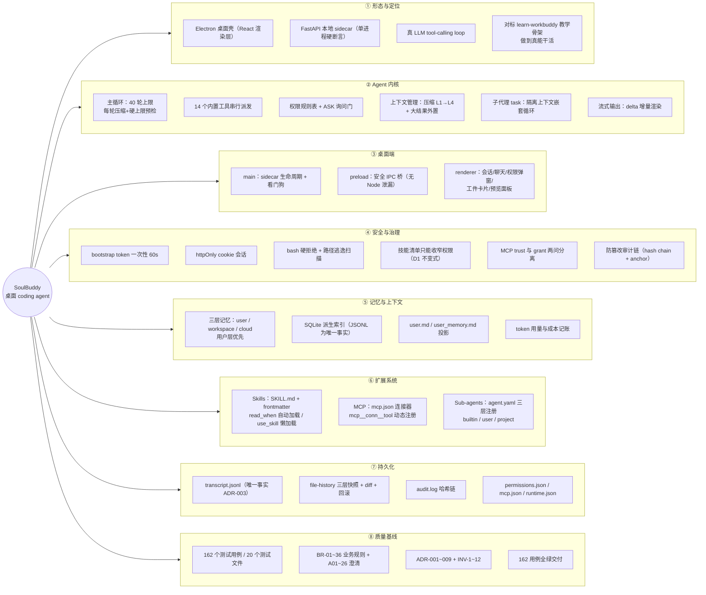
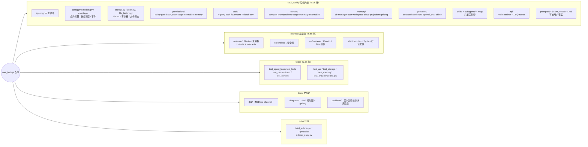
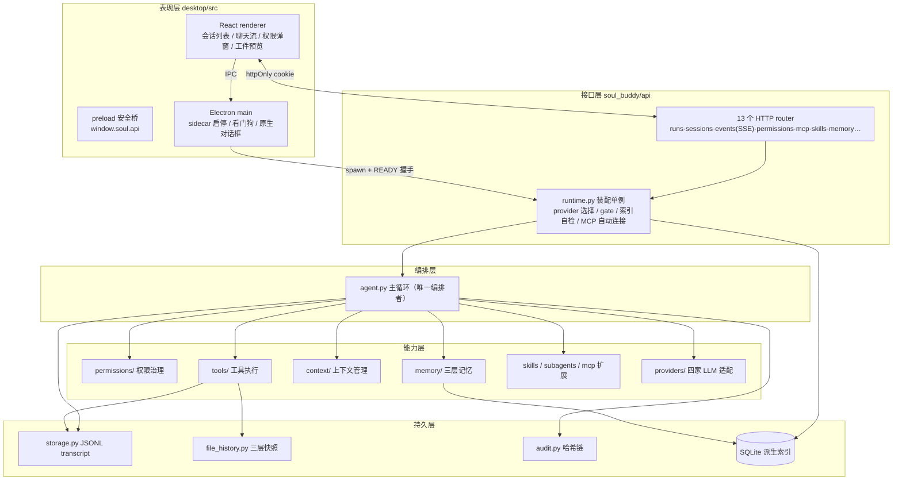
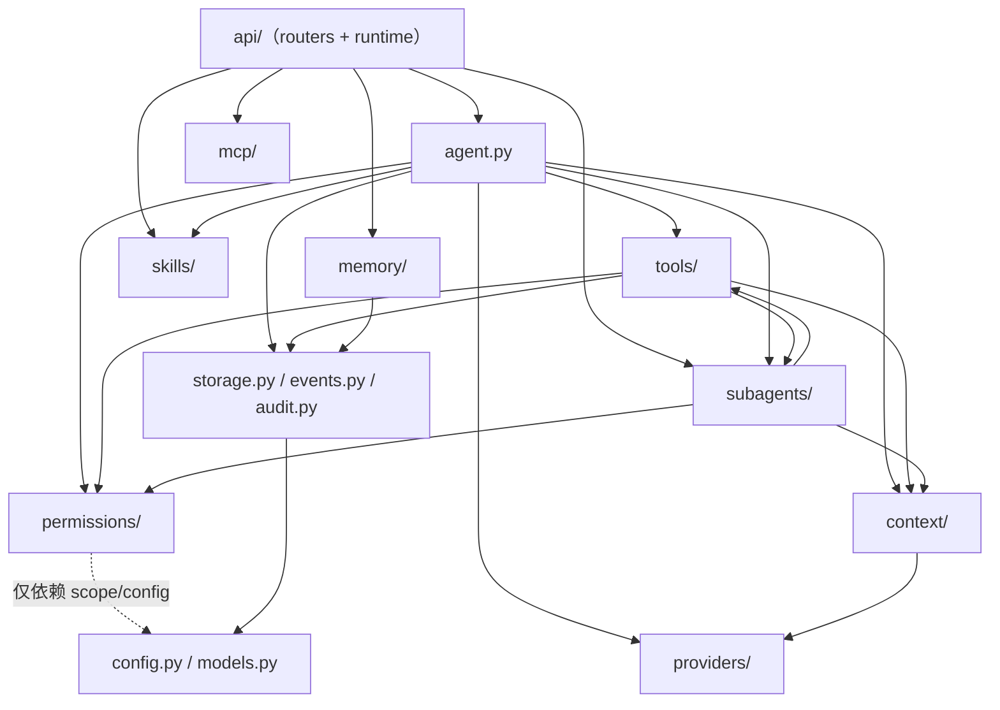

# 项目全景思维导图（Architecture Mindmap）

> 2026-09-13 梳理。本文是**一张地图**：先看图建立全局感，再按「阅读路线」进入各深度文档。
> 事实基线：后端 9,227 行 Python + 桌面端 5,557 行 TS/TSX + 2,489 行测试（20 个文件、162 个用例），
> P0–P5 全部交付。

## 1. 全景思维导图

> 写作说明：用 `flowchart LR` 模拟思维导图（根节点在左，分支向右展开），兼容旧版 mermaid 渲染器。

## 2. 仓库目录思维导图

## 3. 分层架构图

## 4. 模块依赖关系

依赖方向自上而下，**没有反向依赖**（ADR-004：内核不感知 API 层）：

要点：
- `permissions/` 是**最底层的能力模块**——只依赖 config/models，因此任何新执行路径（MCP、skill、sub-agent）都能复用同一套规则表，不存在绕过权限门的路。
- `task` 工具让 `tools/ → subagents/` 形成**受控的循环依赖**（tools 通过 ToolContext 注入的回调调用 subagents，subagents 反向依赖 tools 的 registry）——依赖注入解耦，非 import 环。

## 5. 阅读路线

按目的选路径（都是站内链接）：

| 你想… | 路线 |
|---|---|
| **第一次了解项目** | [项目总览](../overview.md) → 本文 → [模块索引](../modules/INDEX.md) 挑感兴趣的 |
| **搞懂 Agent 循环的每个分支** | [Agent 循环全景图](agent-loop-map.md)（13 张图：思维导图/状态机/主循环流程图/时序图） |
| **理解数据都存在哪、怎么流** | [数据与存储架构](data-and-storage.md) |
| **理解桌面端怎么起来的** | [桌面端架构与生命周期](desktop-architecture.md) |
| **用/写技能、接 MCP 连接器** | [Skills 与 MCP 系统](skills-and-mcp.md) |
| **理解子代理怎么隔离** | [Subagent 架构](subagents-architecture.md) |
| **改某个模块的代码** | 先读对应 [modules/0x.md](../modules/INDEX.md)（设计约束仍有效）→ 再看代码 |
| **追溯一个设计为什么这样定** | [feasibility-analysis.md](../feasibility-analysis.md)（ADR/INV）+ [problems/](../problems/001-tools-permissions-design.md) 三篇决策记录 |
| **跑测试 / 对应用例** | [test-analysis.md](../test-quality/test-analysis.md)（模块 M1–M12 划分）+ [test-cases.md](../test-quality/test-cases.md)（144 条用例） |

## 6. 关键数字速查

| 维度 | 值 | 出处 |
|---|---|---|
| 后端 Python | 9,227 行 / 60+ 文件 | `soul_buddy/` |
| 桌面端 TS/TSX | 5,557 行 | `desktop/src/` |
| 测试 | 20 文件 / 162 用例 / 2,489 行 | `tests/` |
| 内置工具 | 14 个（bash/fs×5/present/rollback×3/skill/task/memory×2） | `tools/registry.py` |
| 事件类型 | 20 种（1 种 delta 仅总线不落盘） | `models.py` |
| Provider | 4 家（deepseek / anthropic / openai-chat / offline 脚本化） | `providers/` |
| 主循环上限 | 40 轮（第 32 轮预警）；同参重放第 4 次拒绝 | `config.py` |
| 权限规则 | 8 级顺序表 + 300s ASK 超时 | `permissions/policy.py` |
| 上下文窗口 | deepseek 64k / anthropic 200k / openai 128k / offline 8k，75% 触发压缩 | `config.py` |
| 子代理 | 默认 10 轮 / 300 秒 / 8 类禁用工具 | `config.py` |
