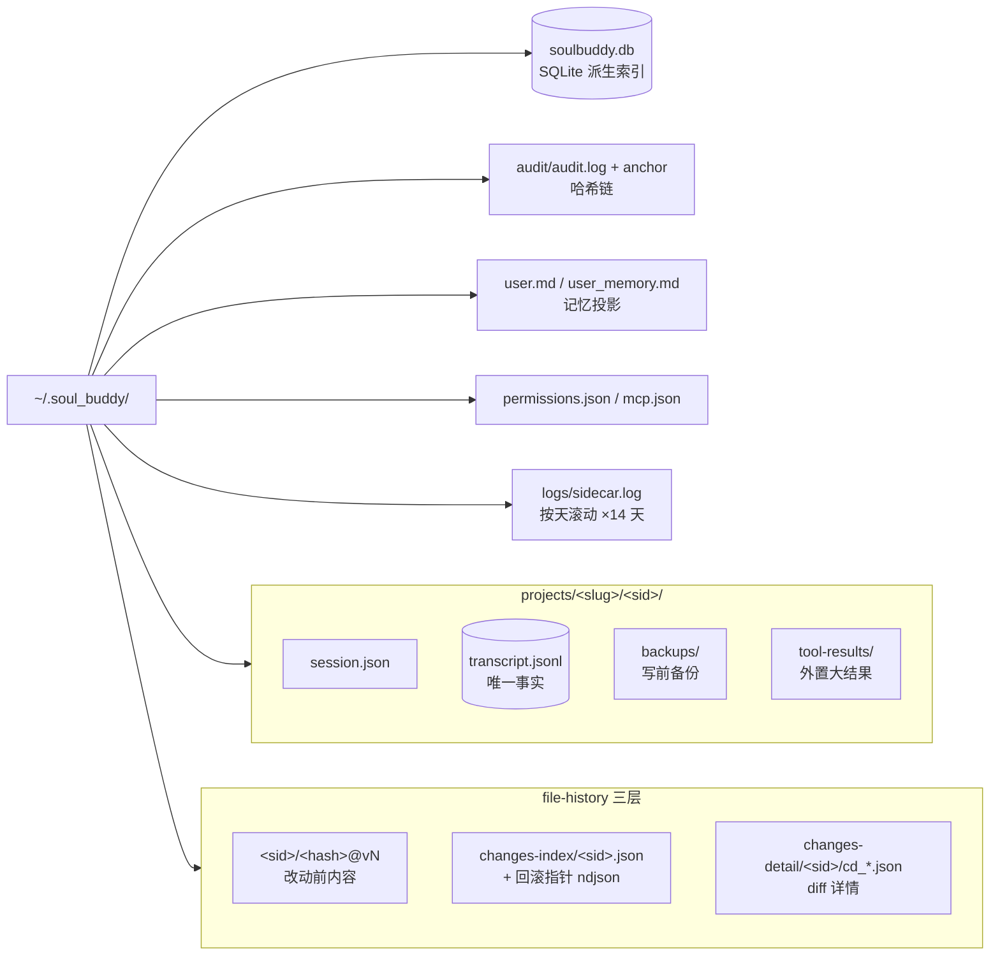
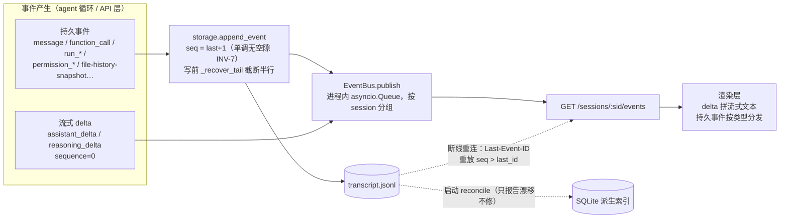
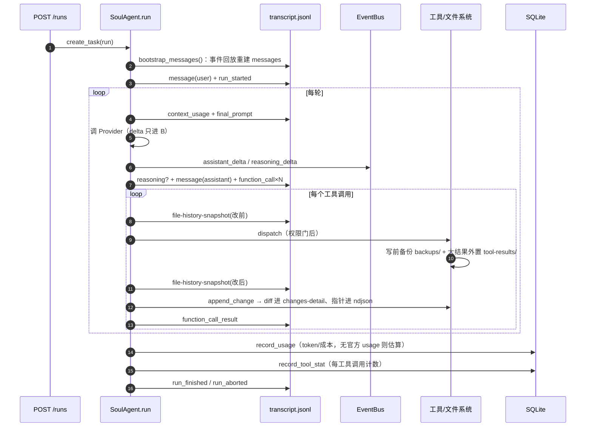
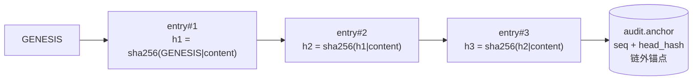
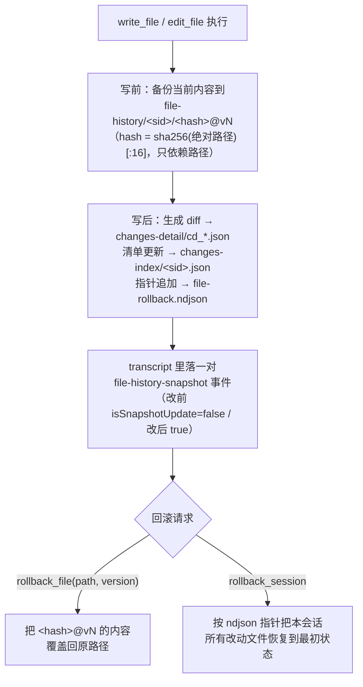
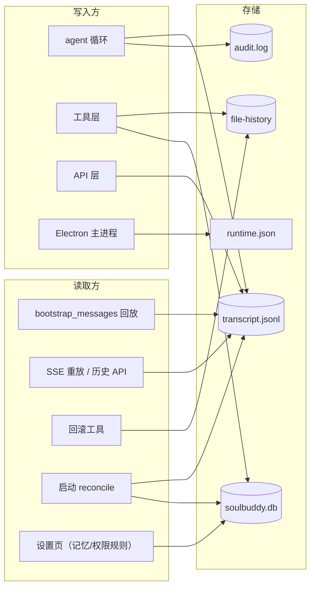

# 数据与存储架构（Data & Storage）

> 回答三个问题：**这个项目把哪些数据写到哪里？事件从产生到被看到经过什么路径？各存储之间谁是事实、谁是派生？**
> 核心原则（ADR-003）：**JSONL transcript 是唯一事实**，SQLite、UI 状态、统计数字全部是可重建的派生品。

## 1. 持久化资产总览

| 资产 | 位置 | 写入者 | 角色 |
|---|---|---|---|
| 会话元数据 | `~/.soul_buddy/projects/<slug>/<sid>/session.json` | SessionStore | 标题/provider/时间 |
| **对话事实** | `~/.soul_buddy/projects/<slug>/<sid>/transcript.jsonl` | agent 循环 `append_event` | **唯一事实（ADR-003）** |
| 派生索引 | `~/.soul_buddy/soulbuddy.db`（SQLite） | MemoryDB | 会话/用量/工具统计/记忆，可重建 |
| 三层记忆 | 同上 SQLite（user/workspace/cloud 三层行） | memory 工具 | 偏好与事实，投影为 user.md |
| 记忆投影 | `~/.soul_buddy/user.md`、`user_memory.md` | projections | 给人看的只读快照 |
| 文件快照内容 | `~/.soul_buddy/file-history/<sid>/<hash>@<vN>` | FileHistoryStore | **改动前**完整文件 |
| 变更清单 | `~/.soul_buddy/changes-index/<sid>.json` | FileHistoryStore | 轻量索引（常驻内存） |
| 变更详情 | `~/.soul_buddy/changes-detail/<sid>/cd_*.json` | FileHistoryStore | 单次变更 diff |
| 回滚指针 | `~/.soul_buddy/changes-index/<sid>.file-rollback.ndjson` | FileHistoryStore | 回滚定位 |
| 工具备份 | `projects/<slug>/<sid>/backups/` | fs.py 写前快照 | 与 file-history 同源 |
| 外置结果 | `projects/<slug>/<sid>/tool-results/` | Externalizer | >50KiB 工具输出落盘 |
| 审计链 | `~/.soul_buddy/audit/audit.log` + `audit.anchor` | AuditLog | 防篡改哈希链 |
| 权限记忆 | `~/.soul_buddy/permissions.json` | PermissionMemory | 30 天 TTL 规则（**未接线**，见文末） |
| MCP 配置 | `~/.soul_buddy/mcp.json` | 用户编辑 | 连接器定义，支持 `${ENV}` 替换 |
| 技能 | `~/.soul_buddy/skills/`、`{workspace}/.soul_buddy/skills/` | 用户 | SKILL.md 目录 |
| 子代理 | `~/.soul_buddy/subagents/`、`{workspace}/.soul_buddy/subagents/` + 包内 builtin | 用户 | agent.yaml 目录 |
| 运行时状态 | `%APPDATA%/<app>/runtime.json` | Electron 主进程 | pid/port（退出时删除） |
| 日志 | `~/.soul_buddy/logs/sidecar.log`（按天滚动，留 14 天） | logging_setup | 后端全部输出 |

`<slug>` 是 workspace_root 的路径指纹（`C:\andy\codebase\soul_buddy` → `c-andy-codebase-soul_buddy`），同一项目的会话归在一个项目目录下。

## 2. 目录结构一图

## 3. 事件生命周期（从产生到被看到）

20 种事件分两类归宿——**持久事件**（写 JSONL + 推总线）和**流式 delta**（只推总线，sequence=0 永不落盘）：

三条铁律：
1. **先落盘再推总线**——`_aemit` 是 `append_event → publish` 的顺序，SSE 断线重连能从 JSONL 补齐，不丢事实。
2. **delta 永不落盘**——重连只重放 `sequence > last_id` 的持久事件，正在流式的半截文本不补发（完整文本随后随 `message` 事件落盘，因此最终一致）。
3. **JSONL 半行自愈**——每次 append 前跑 `_recover_tail`：解析到坏行即截断保留此前的好行（崩溃最坏丢一条事件）。

## 4. 一次 Run 的数据流时序

## 5. 审计链（防篡改哈希链）

- 每条记录的哈希包含前一条的哈希——改任何一条历史记录都会导致后续全部哈希对不上。
- `audit.anchor` 独立存放链尾指针；`verify_state()` 返回四态：`ok / empty_ok / degraded / tampered`——被篡改或被删尾巴都能检出。
- 谁在写：权限决策、MCP 连接、压缩事件（compact_failed / summary_failed）、子代理生命周期、记忆冲突、索引漂移……凡是"需要事后说得清"的动作。

## 6. 文件历史与回滚（三层存储）

注意：**快照存的是"改动前"**，所以"回滚到 vN"= 恢复成第 N 次改动之前的样子。快照只依赖路径哈希，同一文件反复修改产生 v1、v2、v3…版本链。

## 7. 大结果外置与配额

- 工具输出超过 **50 KiB**（严格大于）→ 全文写入 `tool-results/`，上下文里只留 **2 KiB 预览 + 指针**；
- bash 是最大的上下文消耗者，另有独立规则：内联超 20,000 字符时头 14k + 尾 5k 裁剪（错误通常在尾部）；
- 配额（超出触发 LRU 清理）：单会话 **200 MB / 500 个文件**，全局 **2 GB**；
- LRU 清理可能删掉 transcript 里仍被引用的外置文件——**回放时**（`bootstrap_messages`）会核验指针，缺失的标注 `status="missing"`，不会让请求失败。

## 8. 事实与派生：一致性策略

| 关系 | 策略 |
|---|---|
| JSONL → SQLite | **单向派生**。启动时 `reconcile` 对账：发现缺事件只报告（health degraded + audit_gap），**绝不自动补**；只有 DB 完全打不开才从 JSONL 全量重建（自愈）。 |
| JSONL → messages[] | 每次 Run 从头回放重建（`bootstrap_messages`），与 live 形状逐字节一致；配 `sanitize_tool_messages` 兜底孤儿 tool_call。 |
| SQLite → user.md 投影 | 写记忆后立即重建；启动时也重建（用户手改过文件也能纠正回来）。投影失败不影响运行（只发 audit 事件）。 |
| file-history → 回滚 | 全部本地文件操作，无网络、无云端。 |
| permissions.json | 已声明 30 天 TTL 规则（`remember/match`），但**运行时尚无调用方**——`allow_dir` 目前只对当次生效，规则不会持久化，`policy.decide` 也不查已存规则。待接线。 |

## 9. 谁写谁读速查

