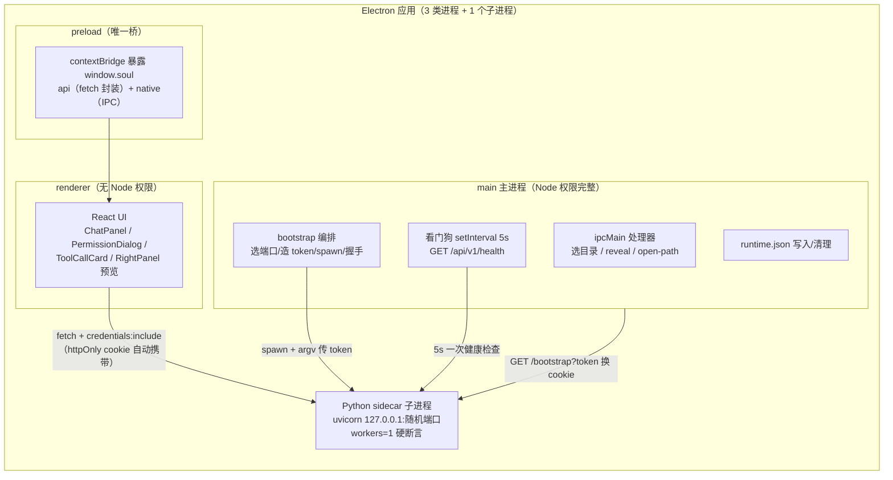
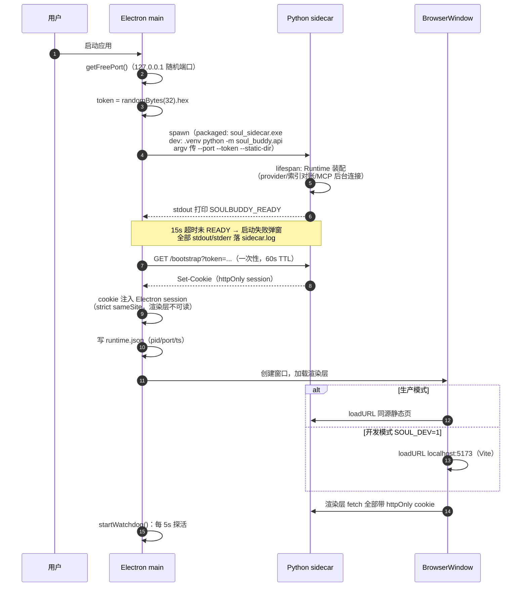
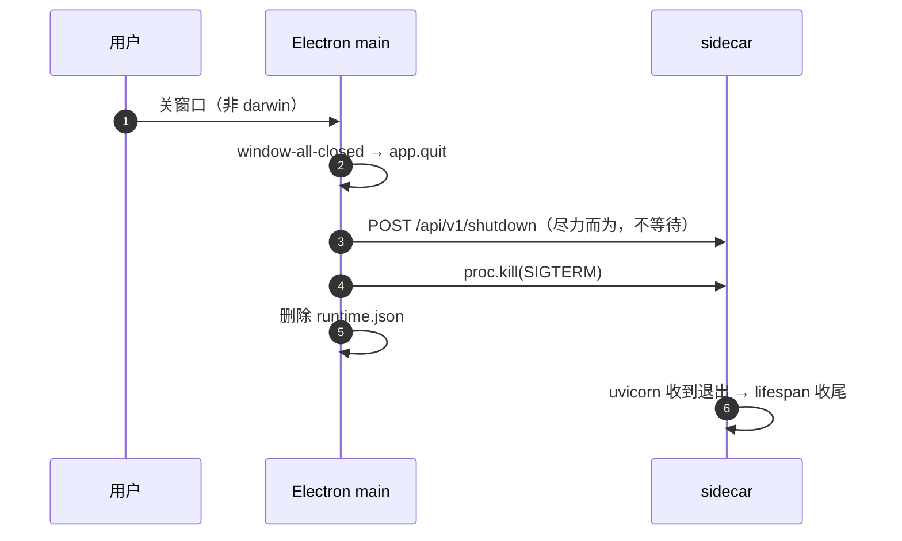

# 桌面端架构与生命周期（Desktop Architecture）

> 回答：**Electron 窗口点开后到能聊天，中间发生了什么？进程怎么拉起、怎么守护、怎么退出？**
> 代码：`desktop/src/main/index.ts`（主进程编排）、`sidecar.ts`（sidecar 拉起与握手）、`preload/index.ts`（安全桥）。

## 1. 进程与信任边界

信任边界设计（A09）：
- **token 只活在主进程**——`crypto.randomBytes(32)` 生成、经 argv 传给 sidecar、主进程亲自调 `/bootstrap` 换 cookie，**从不进入渲染层 JS**，DevTools 里看不到；
- **渲染层零 Node 能力**——`contextIsolation: true` + `nodeIntegration: false`，所有原生能力（选目录、打开文件）走 `ipcMain.handle` 白名单；
- **sidecar 只绑 127.0.0.1**，生产模式渲染层与 API 同源（sidecar 直接托管静态文件），无 CORS；仅开发模式（`SOUL_DEV=1`）为 Vite 的 `localhost:5173` 开 CORS；
- sidecar 启动前**剥离全部 proxy 环境变量**并设 `NO_PROXY=*`——Windows 上 httpx 会拾取系统代理（Clash/v2ray TUN 的 SOCKS），本地纯回环通信不需要代理。

## 2. 启动时序（从双击到可聊天）

两个容易忽略的细节：
- **preload 会主动要配置**（`soul:request-config`）——渲染层 mount 可能早于主进程推送 `soul:config`，只靠 `did-finish-load` 事件会有一瞬间的竞态；
- **dev 模式 Python 优先用项目 `.venv`**（`findProjectRoot` 向上找 `soul_buddy/api/__main__.py`），找不到才回退 `SOUL_PYTHON` 环境变量或 PATH 上的 `python`。

## 3. 运行期守护与失败表现

| 机制 | 行为 | 用户看到什么 |
|---|---|---|
| READY 握手超时 | spawn 后 15s 内 stdout 没出现 `SOULBUDDY_READY` → 启动失败 | "启动失败"弹窗 + `sidecar.log` 里的 Python 崩溃栈 |
| sidecar 提前退出 | 子进程 exit 且 code≠0 → reject | 同上 |
| 看门狗（5s 周期） | `GET /api/v1/health` 失败 → 弹错误框并停止看门狗 | "后端已退出，请重启应用" |
| 优雅关闭 | `before-quit` → POST `/api/v1/shutdown` → `SIGTERM` → 删 runtime.json | 进程不留残留 |
| SSE 断线 | EventSource 自动重连，带 `Last-Event-ID`；服务端先重放 JSONL 缺口再续直播 | 断线期间的消息自动补齐（正在流式的半截文本除外） |

已知边界（诚实记录）：
- **心跳自杀未接线**——config 里有 `HEARTBEAT_INTERVAL/TIMEOUT` 常量（设计：Electron 周期写 runtime.json，sidecar 检测过期自尽），实际桌面端只在启动后写一次 runtime.json，sidecar 也没有过期自检逻辑。当前防挂死靠的是**看门狗弹窗**而非自动恢复；
- 看门狗触发后只弹窗不停应用——窗口仍开着，所有请求会持续失败，需要用户手动重启。

## 4. 关闭时序

正在运行的 Agent Run 不会等：退出即中断，已落盘的事件都在 transcript 里，`run_aborted` 不会被补发（重启后前端靠历史事件推断状态）。

## 5. 打包形态（dev vs packaged）

| | 开发模式 | 打包模式 |
|---|---|---|
| sidecar | `.venv\Scripts\python.exe -m soul_buddy.api` | `resources/sidecar/soul_sidecar.exe`（PyInstaller 单文件，`build/build_sidecar.py`） |
| 渲染层 | Vite dev server（`localhost:5173`，CORS 白名单） | `resources/renderer/` 静态文件，由 sidecar 同源托管 |
| Python 查找 | `findProjectRoot` → `.venv` → `SOUL_PYTHON` → PATH | 不需要（自带 exe） |
| 日志 | 同一个 `~/.soul_buddy/logs/sidecar.log`（stdout/stderr 全量带时间戳落盘） | 同左 |
