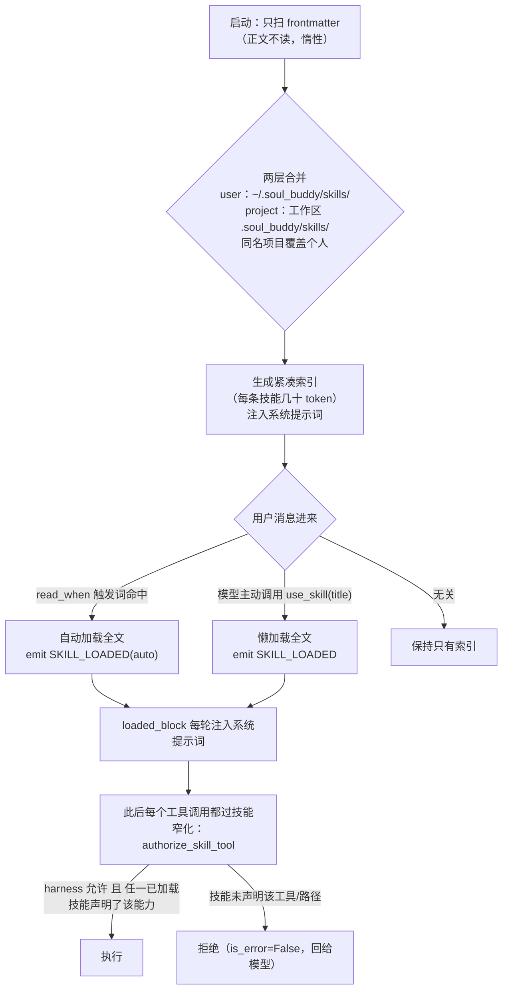
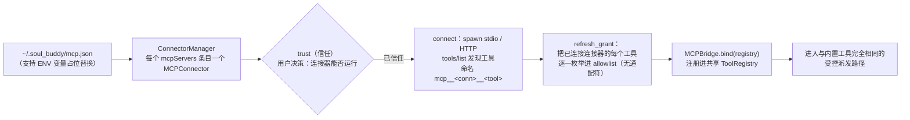
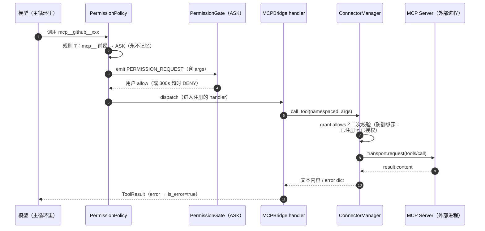
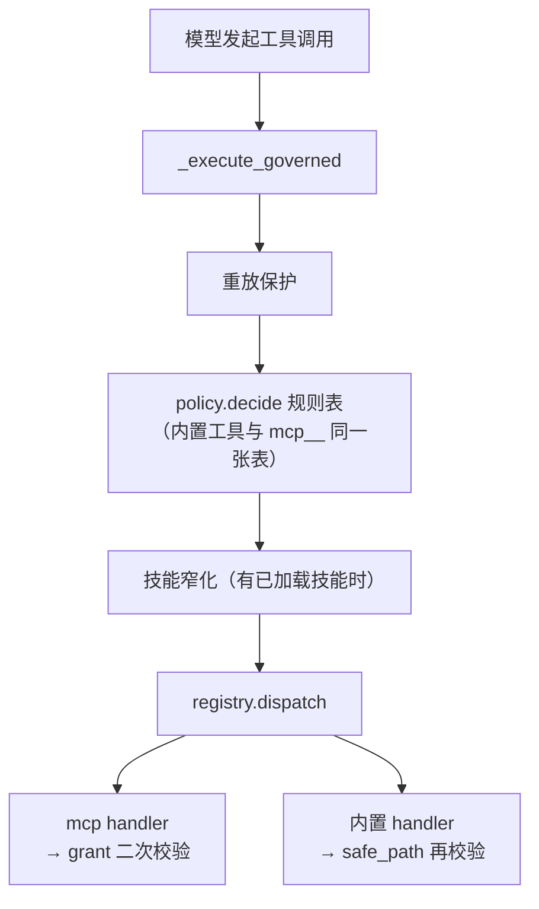

# Skills 与 MCP 系统（扩展机制）

> P5 引入的两套扩展：**Skills**（把领域知识注入提示词，附带声明式权限清单）和 **MCP 连接器**（把外部工具接入同一个受控派发路径）。
> 两者的共同设计原则：**扩展只能收窄既有权限，永远不能放大**。

## 1. Skills：懒加载的领域知识

### 1.1 技能长什么样

每个技能是一个目录 + 一份 `SKILL.md`（YAML frontmatter + 正文）：

```markdown
---
title: git-commit
summary: 规范地提交代码
read_when:
  - 提交
  - commit
permissions:
  tools: [bash, read_file]
  network: false
  read_paths: ["src/**"]
  write_paths: []
---
## 提交流程
1. 先 git status 查看变更…
```

frontmatter 解析是**严格校验**的：`permissions.*` 必须是列表、路径模式不允许 `..` 上溯、类型错了整条技能静默跳过（不炸注册表扫描）。

### 1.2 技能生命周期



### 1.3 D1 不变式：清单只能收窄

`authorize_skill_tool` 的判定是 **AND 关系**：

- harness 权限层（`policy.decide`）先判——它拒绝的，技能声明了也没用；
- 有已加载技能时，还须**任一**技能声明了该工具；声明了 `read_paths/write_paths` 时，`fnmatch` 模式外的路径同样拒绝；
- **没有已加载技能时，harness 策略单独生效**。

一句话：技能清单是"天花板上的天花板"，声明能力永远不等于授权。

## 2. MCP：外部工具接入

### 2.1 架构与信任模型



**trust 与 grant 是两个独立的问题**（故意分开）：

| 问题 | 谁决定 | 粒度 |
|---|---|---|
| trust——这个连接器**能不能跑**？ | 用户（UI 开关或启动自动信任） | 整个连接器 |
| grant——它的哪个工具**可被调用**？ | `refresh_grant` 枚举 + 调用时二次校验 | 单个工具名，`frozenset`，无通配符 |

`MCPPermissionGrant.allows(tool)` 要求 `network=true` **且** 工具名在枚举清单里——一个 MCP 工具若未被显式枚举，永远不可达。

### 2.2 启动时的后台自动连接

Runtime 构造完成后起一个**守护线程**：对每个已配置连接器执行 trust → connect → refresh_grant → bind，全部失败只记审计不阻断启动。之所以放后台：npx stdio 连接器 spawn + 握手实测要 20–30 秒，远超 Electron 15 秒的 READY 预算，不能挡在启动关键路径上。工具是"某一轮突然出现"的——每轮 `tools.specs()` 现查注册表，连上后的下一轮模型就能看到。

### 2.3 一次 MCP 调用的完整路径



双重校验是刻意的：注册表里有这个工具（连接器已连接）**不等于**当前 grant 允许调用——两道门由不同的代码路径维护，一道失效另一道还在。

## 3. 与权限层的汇合点

Skills 和 MCP 最终都汇入同一条路径，这正是 `permissions/` 被提升为顶层包的原因（README「会咬人的点」第 1 条）：



## 4. 使用速查

| 操作 | 位置 |
|---|---|
| 装一个技能 | `~/.soul_buddy/skills/<名>/SKILL.md`（全局）或 `{工作区}/.soul_buddy/skills/<名>/SKILL.md`（项目） |
| 看已装技能 | 设置面板 Skills 列表 / `GET /api/v1/skills` |
| 接一个连接器 | 编辑 `~/.soul_buddy/mcp.json`（参照 mcpServers 标准格式），重启后在 MCP 面板信任/连接 |
| 让模型用上外部工具 | 连接成功即自动注册；模型在下一轮的工具列表里看到 `mcp__<连接器>__<工具>` |
| 系统提示词被技能/索引撑太大？ | 每轮 `CONTEXT_USAGE` 事件可查分段开销；压缩触发的阈值已计入 system + tools 开销（P0-3） |
