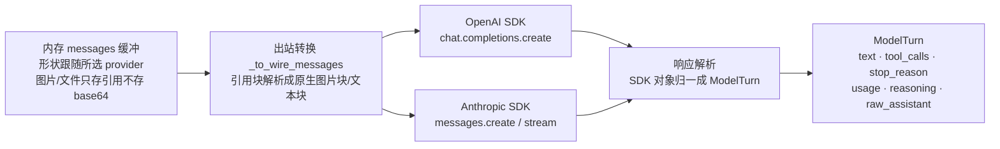
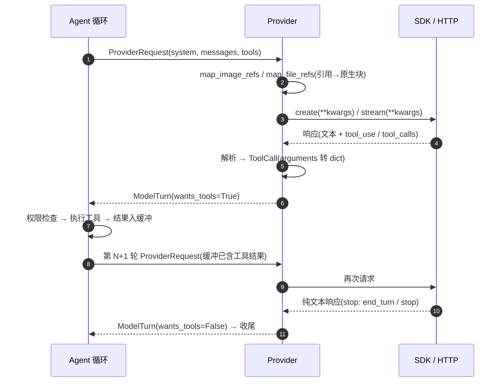

# OpenAI / Claude SDK:请求与响应结构解析

> 定位:讲清楚 OpenAI(Chat Completions API)与 Claude(Anthropic Messages API)两家 SDK 的
> **请求长什么样、响应长什么样、SoulBuddy 的代码怎么解析它们**。
> 读完这篇,`soul_buddy/providers/` 里的转换代码就不再是"魔法"。

> **状态:已实现**(本文描述的是 `soul_buddy/providers/` 的现状,2026-09)。
> 设计期规划见 [modules/07-providers.md](../modules/07-providers.md)。
>
> 先建立一个基本认知:两个 SDK 本身都是 HTTP JSON API 的薄封装。请求体是一个 dict
> (SDK 在发出前用 pydantic 模型校验),响应体由 SDK 反序列化成 pydantic 对象。
> 所以所谓"解析",本质上就是**在响应对象的属性树上取字段 + 做类型转换**,没有别的。

---

## 1. 全景:两种形状,一条归一化管线

Agent 循环里有一个内存 `messages` 缓冲,保存整场对话的历史。SoulBuddy 的关键设计是:
**缓冲的形状跟随所选 provider 的原生格式**——选 Anthropic 就是 Anthropic 形状,
选 OpenAI/DeepSeek 就是 OpenAI 形状。这样模型回复进缓冲、下一轮发出去,不需要来回翻译。



两条硬规则:

1. **归一化的出口只有一个**:`ModelTurn`(`providers/base.py:33`)。agent 循环只认它,
   永远不直接碰 SDK 对象——这是 provider 可切换(ADR-004)的前提。
2. **大对象不出现在缓冲里**:图片/文件附件在缓冲里只存 `{"type": "image", "path": ...}`
   这样的轻量引用块,真正发请求时(`_to_wire_messages`)才读盘、转 base64、套上各家的
   原生形状。这样 token 估算、transcript 快照、上下文压缩都不会碰到几 MB 的字符串。

---

## 2. OpenAI Chat Completions

SDK 入口:`client.chat.completions.create(**kwargs)`(非流式)或 `stream=True`(流式)。
SoulBuddy 里是 `OpenAIChatProvider`(`providers/openai_chat.py`),DeepSeek 复用同一个类
只换 `base_url`(`providers/deepseek.py`——DeepSeek 的 `/chat/completions` 完全讲 OpenAI 协议)。

### 2.1 请求结构

`_kwargs()`(`openai_chat.py:81`)拼出的完整请求体:

```json
{
  "model": "deepseek-chat",
  "messages": [
    {"role": "system", "content": "你是 SoulBuddy……"},
    {"role": "user", "content": "帮我看看这个报错"},
    {"role": "assistant",
     "content": null,
     "tool_calls": [{
       "id": "call_abc123",
       "type": "function",
       "function": {"name": "read_file",
                    "arguments": "{\"path\": \"src/main.py\"}"}
     }]},
    {"role": "tool",
     "tool_call_id": "call_abc123",
     "content": "def main(): ..."}
  ],
  "max_tokens": 4096,
  "tools": [{
    "type": "function",
    "function": {
      "name": "read_file",
      "description": "读取工作区内的文件",
      "parameters": {"type": "object",
                     "properties": {"path": {"type": "string"}},
                     "required": ["path"]}
    }
  }],
  "tool_choice": "auto"
}
```

`messages` 四种 role 一张表看全:

| role | 用途 | content 形态 |
|---|---|---|
| `system` | 系统提示词,固定放 messages[0] | 纯字符串 |
| `user` | 用户输入 | 字符串,或 parts 数组(`{"type":"text"}` / `{"type":"image_url"}`) |
| `assistant` | 模型的历史回复 | 字符串(发起了调用时可为 `null`)+ 可选 `tool_calls` 数组 |
| `tool` | 工具执行结果,**一次调用一条消息** | 字符串,靠 `tool_call_id` 关联回调用 |

带图片时 `user.content` 变成 parts 数组(SoulBuddy 在 wire 时才把图片读盘转成 data URL,
见 `openai_chat.py:32` 的 `_to_wire_messages`):

```json
{"role": "user", "content": [
  {"type": "text", "text": "这张截图里的报错是什么?"},
  {"type": "image_url",
   "image_url": {"url": "data:image/png;base64,iVBORw0KG..."}}
]}
```

### 2.2 响应结构(非流式)

SDK 返回 `ChatCompletion` pydantic 对象(结构上就是下面这个 JSON):

```json
{
  "id": "chatcmpl-123",
  "object": "chat.completion",
  "created": 1726000000,
  "model": "deepseek-chat",
  "choices": [{
    "index": 0,
    "message": {
      "role": "assistant",
      "content": "我先看一下文件。",
      "tool_calls": [{
        "id": "call_abc123",
        "type": "function",
        "function": {"name": "read_file",
                     "arguments": "{\"path\": \"src/main.py\"}"}
      }]
    },
    "finish_reason": "tool_calls"
  }],
  "usage": {"prompt_tokens": 1832, "completion_tokens": 47, "total_tokens": 1879}
}
```

解析代码在 `create()`(`openai_chat.py:240`),就四步:

```python
msg = resp.choices[0].message            # ① 取第一个 choice(不做多选)
text = msg.content or ""                 # ② 文本;发起了调用时是 None,兜成 ""
for tc in (msg.tool_calls or []):        # ③ 遍历 tool_calls
    try:
        args = json.loads(tc.function.arguments or "{}")
    except json.JSONDecodeError:
        args = {}                        #    arguments 是 JSON 字符串,解析失败兜空对象
    tool_calls.append(ToolCall(id=tc.id, name=tc.function.name, arguments=args))
usage = {"prompt_tokens": u.prompt_tokens, "completion_tokens": u.completion_tokens,
         "estimated": False}             # ④ usage 平移进统一字段
```

两个值得注意的细节:

- **`arguments` 是 JSON 字符串,不是对象**。这是 OpenAI 形状和 Anthropic 形状最容易被
  忽略的差异——流式分片拼接的只能是字符串,所以非流式也是字符串,解析责任在调用方。
  模型偶尔会生成截断/非法 JSON,所以 `except JSONDecodeError` 兜空对象,不让一轮对话死在解析上。
- **非流式路径没有读 `finish_reason`**,`stop_reason` 直接由"是否存在 tool_calls"推断
  (`"tool_calls" if tool_calls else "stop"`,`openai_chat.py:287`)。对 agent 循环够用,
  因为循环只关心 `wants_tools`。

### 2.3 流式响应(chunk 流)

`stream=True` 时 SDK 返回一个**同步**迭代器,吐出 `ChatCompletionChunk` 序列:

```json
{"choices": [{"index": 0, "delta": {"role": "assistant", "content": "我"}, "finish_reason": null}]}
{"choices": [{"index": 0, "delta": {"content": "先看一下"}, "finish_reason": null}]}
{"choices": [{"index": 0, "delta": {"tool_calls": [{"index": 0, "id": "call_abc123",
   "type": "function", "function": {"name": "read_file", "arguments": ""}}]},
   "finish_reason": null}]}
{"choices": [{"index": 0, "delta": {"tool_calls": [{"index": 0,
   "function": {"arguments": "{\"path\""}}]}, "finish_reason": null}]}
{"choices": [{"index": 0, "delta": {}, "finish_reason": "tool_calls"}]}
{"choices": [], "usage": {"prompt_tokens": 1832, "completion_tokens": 47, "total_tokens": 1879}}
```

流式解析的三条规则,全部体现在 `astream()`(`openai_chat.py:93`):

1. **文本/推理增量**:每条 chunk 取 `choices[0].delta`——`delta.content` 是文本分片,
   `delta.reasoning_content`(DeepSeek-R1/GLM)或 `delta.reasoning`(OpenRouter)是推理分片,
   到手即通过 `on_delta` / `on_reasoning_delta` 推给前端,同时各自累积拼接。
2. **工具调用按 `index` 分片拼装**:`delta.tool_calls` 里的每个片段只带 `index`,
   `id`/`name` 只在第一个片段出现,`arguments` 是字符串切片。代码用一个
   `tool_acc: dict[index, {id, name, args}]` 累加器(`openai_chat.py:146`),
   流结束后对每个槽位 `json.loads(args or "{}")` 得到完整参数。
3. **usage 在最后一个特殊 chunk**:`stream_options: {"include_usage": True}` 打开后,
   最后一行 chunk 的 `choices` 为空、只带 `usage`。所以代码里 **先查 usage 再判 choices 是否为空**
   (`openai_chat.py:125`),顺序反了 usage 就丢了。`finish_reason` 取第一个非 null 值。

### 2.4 流式的工程桥接:同步生成器不能堵事件循环

OpenAI Python SDK 的流是同步迭代器,而 `astream()` 跑在 FastAPI 的事件循环上。直接 for 循环
会把整个事件循环堵死(健康检查、session 切换全部卡住)。SoulBuddy 的解法
(`openai_chat.py:115` 起):**worker 线程里同步消费流,`queue.Queue` 做线程安全桥,
事件循环侧每 5ms 排空一次队列**——循环空闲时可以去处理别的请求。这是"SDK 形状决定
工程结构"的一个典型例子。

---

## 3. Anthropic Messages API

SDK 入口:`client.messages.create()`(非流式)/ `client.messages.stream()`(流式)。
SoulBuddy 里是 `AnthropicProvider`(`providers/anthropic.py`)。注意 **SoulBuddy 的内存缓冲
默认就是 Anthropic 形状**(`providers/base.py` 的 docstring),所以 Anthropic provider 的
`raw_assistant` 可以 1:1 回填缓冲,几乎没有转换。

### 3.1 请求结构

`create()`(`anthropic.py:152`)拼出的请求体,注意与 OpenAI 的三处结构性差异
(system 是顶层参数、没有 system/tool role、`max_tokens` 必填):

```json
{
  "model": "claude-sonnet-4-5",
  "max_tokens": 4096,
  "system": "你是 SoulBuddy……",
  "messages": [
    {"role": "user", "content": "帮我看看这个报错"},
    {"role": "assistant", "content": [
      {"type": "text", "text": "我先看一下文件。"},
      {"type": "tool_use", "id": "toolu_01ABC",
       "name": "read_file", "input": {"path": "src/main.py"}}
    ]},
    {"role": "user", "content": [
      {"type": "tool_result", "tool_use_id": "toolu_01ABC",
       "content": "def main(): ..."}
    ]}
  ],
  "tools": [{
    "name": "read_file",
    "description": "读取工作区内的文件",
    "input_schema": {"type": "object",
                     "properties": {"path": {"type": "string"}},
                     "required": ["path"]}
  }]
}
```

`messages` 只有 `user` / `assistant` 两种 role,**内容一律是 block 数组**:

| block type | 出现在 | 关键字段 |
|---|---|---|
| `text` | user / assistant | `text` |
| `image` | user | `source: {type: "base64", media_type, data}` |
| `tool_use` | assistant(模型发起调用) | `id`, `name`, **`input`(已解析的 dict!)** |
| `tool_result` | user(回填结果) | `tool_use_id`, `content` |
| `thinking` | assistant(开扩展思考时) | `thinking`, `signature` |

带图片的 user 消息(与 OpenAI 的 data URL 完全不同的形状):

```json
{"type": "image",
 "source": {"type": "base64", "media_type": "image/png", "data": "iVBORw0KG..."}}
```

### 3.2 响应结构(非流式)

SDK 返回 `Message` 对象:

```json
{
  "id": "msg_01ABC",
  "type": "message",
  "role": "assistant",
  "model": "claude-sonnet-4-5",
  "content": [
    {"type": "text", "text": "我先看一下文件。"},
    {"type": "tool_use", "id": "toolu_01ABC",
     "name": "read_file", "input": {"path": "src/main.py"}}
  ],
  "stop_reason": "tool_use",
  "usage": {"input_tokens": 1832, "output_tokens": 96}
}
```

解析代码在 `create()`(`anthropic.py:152`)——核心是**按 block 的 `type` 分派**:

```python
for block in resp.content:
    if block.type == "text":
        text_parts.append(block.text)
    elif block.type == "thinking":
        thinking_parts.append(block.thinking)
    elif block.type == "tool_use":
        tool_calls.append(ToolCall(id=block.id, name=block.name,
                                   arguments=dict(block.input)))
```

和 OpenAI 逐字段对照着看:文本不再是单个 `message.content` 字符串,而可能散在多个
text block 里(所以 `"".join(text_parts)`);工具参数 **`input` 已经是 dict,直接用,
不需要 `json.loads`**;usage 字段名是 `input_tokens` / `output_tokens`,映射成统一的
`prompt_tokens` / `completion_tokens`。`stop_reason` 语义:`end_turn`(自然收尾)/
`tool_use`(要调工具)/ `max_tokens`(被截断),provider 透传,仅在缺失时兜底推断。

### 3.3 流式响应(SSE 事件流)

Anthropic 的流不是"一堆同构 chunk",而是**带类型的有序事件流**:

```text
message_start                      # 消息元数据(含初始 usage.input_tokens)
content_block_start  (text)        # 一个内容块开始
content_block_delta  (text_delta "我")   # 增量:文本分片
content_block_delta  (text_delta "先看一下")
content_block_stop
content_block_start  (tool_use)    # 此刻只有 id/name,input = {}
content_block_delta  (input_json_delta "{\"path\"")   # 增量:JSON 字符串切片
content_block_delta  (input_json_delta ": \"src/main.py\"}")
content_block_stop
message_delta        (stop_reason="tool_use", usage.output_tokens)
message_stop
```

(开启扩展思考时,text block 之前还有 thinking block,增量是 `thinking_delta`。)

`astream()`(`anthropic.py:81`)的处理策略:

- `content_block_delta` 里 `text_delta` → `on_delta(text)` 实时推前端;
  `thinking_delta` → `on_reasoning_delta`,**不进任何缓冲**。
- **工具参数绝不从流事件里拼**。`content_block_start` 虽然能提前拿到 `id`/`name`,
  但 `input` 要等所有 `input_json_delta` 拼完才完整——代码直接等流结束,调
  `stream.get_final_message()` 拿**权威汇总消息**,从它的 `content` 里取完整的
  `tool_use.input`(`anthropic.py:120-127`)。流事件只负责实时推送,final message 负责
  正确性,职责彻底分开。
- usage / stop_reason 同样取自 final message(`anthropic.py:128-135`)。

这也是两家流式设计最大的分野:**OpenAI 是"无类型 delta 拼接",Anthropic 是"结构化事件 + final 汇总"**。

---

## 4. 两家对照速查表

| 维度 | OpenAI Chat Completions | Anthropic Messages |
|---|---|---|
| system prompt | `messages[0]` 里 `role:"system"` 的消息 | 顶层 `system` 参数,不进 messages |
| messages 的 role | `system` / `user` / `assistant` / `tool` | 只有 `user` / `assistant` |
| 工具定义 | `{"type":"function","function":{name, description, parameters}}` | `{name, description, input_schema}` |
| 工具定义参数体 | JSON Schema,`ToolSpec.parameters` 原样透传 | 同左,两家通用 |
| 模型发起调用 | `assistant.tool_calls[]`,`arguments` 是 **JSON 字符串** | content 里的 `tool_use` block,`input` 是 **已解析 dict** |
| 工具结果回填 | 独立消息 `role:"tool"` + `tool_call_id`,**一次调用一条消息** | user 消息里的 `tool_result` block,**多个结果可合并进一条 user 消息** |
| 图片 | parts:`{"type":"image_url","image_url":{"url":"data:...;base64,..."}}` | block:`{"type":"image","source":{"type":"base64",...}}` |
| 结束原因 | `finish_reason`:`stop` / `tool_calls` / `length` | `stop_reason`:`end_turn` / `tool_use` / `max_tokens` |
| token 用量 | `usage.prompt_tokens` / `completion_tokens` / `total_tokens` | `usage.input_tokens` / `output_tokens` |
| 流式形态 | 同构 chunk 流,`choices[0].delta` | 类型化事件流 + `get_final_message()` 权威汇总 |
| 流式工具参数 | 按 `index` 分片拼接 JSON 字符串,流末自己 `json.loads` | `input_json_delta` 分片,但解析以 final message 的 `input` 为准 |
| `max_tokens` | 可选(注:OpenAI o 系模型要求改用 `max_completion_tokens`) | **必填**,不传直接 400 |
| SDK 对象 | `ChatCompletion` / `ChatCompletionChunk`(pydantic) | `Message` / 一组 `MessageStreamEvent`(pydantic) |

---

## 5. 归一化出口:ModelTurn 与三个 format 方法

两家 SDK 的响应最终都收敛到同一个 dataclass(`providers/base.py:33`):

| 字段 | 含义 | 来源(OpenAI / Anthropic) |
|---|---|---|
| `text` | 拼接后的回复文本 | `message.content` / 所有 text block join |
| `tool_calls` | `list[ToolCall]`,`arguments` 统一为 **dict** | `tool_calls` + json.loads / `tool_use.input` |
| `stop_reason` | 归一前的原值透传(缺失才推断) | `finish_reason` / `stop_reason` |
| `usage` | `{"prompt_tokens","completion_tokens","estimated"}` | 字段名映射(A22:优先真实值) |
| `reasoning` | 推理过程,**只做事件推送,永不回灌 LLM** | `reasoning_content`/`reasoning` / thinking block |
| `raw_assistant` | **provider 原生形状**的 assistant 消息 | 直接回填缓冲,下一轮原样发出去 |

`raw_assistant` 是缓冲形状跟随 provider 的粘合剂:OpenAI 形状是
`{"role":"assistant","content":text,"tool_calls":[...]}`,Anthropic 形状是
`{"role":"assistant","content":[block,...]}`(`model_dump()`)。它保证"模型说过的话"
在缓冲里和线上一模一样,不需要任何往返转换。

反方向的归一化(把缓冲里的工具结果变回两家形状)由三个可覆盖的 format 方法承担:

| 方法 | base 默认(Anthropic 形状) | OpenAI 覆盖 |
|---|---|---|
| `initial_user_message` | `{"role":"user","content": str \| [引用块]}` | 同左(两家的 user 消息恰好同形) |
| `format_assistant_message` | content 数组:`text` + `tool_use` blocks | `content` + 平铺的 `tool_calls` 数组 |
| `format_tool_results` | **一条** user 消息,内含全部 `tool_result` blocks | **N 条** `role:"tool"` 消息平铺返回 |

工具 schema 转换同理:`tool_schemas()` 把统一的 `ToolSpec` 变成各家的定义格式
(`parameters` vs `input_schema`,JSON Schema 本体两家通用)。

---

## 6. 一次 tool-calling 回合的完整时序

把上面的所有环节串起来,就是 agent 循环与 provider 的完整对话
(调用点:`agent.py:265` 发请求、`agent.py:488` 回填结果):



---

## 7. 实战坑位清单(全部踩过,代码里有据可查)

1. **孤儿 tool_call → OpenAI 400**。assistant 消息声明了 `tool_calls` 但后续没有配对的
   `role:"tool"` 消息时,OpenAI/DeepSeek 直接拒绝整个请求
   (400 insufficient tool messages)。会话中途被打断/恢复就可能出现。
   `sanitize_tool_messages()`(`base.py:250`)在每轮出站前扫描,给缺失的
   `tool_call_id` 注入占位结果(调用点 `agent.py:240`)。Anthropic 形状没这个问题
   ——`tool_result` 塞在 user 消息里,不存在"配对"约束。
2. **`arguments` 分片拼接后的 JSON 可能非法**。模型生成的参数串偶尔截断,
   `except JSONDecodeError → {}` 兜底,宁可让工具收到空参数报错重试,
   不能让整轮对话崩在 provider 解析层。
3. **system 的位置**。OpenAI 塞 messages,Anthropic 是顶层参数——漏了这层的
   provider 会把系统提示词当成第一条 user 消息发出去。
4. **Anthropic `max_tokens` 必填**。OpenAI 习惯不传,到 Anthropic 直接 400。
   `ProviderRequest.max_tokens = 4096` 的默认值就是为它兜的。
5. **推理字段名三家三个样**:DeepSeek-R1/GLM 是 `reasoning_content`,OpenRouter 是
   `reasoning`(还可能是 dict),Anthropic 是独立的 thinking block。
   `_reasoning_of()`(`openai_chat.py:45`)按顺序探测兼容。
6. **流式工具参数的取法两家不同**:OpenAI 必须自己按 index 拼字符串再解析;
   Anthropic 千万别拼——等 `get_final_message()`。用错一家的办法到另一家就是 bug。
7. **usage 的chunk 顺序**:`include_usage` 的 usage chunk `choices` 为空,先查 usage
   再 skip 空 choices,否则最后一个 chunk 的 usage 永远拿不到。
8. **图片形状**:同一个内部引用块,OpenAI 要转 data URL 塞进 `image_url`,
   Anthropic 要转 base64 source block;文件附件则两家统一降级成围栏文本块
   (2 万字符截断,`base.py:199`)。文件在会话中途被删时降级为占位说明,不让请求失败。
9. **DeepSeek 不是第五家 provider**:它完全讲 OpenAI 协议,继承 `OpenAIChatProvider`
   换个 `base_url` 和模型名就完事(`providers/deepseek.py`)。判断"要不要新写 provider"
   的标准就一条:线上的 JSON 形状一不一样,而不是厂商一不一样。

---

## 8. 关联文档

- 模块详解:[modules/07-providers.md](../modules/07-providers.md)(Provider 层的设计期规划与代码清单)
- Agent 循环全景:[agent-loop-map.md](../architecture-design/agent-loop-map.md)(ModelTurn 之后循环怎么走)
- 图片/文件附件的引用块设计:[base.py](https://github.com/andyxu1234/soul_buddy/blob/main/soul_buddy/providers/base.py) 的 `initial_user_message` / `map_image_refs` / `file_ref_text`
