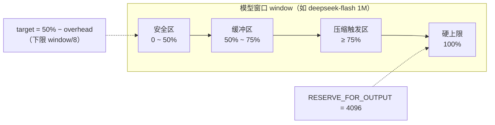
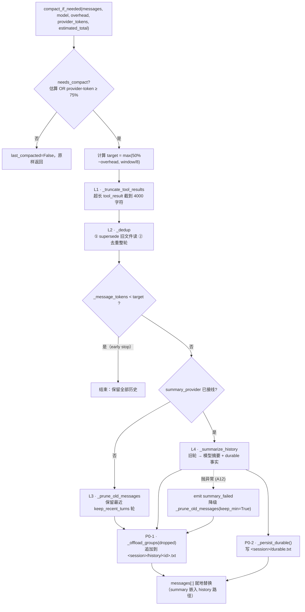
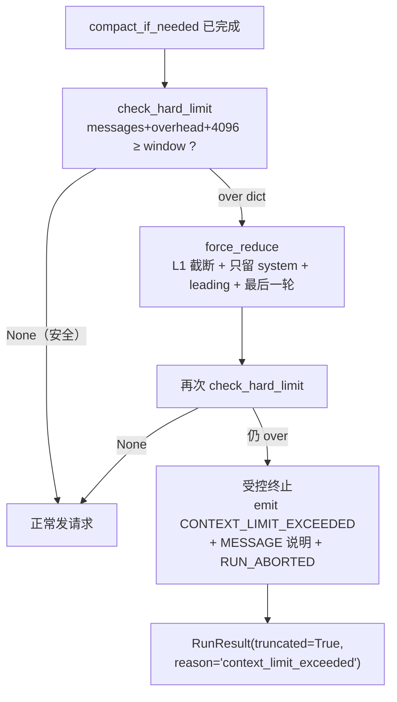
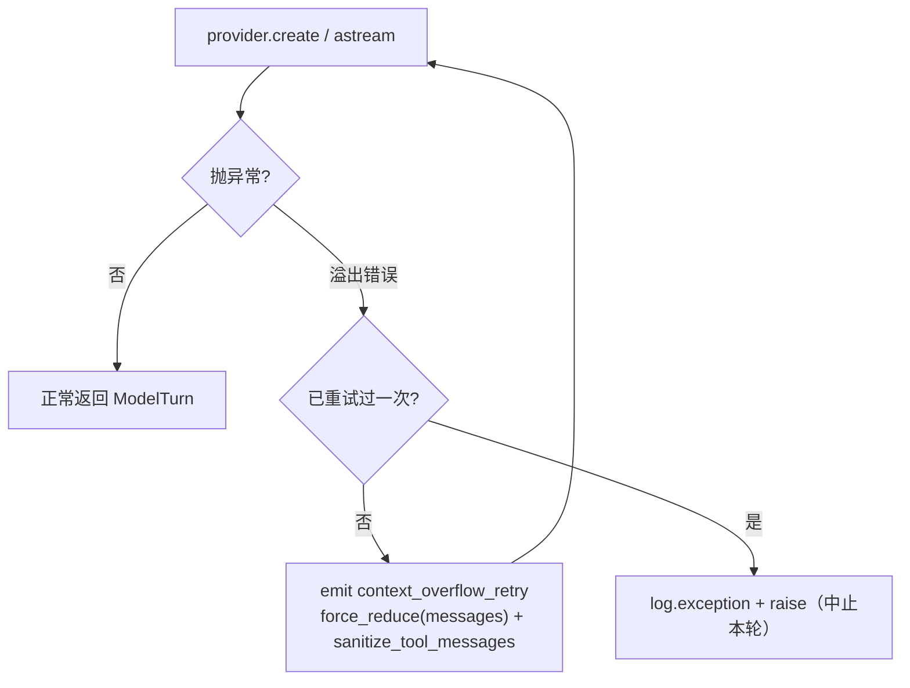
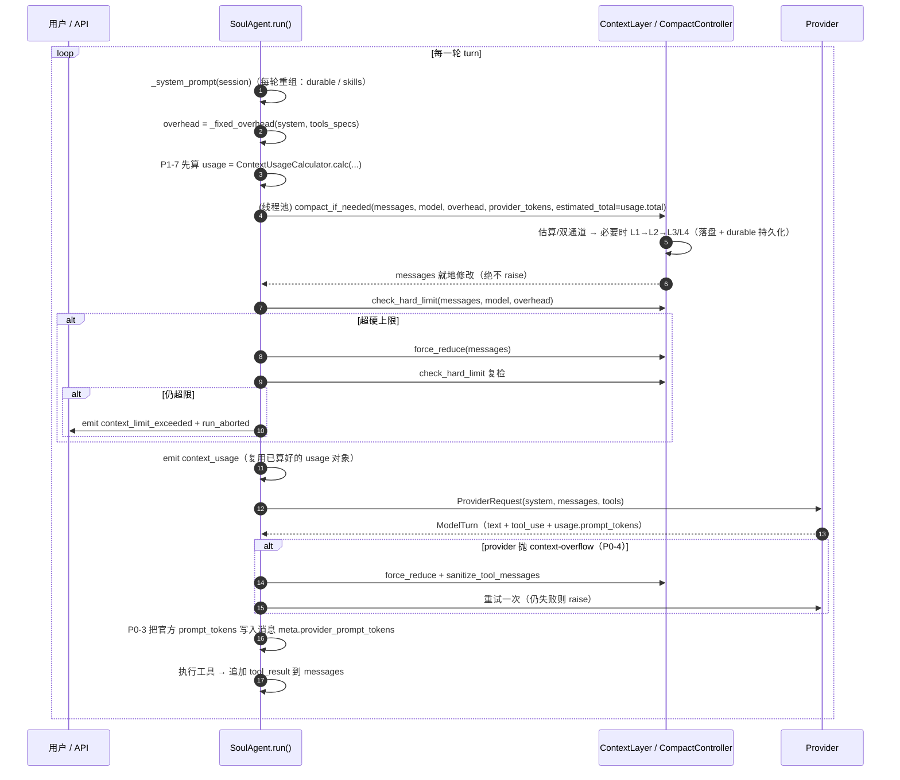
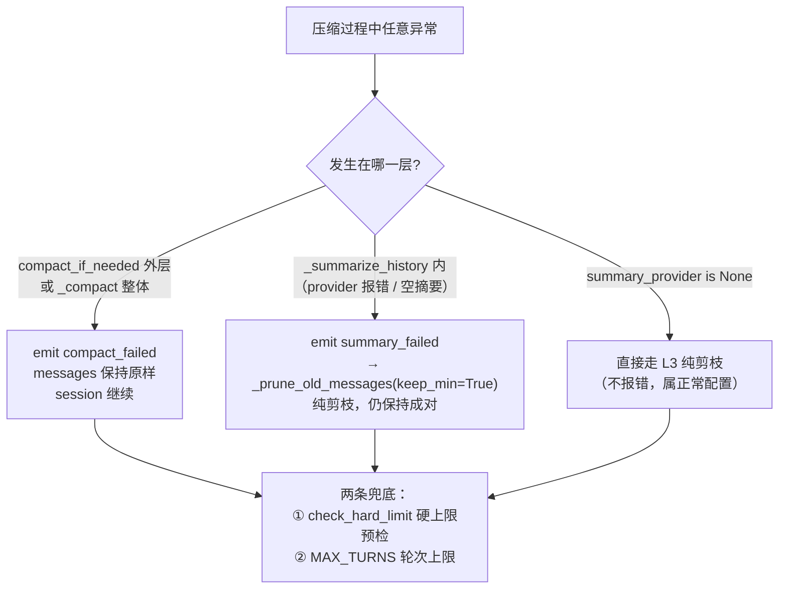
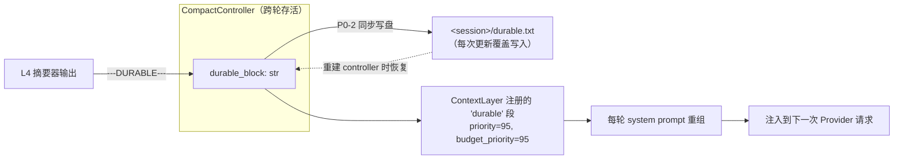

# 10 · 上下文管理与上下文压缩（Context & Compact）

> 代码包：`soul_buddy/context/`（核心：`compact.py` + `summary.py` + `tokens.py` + `usage.py` + `prompt.py` + `externalize.py` + `__init__.py`）
> 功能模块：M7 上下文管理 ｜ 阶段：P2（压缩加固 P0/P1，2026-09 二次加固）｜ 风险：中
> **状态：🟢 已实现（P0–P5 全部交付；2026-09 完成「压缩落盘可回捞」二次加固：P0-1 落盘 / P0-2 durable 持久化 / P0-3 双通道触发 / P0-4 溢出回退 / P1-5 / P1-6 / P1-7 / P2-8 / P2-9）** —— 本文档由原「10 · 上下文管理」与「16 · Context Compact」合并而来，统一以当前代码为准；
> 文中保留设计期约束（§3 仍然有效），「§4 深度解析」为已落地机制，行号以当前代码为准。

---

## 1. 职责定位

让长会话在**不爆上下文、成本可控、关键信息不丢**的前提下持续运行。它由三个动作组成：

| 动作 | 解决什么 | 落地模块 |
|---|---|---|
| **压缩（Compress）** | 历史太长占满预算、撞窗口 | `compact.py`（L1→L2→L3/L4 分层）+ `summary.py`（L4 摘要器） |
| **隔离（Isolate）** | 子任务噪声污染主上下文、大输出挤掉指令 | `subagents/runner.py`（复用公共控制器，P2-9）+ `externalize.py`（大输出落盘） |
| **编排（Orchestrate）** | 每轮该给什么、预算怎么分、可观测 | `prompt.py`（PromptSegment 预算拼装）+ `usage.py`（分类估算+校准）+ `__init__.py`（ContextLayer 门面） |

一次对话的信息流：**每轮重组 system prompt → 压缩阈值判断 → 硬上限预检 → 分类用量统计 → Provider 调用 → 工具结果追加**。记忆层（[11-memory.md](./11-memory.md)）通过 `ContextLayer` 注册成 system 里的一个 segment，与本模块闭环协作（详见 §4.6 / §5）。

---

## 2. 代码文件清单

| 文件 | 职责 |
|---|---|
| `compact.py` | `CompactController`：L1 截断 / L2 去重 / L3 剪枝 / L4 摘要 + 失败降级链（A12）+ 按模型窗口阈值（A13）+ 硬上限预检 + **P0-1 压缩落盘（history offload，可回捞）** + **P0-2 durable 持久化** + **P0-3 provider token 双通道触发** |
| `summary.py` | `make_summary_provider(provider)`：把 Provider 包装成同步 `Callable[[str], str]`，供 L4 摘要调用；**P1-5 摘要预算可配置（`SUMMARY_MAX_TOKENS`）** |
| `tokens.py` | 启发式 token 估算（中文 ×1.0 / ASCII 字母数字 ×0.25 / ASCII 符号 ×1/3 / emoji ×2.0，无 tiktoken 依赖）；图片按分辨率另计 |
| `usage.py` | `ContextUsageCalculator` / `ContextUsage`：旁路分类用量估算 + 官方 `prompt_tokens` 校准 + **P1-6 tool schema token 缓存** |
| `prompt.py` | `PromptPlanner` / `PromptSegment`：system prompt 分段注册 + 预算拼装 + `dropped_segments` 记录 |
| `externalize.py` | `Externalizer`：>50 KiB 输出落盘返回指针 + 预览；配额与 LRU 清理（A15） |
| `__init__.py` | `ContextLayer` / `build_context_layer`：门面，注册 `memory` 与 `durable` 两个 system segment；**P2-8 session 级 history/durable 路径注入** |
| `agent.py`（协作） | 每轮调用 `compact_if_needed` → `check_hard_limit` → `force_reduce`；`_fixed_overhead` / `_wire_ref_tokens`；**P0-3 `_last_provider_tokens` 记录并读取官方 token**；**P0-4 溢出运行时回退（force_reduce + 重试一次）**；P1-7 用量先算一次供展示与触发共用 |
| `subagents/runner.py`（协作） | 子代理**复用公共 `CompactController`**（P2-9，`keep_recent_turns=4`）+ 接入主会话 history/durable 落盘路径 |
| `api/runtime.py`（协作） | 生产 wiring：`build_context_layer(summary_provider=make_summary_provider(provider), session_dir, session_id, ...)` |
| `models.py`（协作） | 新增事件 `context_overflow_retry`（P0-4 审计） |
| `providers/base.py`（协作） | 新增 `is_context_overflow_error()`（P0-4 溢出错误识别） |

---

## 3. 设计决策与约束

- 输出 > 50 KiB（UTF-8 字节数，**严格大于**）落盘返回指针 + 前 2KB 预览（BR-06 / A14 / B08）
- 外部化配额：单会话 ≤200MB 或 500 文件，全局 ≤2GB，超配额 LRU 清理且入审计（BR-24 / A15）
- 压缩四层（L1 截断 / L2 去重 / L3 剪枝 / L4 摘要）+ 失败降级链；**降级路径仍须保持 `tool_use`/`tool_result` 成对**（A12 / INV-5）
- 压缩阈值按**模型**不同（A13）：`CONTEXT_WINDOW` 以**模型名**为键，由 `context_window(model)` 解析（精确 → 前缀 → 兜底 `DEFAULT_CONTEXT_WINDOW`）
- 压缩触发计入固定开销（system + 工具定义 + 图片 ref，P0-3），避免"messages 没超、真实请求已超窗"；**P0-3 再加 provider 上报 token 双通道**（估算 OR 官方 token 任一命中即压）
- **P0-1 压缩落盘可回捞**：被淘汰 turns 序列化追加到 `<session_dir>/history/<id>.txt`（独立目录，P2-8），summary 消息嵌入路径供 `read_file` 回捞；落盘失败不阻断（A12）
- **P0-2 durable 持久化**：`durable_block` 每次更新同步写 `<session_dir>/durable.txt`，重建 controller 时从磁盘恢复（跨进程）
- **P0-4 溢出运行时回退**：provider 调用 catch context-overflow 类错误 → `force_reduce` → 重试一次；仍失败才中止（对齐 Octop 的 ContextOverflowError）
- token 默认启发式，`tiktoken` 仅可选增强（A23）；启发式刻意留 25% 余量吸收误差
- 压缩**永不 raise**：任何内部异常都被吞掉、messages 原样返回，session 继续跑（BR-19）
- prompt 预算丢弃 segment 须可解释 `dropped_segments`（BR-14）
- 记忆段在 P2 不注册（禁止塞桩/假数据，A02），P3 由 [11-memory.md](./11-memory.md) 接入后才注入

---

## 4. 深度解析：上下文压缩流水线（原 16 章合并）

### 4.0 一句话总览

压缩是 agent 循环里的**每轮前置守卫**：每次调用 LLM 之前先估算「system + tools + messages + 输出预留」是否逼近模型窗口，若逼近就按 **L1→L2→L3/L4** 由廉价到昂贵地减小 messages，直到回到 target 以下；任何环节失败都**降级而非抛错**，session 永远能继续跑。

三个核心不变量：

| 不变量 | 含义 | 落实位置 |
|---|---|---|
| **成对保护** | `tool_use` 与 `tool_result` 永远同时保留或同时丢弃 | `_group()` 按「整轮」分组；`_supersede_old_reads()` 只改内容不删块 |
| **绝不 raise** | 压缩内部任何异常都被吞掉，messages 原样返回 | `compact_if_needed()` 的 `try/except`；`_compact()` 的降级分支；P0-1/P0-2 落盘失败也只 `on_event` |
| **够用即停** | 廉价层达标就不再动历史，绝不超删 | `_compact()` 中 `_message_tokens(messages) < target` 的 early return |
| **落盘可回捞**（P0-1） | 被淘汰 turns 不永久丢失，写盘后可回放/审计/纠错 | `_offload_groups()` 追加 `<session>/history/<id>.txt`；三处丢弃路径（L3/L4/force_reduce）都调用 |

### 4.1 触发判定（A13 / P0-3 双通道 / P1-7 同源）

```python
def needs_compact(tokens, model, fixed_overhead=0, provider_tokens=None,
                  estimated_total=None) -> bool:
    window = context_window(model)   # 按模型名查表（精确 → 前缀 → DEFAULT_CONTEXT_WINDOW）
    threshold = window * COMPACT_TRIGGER_RATIO
    # P0-3 双通道：provider 官方 token 通道（不含 fixed_overhead，官方已含 system/tools）
    if provider_tokens and provider_tokens > 0:
        if provider_tokens + RESERVE_FOR_OUTPUT >= threshold:
            return True
    # 估算通道：默认 tokens+overhead；P1-7 传入 estimated_total 时与展示同源
    basis = (tokens + fixed_overhead) if estimated_total is None else estimated_total
    return basis + RESERVE_FOR_OUTPUT >= threshold
```

`fixed_overhead` 是 **system prompt + 工具定义 + 图片 ref** 的估算 token，由 `SoulAgent` 每轮算出：

```python
ref_tokens = self._wire_ref_tokens(messages)          # 图片按分辨率另计
overhead = self._fixed_overhead(system, tools_specs) + ref_tokens
```

**为什么必须计入**：skills 索引块、subagent 目录、MCP 连接器描述都嵌在 system prompt 里；图片在 buffer 里只是 `{"type": "image", "path": ...}` 的轻引用，base64 要到 wire 阶段才展开，纯文本估算会把它算成 0。只数 messages 会低估真实请求，等 messages 阈值触发时请求其实早已超窗。

**P0-3 provider token 双通道**：旁路估算有误差，可能漏触发撞窗或提前压缩。`agent.py` 每轮把 provider 上报的**官方** `prompt_tokens`（`_record_usage` 的 `turn.usage`，仅非估算值）记录到 assistant 消息的 `meta.provider_prompt_tokens`，下一轮经 `_last_provider_tokens(messages)`（`agent.py:865`）取出作为第二通道；估算 **OR** 官方任一命中即触发（对齐 Octop 的 `_should_summarize_based_on_reported_tokens`）。

**P1-7 展示与触发同源**：`agent.py` 每轮先算一次 `usage = calc.calc(...)`（`agent.py:214`），把 `usage.total` 作为 `estimated_total` 传给压缩触发、并复用同一对象 emit `context_usage` —— 展示 pct 与触发不再两套口径（避免"展示满但没触发 / 触发但展示未满"）。注意触发阈值仍以 `_message_tokens + overhead` 为**默认**基线（该口径由 `test_long_session_stays_within_budget` 锁死，估计通道内部不改）。

压缩目标（messages-only target）：

```python
target = max(int(window * COMPACT_TARGET_RATIO) - fixed_overhead, window // 8)
```

`window // 8` 是**下限兜底**：当 overhead 本身巨大（如 offline 8k 窗口）时，仍保证留一点历史，不会把 target 压成负数。

**数轴视角**：



### 4.2 分层压缩管线（廉价优先）



**L1 · 截断超长 tool_result**

- 同时兼容两种消息形态：Anthropic 的 `content[].type == "tool_result"` 块 与 OpenAI 的 `role="tool"` 扁平消息。
- 超过 `max_chars=4000` 时保留**头部**并追加 `...[truncated N chars]` 标记。
- 打 `_truncated=True` 标记 → **幂等**，同一块不会被反复截断（也就不会反复加标记）。

**L2 · 去重**

两个子步骤：

① **supersede 旧的文件重读（P1-6）**：第一遍遍历收集 `path -> 最新 call_id`；第二遍把非最新的 `tool_result` **内容替换**为 `[superseded by a later read of the same file]`。关键：**只改内容，不删块**——删块会让 `tool_use` 变成孤儿，请求被 provider 400 拒绝（INV-5）。同时识别 Anthropic `tool_use` 块与 OpenAI `tool_calls` 条目（`_iter_read_calls`）。

② **去重完全重复的整轮**：用 `_group_text(group)` 作为 key，靠 `OrderedDict` 保留**首次出现顺序**、丢弃后出现的重复轮。

**`_group()`：成对保护的地基**

所有「丢弃」操作都建立在分组之上：messages → `system`（永不丢弃）+ `leading`（首个 assistant 之前的 user 消息 = 初始意图，三处都保留）+ `groups`（每个 = `[assistant, tool_result..., ...]` = 一个完整对话轮）。按「整轮」切，`tool_use` 与其 `tool_result` 天然同生共死 → 成对保护自动成立。

**L3 · 纯剪枝**

```python
keep = max(1, self.keep_recent_turns // 2) if keep_min else self.keep_recent_turns
if len(groups) <= keep: return
messages[:] = system + leading + [m for g in groups[-keep:] for m in g]
```

`keep_min=True` 只在 L4 降级时使用（保留轮数减半，因为摘要已经丢了信息，需要多留一点原文）。

**L4 · 模型摘要（`compact.py` + `summary.py`）**

```mermaid
sequenceDiagram
    participant C as CompactController
    participant P as build_summary_prompt
    participant SP as summary_provider (Provider)
    participant R as split_summary_response
    participant H as history file &lt;session>/history/&lt;id>.txt
    participant D as durable.txt
    C->>C: groups[:-keep] = dropped（全部被丢轮）
    C->>P: dropped 文本（尾部截到 30_000 字符）+ 上一轮 durable_block + 上一轮 summary（P1-5 链式）
    P-->>C: 「压缩助手」提示词（要求 ---SUMMARY--- / ---DURABLE--- 分段格式）
    C->>SP: ProviderRequest(system=摘要人格, tools=[], max_tokens=SUMMARY_MAX_TOKENS)
    SP-->>R: 原始响应文本
    R-->>C: (summary, durable)
    alt summary 为空
        C->>C: raise ValueError → A12 降级为 prune(keep_min=True)
    else 有摘要
        C->>C: durable_block = durable（累积到控制器，不随消息被压掉）
        C->>D: P0-2 _persist_durable()（写盘，失败仅 on_event）
        C->>H: P0-1 _offload_groups(dropped)（追加，带时间戳分段）
        C->>C: messages[:] = system + leading + [summary_msg 含 history 路径] + 最近 keep 轮
    end
```

设计要点：

1. **摘要全部被丢的轮**，而不是先剪枝再摘要——先剪到 `keep_recent_turns` 会让摘要器无内容可摘。
2. **空摘要保护**：响应为空/全空白直接 `raise`，绝不让空字符串顶替历史的唯一副本。
3. **双段格式**：一次调用同时产出 `summary` 与 `durable facts`，用 `---SUMMARY---` / `---DURABLE---` 分隔；无标记时整段当 summary（durable 保持上一轮值）。
4. **durable 累积 + 持久化**：`previous_durable` 回喂给下一次摘要提示词（多次压缩不丢早期事实）；**P0-2 每次更新同步写 `<session>/durable.txt`**，进程重启后重建 controller 即从磁盘恢复。
5. **P0-1 落盘可回捞**：`dropped` 以带 role 标记的文本**追加**写入 `<session>/history/<id>.txt`（独立目录，P2-8，不受 Externalizer 配额 LRU 影响），summary 消息末尾嵌入 `Full history saved to {path}; read_file it for details if needed.`，模型可 `read_file` 回捞；多次压缩**追加不覆盖**，带时间戳分段。落盘失败只 `on_event("history_offload_failed")`，绝不阻断（A12）。
6. **P1-5 摘要预算可配置**：`max_tokens` 取 `config.SUMMARY_MAX_TOKENS`（默认 1024，可经 `SOUL_SUMMARY_MAX_TOKENS` 覆盖），长会话可调高保住早期上下文；**旧 summary 消息留在 leading 里，显式取出注入本次摘要输入**（链式累积，对齐 Octop，不丢历史摘要）。
7. **物理隔离**：`durable_block` 存在 `CompactController` 上，由 `ContextLayer` 注册成独立的 system prompt 段（priority 95），**L1–L4 永远碰不到它**——「有损的消息压缩」不会伤到「无损的关键事实」。

### 4.3 硬上限预检与最后手段（P0-4）

普通压缩后仍可能超窗（例如单条 tool_result 或 overhead 本身就巨大）。`agent.py` 每轮做二次守卫（**发前预检**）：



`force_reduce` 是**真正不可逆**的操作（只留最后一轮），因此只在硬上限路径使用，且返回体只含估算数字、不含消息正文（审计安全）。**P0-1 下 `force_reduce` 也会把被淘汰 turns 落盘**（`_offload_groups(groups[:-1])`），即便走到最后手段历史仍可回捞。

**P0-4 运行时溢出回退**：发前预检是估算，低估时真实请求仍会被 provider 拒（400 / context-overflow）。因此 provider 调用外层包 `try/except`（`agent.py` 主循环），用 `providers/base.py: is_context_overflow_error()`（按错误码/关键词识别，覆盖 OpenAI/DeepSeek/Anthropic 措辞）判断：



### 4.4 主循环中的完整时序



注意：L4 摘要内部会**发起一次真实 provider 调用**，因此 `compact_if_needed` 被丢进 `anyio.to_thread.run_sync`，避免阻塞 SSE 事件循环（与工具派发同一理由）。

### 4.5 降级链全景（A12）



### 4.6 durable 事实段（P1-7 / P0-2 持久化）



- 空时 `_render_durable()` 返回 `""`，planner 自动跳过该段（不留占位垃圾）。
- 渲染文案明确告诉模型：「历史已被压缩掉时，信任这些事实」。
- 这是「有损摘要」与「无损关键事实」的隔离机制：即使某次摘要质量差，之前累积的 durable 事实仍在 system prompt 中。
- **P0-2 持久化**：`_persist_durable()`（`compact.py:352`）在 `durable_block` 每次更新时把完整值覆盖写入 `<session>/durable.txt`；`CompactController.__init__`（`compact.py:316`）构造时经 `_load_durable()`（`compact.py:341`）从磁盘恢复——子代理 / 进程重启 / 会话重建都不会丢已压缩的关键事实。写盘失败只 `on_event("durable_persist_failed")`，不阻断（A12）。

---

## 5. 上下文预算与可观测性（编排）

### 5.1 PromptSegment 预算拼装（`prompt.py`）

system prompt 按 segment 注册（role / skills / subagents / expert / connectors / **memory** / **durable**），`PromptPlanner.assemble()` 按 `budget_priority` 排序，在 `budget_chars`（默认 16_000 字符）内从高到低装入；超预算的段被丢弃并记入 `dropped_segments`（可解释，BR-14）。

### 5.2 分类用量估算 + 校准（`usage.py`）

`ContextUsageCalculator.calc()`（`usage.py:83`）按 **system / tools / messages / skills / memory / connectors** 分类估算 token（`estimate_tokens` 启发式），图片 ref 通过 `extra_messages_tokens` 计入 `messages` 分类；拿到官方 `prompt_tokens` 后用 `calibrate()`（`usage.py:128`）按比例缩放各分类，scale 超出 `[0.3, 3.0]` 放弃校准。每轮 emit `context_usage` 事件供前端/审计展示「当前窗口占用百分比」。

**P1-6 tool schema token 缓存**：`_safe_estimate_tools()`（`usage.py:182`）按 `(name, description, params)` 三元组缓存每份 tool 的 token 数（模块级 `_TOOL_SCHEMA_CACHE`，有界 512 条，`usage.py:25-26`）——工具定义在会话内基本不变，命中缓存后**免去反复 JSON 序列化 + 估算**，长会话每轮省一次高频计算；缓存 LRU 超限时清空重建。

### 5.3 token 估算口径（`tokens.py`）

| 字符 | 权重 | 说明 |
|---|---|---|
| 中文汉字 | ×1.0 | 保守取上限（实际 0.6–1.0） |
| emoji / 特殊符号 | ×2.0 | 组合序列一并计 |
| 空白 / 换行 / 缩进 | ×0.25 | 也要算 |
| ASCII 字母 / 数字 | ×0.25 | ~4 字符/token |
| ASCII 符号（代码/JSON） | ×1/3 | 符号切得碎 |
| 其它非 ASCII | ×1.0 | 日文假名、全角标点等 |

图片**按分辨率**另计：`estimate_image_tokens()` 读图片文件头拿宽高（纯 stdlib，不引入 Pillow），按 `max(85, w×h/750)`（Anthropic 口径）估算，读不到尺寸回落 `IMAGE_TOKEN_FALLBACK=1400`。非视觉模型（`supports_images=False`）不计整图，避免误触压缩。

---

## 6. 隔离：子代理与外部化

**子代理（P2-9 复用公共控制器）**：`subagents/runner.py` **不再**给自己单建独立控制器，而是复用主会话的公共 `CompactController`，并把主会话的 history / durable 落盘路径一并接进来：

```python
compact = CompactController(                       # runner.py:123
    summary_provider=make_summary_provider(provider),
    on_event=lambda name, data: self.audit.append(
        "subagent_context_event", {"name": name, "subagent": cfg.name, **data}),
    keep_recent_turns=SUBAGENT_KEEP_RECENT_TURNS,   # 4
    history_path=sdir / HISTORY_SUBDIR / HISTORY_FILENAME.format(session_id=session_id),  # runner.py:129
    durable_path=sdir / DURABLE_FILENAME,           # runner.py:131
)
```

与主循环**同语义**（每轮 `compact_if_needed`，绝不 raise），但 `keep_recent_turns=4`：长探索任务更激进地压缩。事件名 `subagent_context_event` 让审计可区分来源。**P2-9**：复用公共控制器 + 主会话落盘路径，意味着子代理压缩掉的 turns 也写进主会话的 `<session>/history/<id>.txt`、durable 也与主会话共享同一 `durable.txt`——子任务的过程数据与主会话统一可回捞、可恢复，不产生孤立的子目录。子代理仍独立 messages、独立收窄 ToolRegistry、不写 transcript、`ASK` 降级 `DENY`、只回传结构化 JSON 结论——主上下文只看到一条 `function_call_result`，实现彻底隔离。

**外部化（A14 / A15）**：>50 KiB 的工具输出由 `Externalizer` 写盘 `tool-results/<id>.txt`，上下文只留指针 + 2 KiB 预览（bash 用 head_tail 保留头部+尾部）；LRU 配额清理（单会话 ≤200MB/500 文件、全局 ≤2GB），删除通过 `on_event` 入审计。**注意**：压缩落盘 `history/<id>.txt` 与 `durable.txt`（P0-1/P0-2）**不归 Externalizer 配额、不受 `QUOTA_SESSION_*`/`QUOTA_GLOBAL_*` LRU 清理**——它们是审计/回捞的只增日志，独立于工具输出缓存。

---

## 7. 事件与可观测性

| 事件 | 触发点 | 载荷 |
|---|---|---|
| `compact_failed` | `compact_if_needed` 外层异常 | `{"error": repr(e)}` |
| `summary_failed` | L4 摘要异常 | `{"error": repr(e)}` |
| `context_usage` | 每轮旁路估算 | `ContextUsage.to_dict()`（system/tools/messages/skills/memory/total/window/pct/estimated） |
| `context_limit_exceeded` | 硬上限复检仍超窗 | `{estimated_tokens, window, fixed_overhead}`（无消息正文） |
| `context_overflow_retry`（P0-4） | provider 抛 context-overflow 触发运行时回退 | `{"error": ..., "attempt": ...}` 落审计 |
| `history_offload_failed`（P0-1） | 压缩落盘写盘失败（不阻断） | `{"error": repr(e), "path": ...}` |
| `durable_persist_failed`（P0-2） | durable.txt 写盘失败（不阻断） | `{"error": repr(e), "path": ...}` |
| `subagent_context_event` | 子代理压缩事件 | `{"name": ..., "subagent": ..., ...}` 落审计 |
| `final_prompt` | 每轮真实请求前快照 | system + messages（调试/审计用） |

> 审计侧：主循环 `on_event` 写 `context_event`，子代理写 `subagent_context_event`。

---

## 8. 常见疑问

**Q1：为什么压缩后要求 messages < target，而不是 < 触发线？**
避免「压一点点、下一轮立刻又触发」的抖动（thrashing）。压到 50% 留出足够余量。

**Q2：为什么 early return 这么重要？**
L1 截断 + L2 supersede 常常就够了。若不带 early return，会无谓地丢掉整个历史轮次——`test_early_stop_preserves_history_when_cheap_layers_suffice` 专门守这条。

**Q3：`_truncated` / `_superseded` 标记会不会被发给模型？**
标记是消息 dict 上的私有字段，provider 适配层只取 `role` / `content` / `type`，不会污染请求体。行为上只保证幂等。

**Q4：token 估算不准怎么办？**
启发式刻意留 25% 压缩余量吸收误差；`usage.py` 的 `calibrate()` 用官方 `prompt_tokens` 按比例校准，scale 超出 `[0.3, 3.0]` 放弃校准。

**Q5：offline 窗口只有 8k，测试怎么用？**
测试故意用 offline 触发压缩路径（`ctrl.compact_if_needed(msgs, "offline")`），因为它的窗口小、几乎必触发。

**Q6：用户上传的图片，token 怎么算？**
buffer 里图片只是 `{"type": "image", "path": ...}` 轻引用，纯文本估算算成 0；但视觉模型按分辨率计费，故 `_wire_ref_tokens()` 叠加进 `fixed_overhead`，并通过 `calc(..., extra_messages_tokens=)` 计入 `messages` 分类。非视觉模型不计整图。

**Q7：不接 `summary_provider` 会怎样？**
长会话会退化成纯截断、丢失意图——所以这是 P0-1 的必做项，生产由 `api/runtime.py` 的 `build_context_layer` 唯一接线。

**Q8：压缩落盘的文件在哪？会被 Externalizer 配额清理吗？**
在 `<session_dir>/history/<session_id>.txt`（追加式，P0-1）与 `<session_dir>/durable.txt`（覆盖式，P0-2），由 `storage._session_dir` 定位。它们是审计/回捞的只增日志，**不归 Externalizer、不受 `QUOTA_SESSION_*`/`QUOTA_GLOBAL_*` LRU 清理**；未落盘失败也只会发 `history_offload_failed`/`durable_persist_failed`，压缩照常进行。

**Q9：估算和 provider 上报都算，会不会重复/误触发？**
不会重复计数：`needs_compact` 的两个通道是**任一命中即触发**（OR），provider 官方 token 已含 system+tools，不再叠加 `fixed_overhead`；触发后仍是同一条 L1→L4 压缩路径，最终以 `messages < target` 为收敛条件（Q1 的反抖动保证）。

---

## 9. 测试覆盖

| 用例 | 验证点 |
|---|---|
| `test_compact_reduces_tokens` | 压缩确实降低 token |
| `test_compact_keeps_pairs` | 压缩后 `tool_use` 必有对应 `tool_result`（INV-5） |
| `test_compact_no_compact_when_under_budget` | 未达阈值不压缩 |
| `test_summary_failure_degrades_to_prune` | A12 降级链 + `summary_failed` 事件 |
| `test_compact_internal_error_does_not_raise` | 脏输入不抛异常（BR-19） |
| `test_needs_compact_counts_fixed_overhead` | P0-3 overhead 计入触发 |
| `test_context_window_lookup_by_model_name` | 窗口按模型名查表（含前缀匹配 + 未知模型兜底） |
| `test_estimate_image_tokens_uses_pixel_dimensions` | 图片按分辨率计费（含 85 下限） |
| `test_estimate_image_tokens_fallback_and_explicit_size` | 读不到尺寸回落常量；ref 带 width/height 时不读盘 |
| `test_image_dimension_probes` | PNG/JPEG/GIF/BMP 头解析；坏文件/目录安全返回 (0,0) |
| `test_estimate_images_tokens_sums_all_refs` | 一条消息多图累加；纯文本不计 |
| `test_context_usage_counts_image_refs`（image_upload） | 图片计入 `context_usage` 的 messages 分类 |
| `test_wire_ref_tokens_skipped_for_non_vision_model`（image_upload） | 非视觉模型不按整图计费 |
| `test_early_stop_preserves_history_when_cheap_layers_suffice` | 便宜层够用时不得剪枝 |
| `test_prune_runs_when_cheap_layers_not_enough` | 便宜层不足时剪到 `keep_recent_turns` |
| `test_supersede_old_file_reads_keeps_pairs` | P1-6 supersede 且保持成对 |
| `test_long_session_stays_within_budget`（agent_loop） | 端到端长会话不爆窗口 |

**二次加固新增（P0-1 / P0-2 / P0-3 / P0-4 / P1-5 / P1-6 / P1-7，2026-09）**：

| 用例 | 验证点 |
|---|---|
| `test_compact_offloads_dropped_turns_to_history_file` | P0-1：被淘汰 turns 落盘存在 + summary 嵌入 history 路径 |
| `test_compact_offload_appends_across_multiple_compactions` | P0-1：多次压缩**追加不覆盖**（带时间戳分段） |
| `test_offload_disabled_by_default` | P0-1：未给 history_path 时默认不落盘（纯内存，向后兼容） |
| `test_offload_failure_does_not_raise` | P0-1：落盘失败不 raise（blocker 文件占位），只 `history_offload_failed` |
| `test_durable_persisted_and_reloaded_on_rebuild` | P0-2：durable 写盘 + 重建 controller 从磁盘恢复 |
| `test_durable_persist_failure_does_not_raise` | P0-2：durable.txt 写失败不 raise |
| `test_needs_compact_provider_channel_triggers` | P0-3：provider_tokens 通道命中即触发（`needs_compact` 层） |
| `test_compact_if_needed_provider_channel_triggers` | P0-3：双通道贯穿到 `compact_if_needed` 层 |
| `test_is_context_overflow_error_matches_provider_messages` | P0-4：溢出错误识别覆盖 OpenAI/DeepSeek/Anthropic 措辞 |
| `test_force_reduce_offloads_dropped_turns` | P0-1/P0-4：最后手段 `force_reduce` 也落盘被淘汰 turns |
| `test_tool_schema_token_cache_reuses_estimate` | P1-6：tool schema token 缓存命中复用（有界 512） |
| `test_context_usage_calc_tool_total_matches_shared_estimator` | P1-6：`calc.tools` 与共享估算器口径一致 |
| `test_needs_compact_uses_estimated_total_when_provided` | P1-7：传入 `estimated_total` 时触发基准与展示同源 |

---

## 10. 关联文档

- 记忆层接入：[11-memory.md](./11-memory.md)
- 主循环全景：[../architecture-design/agent-loop-map.md](../architecture-design/agent-loop-map.md)
- 主循环模块：[06-agent.md](./06-agent.md) · 配置常量：[01-config.md](./01-config.md) · 事件：[03-events.md](./03-events.md) · 模块索引：[INDEX.md](./INDEX.md)
- 设计约束来源：`docs/feasibility-analysis.md`（ADR-009 / INV-5）· `docs/implementation-plan.md` §11（A12 / A13 / A23 / BR-19）
- **本次二次加固（P0-1/P0-2/P0-3/P0-4/P1-5/P1-6/P1-7/P2-8/P2-9）**：见改造工单 `C:\andy\codebase\Octop\soulbuddy上下文压缩改造工单.md`（§0 硬约束：Compaction NEVER raises / pair-preserving / 双格式 / durable / externalize / hard-limit 行为保留）
