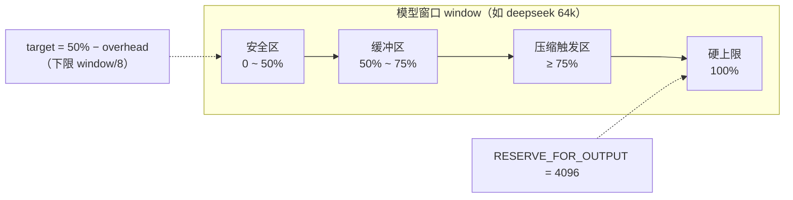
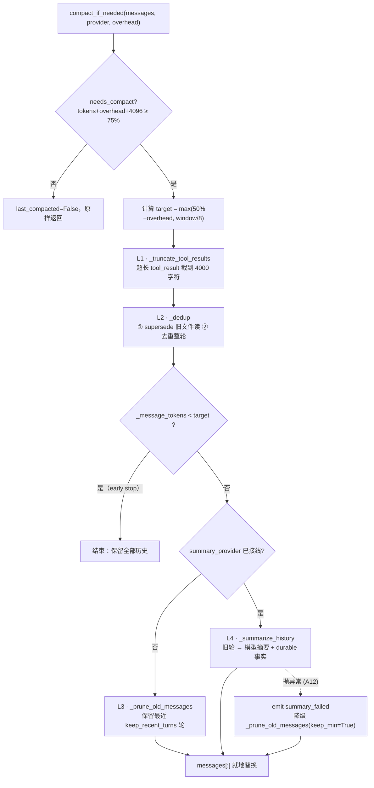
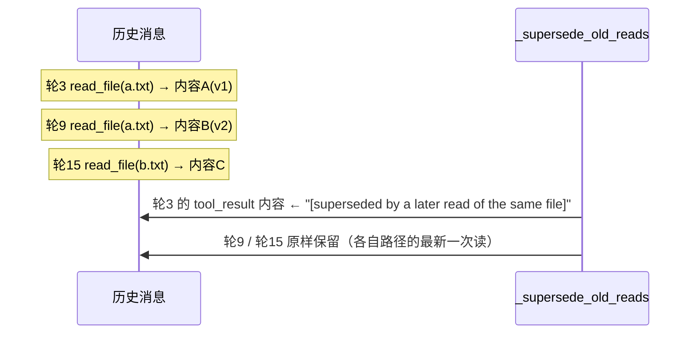
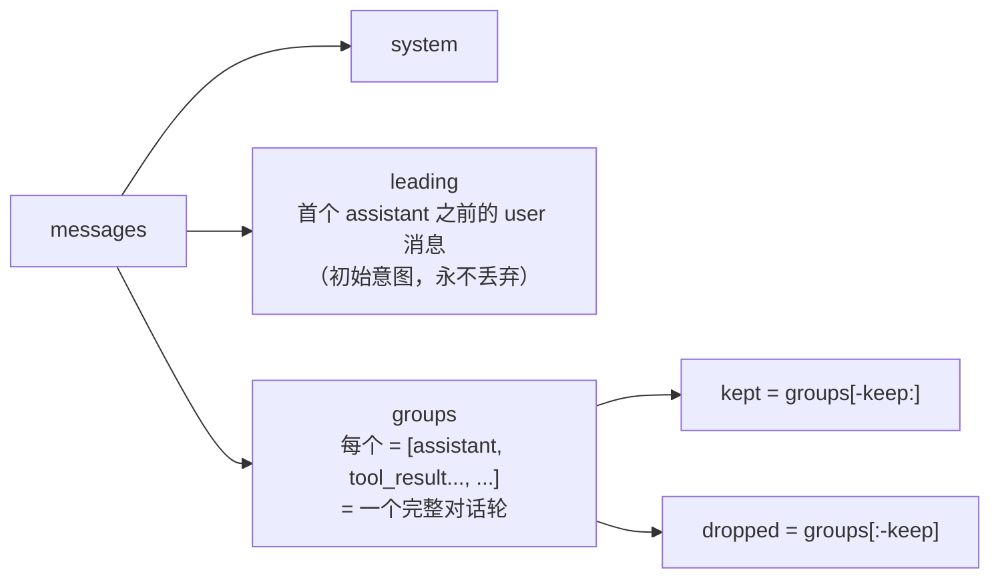
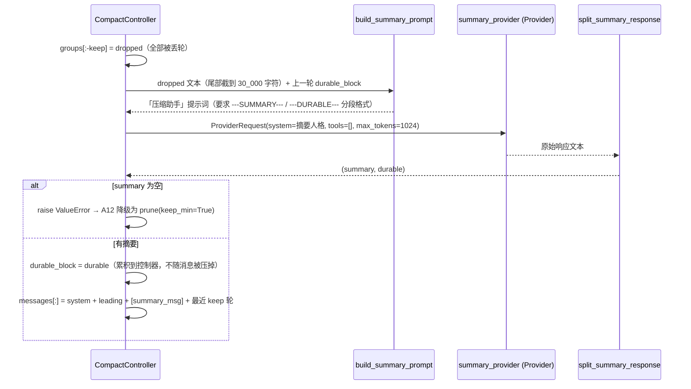
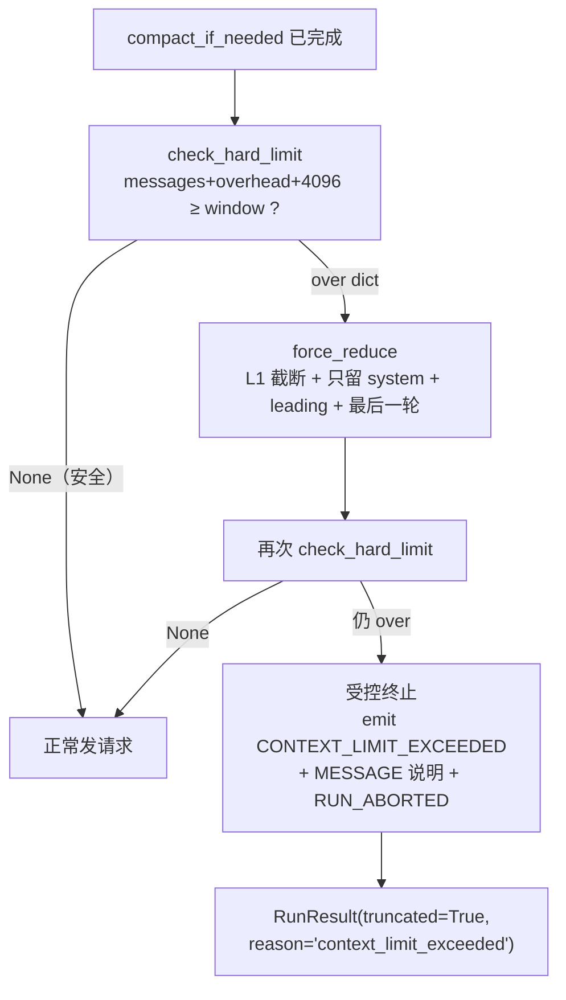
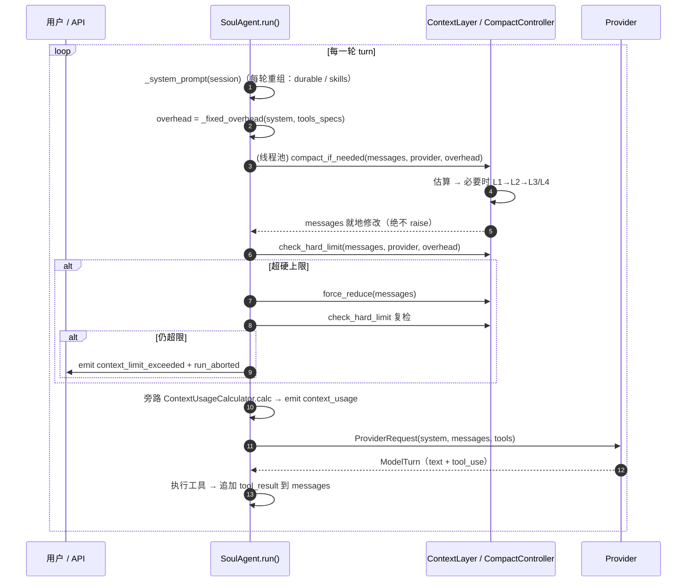
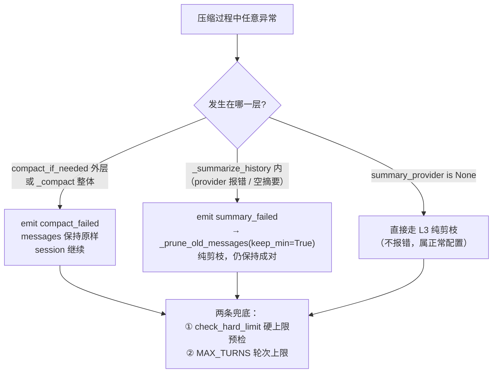
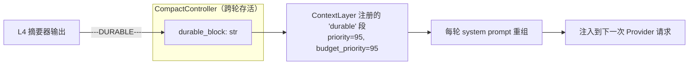

# 16 · Context Compact（上下文压缩）深度解析

> 代码包：`soul_buddy/context/compact.py`（核心）+ `summary.py` / `tokens.py` / `usage.py`
> 关联模块：[10-context.md](./10-context.md)（M7 上下文管理）· [06-agent.md](./06-agent.md)（M2 主循环）
> 关联条款：A12（失败降级）· A13（按 provider 阈值）· A23（启发式 token）· BR-19（禁止异常穿透）· INV-5（tool_use/tool_result 成对）
> 状态：🟢 已实现，行号以当前代码为准

---

## 1. 一句话总览

压缩（compaction）是 agent 循环里的**每轮前置守卫**：在每次调用 LLM 之前先估算「system + tools + messages + 输出预留」是否逼近模型窗口，若逼近就按 **L1→L2→L3/L4** 由廉价到昂贵地减小 messages，直到回到 target 以下；任何环节失败都**降级而非抛错**，session 永远能继续跑。

三个核心不变量：

| 不变量 | 含义 | 落实位置 |
|---|---|---|
| **成对保护** | `tool_use` 与 `tool_result` 永远同时保留或同时丢弃 | `_group()` 按「整轮」分组；`_supersede_old_reads()` 只改内容不删块 |
| **绝不 raise** | 压缩内部任何异常都被吞掉，messages 原样返回 | `compact_if_needed()` 的 `try/except`；`_compact()` 的降级分支 |
| **够用即停** | 廉价层达标就不再动历史，绝不超删 | `_compact()` 中 `_message_tokens(messages) < target` 的 early return |

---

## 2. 涉及文件与职责

| 文件 | 关键内容 | 职责 |
|---|---|---|
| `context/compact.py` | `CompactController`、`needs_compact`、`_group`、`_supersede_old_reads`、`build_summary_prompt`、`split_summary_response` | 压缩控制器 + 分层管线 + 触发判定 + 降级链 + 硬上限预检 |
| `context/summary.py` | `make_summary_provider(provider)` | 把 Provider 包装成同步 `Callable[[str], str]`，供 L4 摘要调用 |
| `context/tokens.py` | `estimate_tokens` / `estimate_messages` | 启发式 token 估算（CJK×1.5、ASCII×0.25，无 tiktoken 依赖） |
| `context/usage.py` | `ContextUsageCalculator` / `ContextUsage` | 旁路用量分类估算 + 官方 `prompt_tokens` 校准；`_fixed_overhead` 复用它 |
| `context/__init__.py` | `ContextLayer` / `build_context_layer` | 门面；注册 `durable` system prompt 段（P1-7） |
| `agent.py` | `run()` 主循环、`_fixed_overhead` | 每轮调用 `compact_if_needed` → `check_hard_limit` → `force_reduce` |
| `subagents/runner.py` | P1-9 独立 `CompactController(keep_recent_turns=4)` | 子代理共享同一 provider 窗口，历史下限更小 |
| `api/runtime.py` | `build_context_layer(summary_provider=make_summary_provider(provider), ...)` | 生产 wiring：把 L4 真正接上当前会话的 provider |

---

## 3. 配置常量（`config.py`）

```python
CONTEXT_WINDOW = {
    "deepseek": 64_000,
    "anthropic": 200_000,
    "openai": 128_000,
    "offline": 8_000,          # 未命中时回落（见 needs_compact）
}
COMPACT_TRIGGER_RATIO = 0.75   # 触发线：窗口 75%
COMPACT_TARGET_RATIO  = 0.50   # 压缩目标：压到窗口 50%
RESERVE_FOR_OUTPUT    = 4_096  # 给模型输出预留
SUMMARY_INPUT_MAX_CHARS = 30_000  # 送摘要器的历史文本上限（保留末尾）
SUBAGENT_KEEP_RECENT_TURNS = 4    # 子代理保留轮数
```

> ⚠️ 没有独立的 `enable_compact` 开关：只要 `agent.context is not None` 就默认启用。
> 摘要模型**复用当前会话的 provider**（不额外选模型），`max_tokens=1024`、`tools=[]`。

---

## 4. 触发判定（A13 / P0-3）

```python
def needs_compact(tokens, provider, fixed_overhead=0) -> bool:
    window = CONTEXT_WINDOW.get(provider, CONTEXT_WINDOW["offline"])
    return tokens + fixed_overhead + RESERVE_FOR_OUTPUT >= window * COMPACT_TRIGGER_RATIO
```

`fixed_overhead` 是 **system prompt + 工具定义**的估算 token，由 `SoulAgent._fixed_overhead()` 每轮算出：

```12:14:soul_buddy/agent.py
overhead = self._fixed_overhead(system, tools_specs)
# P0-3: 触发阈值计入 system + tools 开销,否则 skills/MCP
# 块很大时真实请求会先于 messages 阈值撞上窗口。
```

**为什么必须计入**：skills 索引块、subagent 目录、MCP 连接器描述都嵌在 system prompt 里。只数 messages 会低估真实请求，等 messages 阈值触发时请求其实早已超窗。

压缩目标（messages-only target）：

```python
target = max(int(window * COMPACT_TARGET_RATIO) - fixed_overhead, window // 8)
```

`window // 8` 是**下限兜底**：当 overhead 本身巨大（如 offline 8k 窗口）时，仍保证留一点历史，不会把 target 压成负数。

**数轴视角**：



---

## 5. 分层压缩管线（廉价优先）



### 5.1 L1 · 截断超长 tool_result（`compact.py:293`）

- 同时兼容两种消息形态：Anthropic 的 `content[].type == "tool_result"` 块 与 OpenAI 的 `role="tool"` 扁平消息。
- 超过 `max_chars=4000` 时保留**头部**并追加 `...[truncated N chars]` 标记。
- 打 `_truncated=True` 标记 → **幂等**，同一块不会被反复截断（也就不会反复加标记）。

### 5.2 L2 · 去重（`compact.py:324`）

两个子步骤：

**① supersede 旧的文件重读（P1-6）**



- 第一遍遍历收集 `path -> 最新 call_id`；第二遍把非最新的 `tool_result` **内容替换**为短备注。
- 关键：**只改内容，不删块**。删块会让 `tool_use` 变成孤儿，请求被 provider 400 拒绝（INV-5）。
- 同时识别 Anthropic `tool_use` 块与 OpenAI `tool_calls` 条目（`_iter_read_calls`）。

**② 去重完全重复的整轮**

用 `_group_text(group)` 作为 key，靠 `OrderedDict` 保留**首次出现顺序**、丢弃后出现的重复轮。

### 5.3 `_group()`：成对保护的地基（`compact.py:128`）

所有「丢弃」操作都建立在分组之上：



- `leading` 是原始用户诉求，`_prune_old_messages` / `_summarize_history` / `force_reduce` **三处都保留它**。
- 因为按「整轮」切，`tool_use` 与其 `tool_result` 天然同生共死 → 成对保护自动成立。

### 5.4 L3 · 纯剪枝（`compact.py:339`）

```python
keep = max(1, self.keep_recent_turns // 2) if keep_min else self.keep_recent_turns
if len(groups) <= keep: return
messages[:] = system + leading + [m for g in groups[-keep:] for m in g]
```

`keep_min=True` 只在 L4 降级时使用（保留轮数减半，因为摘要已经丢了信息，需要多留一点原文）。

### 5.5 L4 · 模型摘要（`compact.py:349` + `summary.py`）



设计要点：

1. **摘要全部被丢的轮**，而不是先剪枝再摘要——先剪到 `keep_recent_turns` 会让摘要器无内容可摘。
2. **空摘要保护**：响应为空/全空白直接 `raise`，绝不让空字符串顶替历史的唯一副本。
3. **双段格式**：一次调用同时产出 `summary` 与 `durable facts`，用 `---SUMMARY---` / `---DURABLE---` 分隔；无标记时整段当 summary（durable 保持上一轮值）。
4. **durable 累积**：`previous_durable` 会回喂给下一次摘要提示词，多次压缩不丢早期事实。
5. **物理隔离**：`durable_block` 存在 `CompactController` 上，由 `ContextLayer` 注册成独立的 system prompt 段（priority 95），**L1–L4 永远碰不到它**——这样「有损的消息压缩」不会伤到「无损的关键事实」。

---

## 6. 硬上限预检与最后手段（P0-4）

普通压缩后仍可能超窗（例如单条 tool_result 或 overhead 本身就巨大）。`agent.py` 每轮做二次守卫：



```383:396:soul_buddy/context/compact.py
def check_hard_limit(self, messages, provider, fixed_overhead=0) -> Optional[dict]:
    window = CONTEXT_WINDOW.get(provider, CONTEXT_WINDOW["offline"])
    total = _message_tokens(messages) + fixed_overhead + RESERVE_FOR_OUTPUT
    if total < window:
        return None
    return {"estimated_tokens": total, "window": window,
            "fixed_overhead": fixed_overhead}
```

`force_reduce` 是**真正不可逆**的操作（只留最后一轮），因此只在硬上限路径使用，且返回体只含估算数字、不含消息正文（审计安全）。

---

## 7. 主循环中的完整时序



注意：L4 摘要内部会**发起一次真实 provider 调用**，因此 `compact_if_needed` 被丢进 `anyio.to_thread.run_sync`，避免阻塞 SSE 事件循环（与工具派发同一理由）。

---

## 8. 降级链全景（A12）



对应测试：`tests/test_context.py::test_summary_failure_degrades_to_prune`、`test_compact_internal_error_does_not_raise`；端到端：`tests/test_agent_loop.py::test_long_session_stays_within_budget`。

---

## 9. 子代理与生产接线

**子代理（P1-9）**：`subagents/runner.py` 给自己建一个独立 `CompactController`：

```118:124:soul_buddy/subagents/runner.py
compact = CompactController(
    summary_provider=make_summary_provider(provider),
    on_event=lambda name, data: self.audit.append(
        "subagent_context_event",
        {"name": name, "subagent": cfg.name, **data}),
    keep_recent_turns=SUBAGENT_KEEP_RECENT_TURNS,   # 4
)
```

与主循环**同语义**（每轮 `compact_if_needed`，绝不 raise），但 `keep_recent_turns=4`：长探索任务更激进地压缩。事件名 `subagent_context_event` 让审计可区分来源。

**生产 wiring（P0-1）**：`api/runtime.py` 里唯一一处 `build_context_layer`，其中

```322:328:soul_buddy/api/runtime.py
context = build_context_layer(
    summary_provider=make_summary_provider(provider),
    on_event=lambda name, data: self.audit.append(
        "context_event", {"name": name, **data}),
    memory=self.memory_manager,
    audit=self.audit,
    role_override=role_override,
)
```

不接 `summary_provider` 的话，长会话会退化成纯截断、丢失意图——所以这是 P0-1 的必做项。

---

## 10. durable 事实段（P1-7）



- 空时 `_render_durable()` 返回 `""`，planner 自动跳过该段（不留占位垃圾）。
- 渲染文案明确告诉模型：「历史已被压缩掉时，信任这些事实」。
- 这是「有损摘要」与「无损关键事实」的隔离机制：即使某次摘要质量差，之前累积的 durable 事实仍在 system prompt 中。

---

## 11. 事件与可观测性

| 事件 | 触发点 | 载荷 |
|---|---|---|
| `compact_failed` | `compact_if_needed` 外层异常 | `{"error": repr(e)}` |
| `summary_failed` | L4 摘要异常 | `{"error": repr(e)}` |
| `context_usage` | 每轮旁路估算 | `ContextUsage.to_dict()`（system/tools/messages/skills/memory/total/window/pct/estimated） |
| `context_limit_exceeded` | 硬上限复检仍超窗 | `{estimated_tokens, window, fixed_overhead}`（无消息正文） |
| `subagent_context_event` | 子代理压缩事件 | `{"name": ..., "subagent": ..., ...}` 落审计 |

> 审计侧：主循环 `on_event` 写 `context_event`，子代理写 `subagent_context_event`。

---

## 12. 常见疑问

**Q1：为什么压缩后要求 messages < target，而不是 < 触发线？**
避免「压一点点、下一轮立刻又触发」的抖动（thrashing）。压到 50% 留出足够余量。

**Q2：为什么 early return 这么重要？**
L1 截断 + L2 supersede 常常就够了。若不带 early return，会无谓地丢掉整个历史轮次——`test_early_stop_preserves_history_when_cheap_layers_suffice` 专门守这条。

**Q3：`_truncated` / `_superseded` 标记会不会被发给模型？**
标记是消息 dict 上的私有字段，provider 适配层只取 `role` / `content` / `type`，不会污染请求体。行为上只保证幂等。

**Q4：token 估算不准怎么办？**
`estimate_tokens` 是启发式（CJK×1.5、ASCII×0.25），刻意留 25% 压缩余量吸收误差。`usage.py` 的 `calibrate()` 可用官方 `prompt_tokens` 按比例校准，但 scale 超出 `[0.3, 3.0]` 就放弃校准。

**Q5：offline provider 窗口只有 8k，测试怎么用？**
测试故意用 offline 触发压缩路径（`ctrl.compact_if_needed(msgs, "offline")`），因为它的窗口小、几乎必触发。

---

## 13. 测试覆盖

| 用例 | 验证点 |
|---|---|
| `test_compact_reduces_tokens` | 压缩确实降低 token |
| `test_compact_keeps_pairs` | 压缩后 `tool_use` 必有对应 `tool_result`（INV-5） |
| `test_compact_no_compact_when_under_budget` | 未达阈值不压缩 |
| `test_summary_failure_degrades_to_prune` | A12 降级链 + `summary_failed` 事件 |
| `test_compact_internal_error_does_not_raise` | 脏输入不抛异常（BR-19） |
| `test_needs_compact_counts_fixed_overhead` | P0-3 overhead 计入触发 |
| `test_early_stop_preserves_history_when_cheap_layers_suffice` | 便宜层够用时不得剪枝 |
| `test_prune_runs_when_cheap_layers_not_enough` | 便宜层不足时剪到 `keep_recent_turns` |
| `test_supersede_old_file_reads_keeps_pairs` | P1-6 supersede 且保持成对 |
| `test_long_session_stays_within_budget`（agent_loop） | 端到端长会话不爆窗口 |

---

## 14. 关联文档

- 模块总览：[10-context.md](./10-context.md)
- 主循环全景：[../agent-loop-map.md](../agent-loop-map.md)
- 主循环模块：[06-agent.md](./06-agent.md) · 配置常量：[01-config.md](./01-config.md) · 事件：[03-events.md](./03-events.md)
- 设计约束来源：`docs/feasibility-analysis.md`（ADR-009 / INV-5）· `docs/implementation-plan.md` §11（A12 / A13 / A23 / BR-19）
