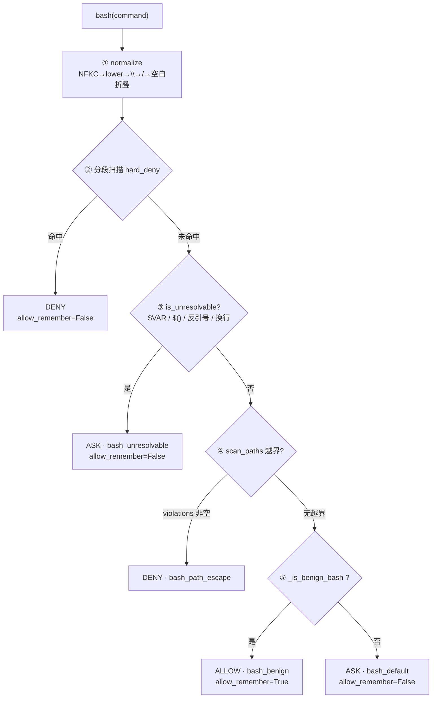

# 17 · Human-in-the-Loop（人工介入）

> 代码位置：`soul_buddy/permissions/policy.py`（决策）· `permissions/gate.py`（挂起/恢复）· `agent.py::_execute_governed`（触发）
> 关联：[08-permissions.md](./08-permissions.md) · [06-agent.md](./06-agent.md)
> 状态：🟢 已实现

---

## 1. 什么时候会触发 HITL

每次工具调用都会先问一句 `PermissionPolicy.decide()`，返回三个值之一：

| 结果 | 行为 | 是否打扰用户 |
|---|---|---|
| `ALLOW` | 直接执行 | 否 |
| `ASK` | 发 SSE `permission_request`，在 `gate.wait()` 上阻塞等用户点选 | **是 ← HITL 只在这一支** |
| `DENY` | 不执行，返回 `ToolResult("已拒绝：<reason>")` 喂回模型 | 否 |

`ASK` 只出现 3 个地方：

| rule_id | 触发条件 | 可记忆 |
|---|---|---|
| `bash_unresolvable` | bash 命令含 `$VAR` / `$(...)` / 反引号 / 换行，无法静态判定路径 | 否 |
| `bash_default` | 其他 bash 命令（不在只读白名单内） | 否 |
| `mcp_remote_call` | 工具名以 `mcp__` 开头的远程调用 | 否 |

**注意：读写文件类工具不会触发 HITL**——路径越界已被 `DENY` 拦死，区内写入由 `fs.py` 自动备份兜底。

触发后（`agent.py:455-477`）：

```python
if decision.action == PermissionAction.ASK:
    req.args["__call_id"] = call.id
    await self._aemit(session, EventType.PERMISSION_REQUEST, {...})   # 先发事件
    choice = await approver.wait(req, timeout=300)                    # 再阻塞
    if choice is None:        # 300s 超时
        emit PERMISSION_EXPIRED;  return ToolResult("已拒绝：权限请求超时")
    if choice.action == DENY:
        emit PERMISSION_RESOLVED; return ToolResult("已拒绝：用户未授权该操作")
    emit PERMISSION_RESOLVED
# 继续往下执行工具
```

用户 4 个选项（前端 `PermissionDialog`，倒计时 300s，Esc = 拒绝）：

| choice | 含义 |
|---|---|
| `allow_once` | 允许本次 |
| `allow_dir` | 允许本次 + 标记 `allow_remember=True`（**记忆侧当前未接线，等价于 allow_once**）|
| `deny` | 拒绝本次，模型可换方案 |
| `deny_rest` | 拒绝 + 本次 Run 后续所有工具调用直接 DENY（gate 上的粘性开关，每个 Run 开头 `reset_run_flags()` 清零）|

回传端点：`POST /api/v1/sessions/{sid}/permissions/{call_id}`，body `{"choice": ...}`。已超时/已处理的 call_id 返回 **409 expired**，前端静默吞掉。

---

## 2. 各工具配置：ALLOW / ASK / DENY

规则表**顺序敏感**（自 `policy.py` 文件头注释）：

| 序 | 规则 | 结果 | 说明 |
|---|---|---|---|
| 1 | `hard_deny` | **DENY** | 见 §3.1 |
| 2 | 工具 `path` 参数越界（`WorkspaceScope.safe_path` 返回 `None`） | **DENY** | INV-6 |
| 2b | bash 命令串内路径越界 | **DENY** | 见 §3.3 |
| 3 | bash 静态不可判定 | **ASK** | `bash_unresolvable` |
| 3b | benign 只读 bash | **ALLOW** | 见 §3.4 |
| 4 | `read_file` / `glob` / `grep` / `search_knowledge` | **ALLOW** | 读类 |
| 5 | `write_file` / `edit_file` | **ALLOW** | 区外已 DENY，区内有备份 |
| 4b | `present_files` | **ALLOW** | 声明式展示，无副作用 |
| 4c | `list_changes` / `rollback_file` / `rollback_session` | **ALLOW** | 回滚到自动快照，低风险 |
| 4d | `task` / `use_skill` | **ALLOW** | 委托与加载，子代理自守其门 |
| 4e | `save_user_preference` / `write_workspace_fact` | **ALLOW** | 只写 `~/.soul_buddy` 本地库，落审计 |
| 5′ | `mcp__<connector>__<tool>` | **ASK** | 远程调用 |
| 6 | 其他 bash | **ASK** | `bash_default` |
| 7 | 默认 | **DENY** | 未匹配任何规则 |

工具分类集合定义在 `policy.py:27-45`：

```python
READ_TOOLS    = {"read_file", "glob", "grep", "search_knowledge"}
WRITE_TOOLS   = {"write_file", "edit_file"}
PRESENT_TOOLS = {"present_files"}
ROLLBACK_TOOLS= {"list_changes", "rollback_file", "rollback_session"}
TASK_TOOLS    = {"task"}
SKILL_TOOLS   = {"use_skill"}
MEMORY_TOOLS  = {"save_user_preference", "write_workspace_fact"}
```

**子代理例外**：`subagents/runner.py:305-313` 把 `ASK` 直接**降级为 DENY**（子代理跑在同步循环里没有 gate，且不发布 SSE），落审计 `subagent_ask_downgraded`。

---

## 3. Bash 工具的处理（重点）

bash 是唯一「字符串即命令」的工具，路径守卫看不见它（`cat ~/.ssh/id_rsa` 在 `args` 里没有 `path` 字段），所以单独设计了一条 4 步判定链，**顺序不可调换**：



### 3.1 第 ① 步：归一化（`normalize.py:29-32`）

```python
def normalize(cmd: str) -> str:
    s = unicodedata.normalize("NFKC", cmd).lower()
    s = s.replace("\\", "/")
    return re.sub(r"\s+", " ", s).strip()
```

`rm -rf` 的子串直接匹配可以被轻松绕过（`rm  -rf`、`RM -RF`、`echo hi && rm -rf /`），所以先把全角转半角、转小写、反斜杠转正斜杠、多空白折叠成一个空格，**再做正则**。

### 3.2 第 ② 步：分段 hard_deny（`normalize.py:13-22, 35-40`）

```python
SEGMENT_SPLIT = re.compile(r";|&&|\|\||\||\n")

HARD_DENY_PATTERNS = [re.compile(p) for p in [
    r"\brm\s+-[a-z]*r[a-z]*f\b",
    r"\bsudo\b",
    r"\bshutdown\b",
    r"\bmkfs\b",
    r"\bdd\s+if=",
    r"\bformat\b\s+[a-z]:",
]]

def scan_hard_deny(cmd: str) -> str | None:
    for seg in SEGMENT_SPLIT.split(normalize(cmd)):
        for pat in HARD_DENY_PATTERNS:
            if pat.search(seg):
                return pat.pattern
    return None
```

**关键点是「按段扫描」而不是整串匹配**：先把命令按 `;` `&&` `||` `|` 换行切成段，每段单独跑正则。这样 `echo safe` 这类无害前缀**无法掩护**后面的 `&& rm -rf /`。

hard_deny 命中 → `DENY` 且 `allow_remember=False`：**永不允许授权，永不进记忆**。

### 3.3 第 ③④ 步：不可判定 → ASK，越界 → DENY（`bash_scan.py`）

**③ 不可静态判定**（`normalize.py:26, 43-44`）：

```python
UNRESOLVABLE = re.compile(r"\$[A-Za-z_]|[$][(]|`|<\(")

def is_unresolvable(cmd: str) -> bool:
    return bool(UNRESOLVABLE.search(cmd))
```

命令里出现变量、命令替换、进程替换时，路径只有运行期才知道 → **保守地 ASK 用户**（`bash_unresolvable`），绝不猜、绝不放行、绝不记忆。

**④ 路径越界扫描**（`bash_scan.py:61-86`）：

```python
def scan_paths(cmd: str, cwd: Path, root: Path) -> ScanResult:
    if is_unresolvable(cmd) or "\n" in cmd:
        return ScanResult(violations=[], decidable=False)   # 交给 ASK 分支
    cwd, root = Path(cwd).resolve(), Path(root).resolve()
    violations = []
    for tok, is_redirect_target in _tokenize(cmd):
        cand = tok.strip("\"'")
        if not is_redirect_target and not looks_like_path(cand):
            continue
        ...
        p = (cwd / Path(cand).expanduser()).resolve()
        if not p.is_relative_to(root):
            violations.append(str(p))
    return ScanResult(violations=violations, decidable=True)
```

做法：token 化 → 挑出「像路径的 token」（含 `/` `\` `C:` `~` `..`，或重定向目标）→ 按 `cwd` resolve → `is_relative_to(workspace_root)` 校验。任一越界 → **DENY `bash_path_escape`**（永不 ASK、永不记忆）。

```python
PATH_HINT_CMD = {"cat", "type", "grep", "head", "tail", "rm", "del", "cp", "mv",
                 "copy", "move", "echo", "curl", "start", "notepad", "less",
                 "more", "python", "python3", "node", "git"}
_REDIRECT = {"<", ">", ">>", "2>", "&>", ">>", "<<"}
```

注意 `_tokenize` 会把重定向**目标**单独标出来：即使目标不像常规路径（比如 `> ./out`），也会被扫。

### 3.4 第 ⑤ 步：benign 只读白名单（`policy.py:50-173`）

`_BENIGN_COMMANDS` 是一张只读命令白名单，分 7 类：

```python
_BENIGN_COMMANDS = frozenset([
    # 目录/导航
    "ls", "lsdir", "dir", "pwd", "find", "tree",
    # 读文件
    "cat", "head", "tail", "less", "more", "wc", "sort", "uniq",
    "grep", "rg", "fd", "egrep", "fgrep",
    # 只读文本处理
    "sed", "awk", "cut", "diff", "cmp", "stat", "file",
    # 环境/身份
    "echo", "date", "whoami", "hostname", "uname", "env", "printenv",
    "getconf", "id", "groups",
    # 定位
    "which", "where", "whereis",
    # 版本/构建/测试类（只读调用）
    "python", "python3", "node", "npm", "yarn", "pnpm", "go", "cargo",
    "java", "javac", "ruby", "perl", "php", "rustc", "dotnet",
    "pip", "pip3", "git", "svn", "hg", "make", "cmake", "gcc", "g++",
    "pytest", "unittest", "ruff", "flake8", "black", "isort", "mypy", "pylint",
    "brew", "conda", "docker", "kubectl",
    "ps", "df", "du", "free", "top", "htop", "xargs",
    # 网络只读
    "curl", "wget", "Invoke-WebRequest", "Invoke-RestMethod", "irm", "iwr",
])
```

`_is_benign_bash()` 的判定逻辑（`policy.py:88-173`）：

1. **`cd <path>` 特例**：单独 `cd` 算 benign；`cd x && <rest>` 递归判定 `rest`。
2. **含命令替换 → 非 benign**：`re.search(r'\$\(.*?\)|`[^`]+`', s)` 命中即退出。
3. **含危险子命令 → 非 benign**：
   ```python
   r'(?:^|\s)(?:sudo|rm|del|mv|cp|copy|move|chmod|chown|mkdir|touch|'
   r'rmdir|format|shutdown|reboot|kill|pkill|dd|mkfs|'
   r'git\s+push|git\s+commit|git\s+checkout|git\s+merge|'
   r'git\s+rebase|git\s+reset|git\s+clean)'
   ```
   注意 `git` 在白名单里，但 `git push/commit/reset/...` 这些**写历史的子命令**被单独拉黑。
4. **`curl` / `wget` 写盘 → 非 benign**：
   - `curl` 带 `-o` / `--output` / `-O` / `--remote-name` → 非 benign
   - `wget` **默认就写盘**，只有显式 `-qO-`（转小写后 `-qo-`）才输出到 stdout，否则一律非 benign
5. **写重定向 → 非 benign**，但区分得很细：
   ```python
   write_redirect = re.compile(
       r'(?:^|\s)(?:\d*)>>(?!\s*&)'      # >> 且后面不跟 &
       r'|(?:^|\s)(?:\d*)>(?!\s*[>&=])'  # > 且后面不跟 > & =
   )
   ```
   - `> file` / `>> file` → 写盘，**非 benign**
   - `2>&1` / `1>&2` → fd 合并，**允许**
   - `>=` → 比较运算符，**允许**
   - `< file` → 读重定向，**允许**（并在第 6 步被剥掉）
6. **逐段白名单校验**：按 `;` `&&` `|` 分段，剥掉 `< xxx` 后，**每段的首 token 都必须在 `_BENIGN_COMMANDS` 里**，任一段不合格即整体非 benign。

合法示例：

```bash
ls -la
cat a.txt ; echo done
ls -R | head -100        # 管道两侧都是只读，允许
cd src && grep -n TODO *.py
cat a.txt 2>&1
git status
```

非法示例（→ ASK）：

```bash
rm -rf build            # 危险子命令（且 hard_deny 更早拦截）
git commit -m "x"       # git 写历史子命令
echo hi > out.txt       # 写重定向
curl -o a.zip http://x  # curl 写盘
wget http://x           # wget 默认写盘
cat $HOME/.ssh/id_rsa   # 含 $VAR → 更早进入 unresolvable ASK
npm install             # ⚠️ npm 在白名单里 → 实际会被 ALLOW
```

> ⚠️ 白名单是按**首 token** 判定的，所以 `npm install` / `pip install xxx` / `make` / `docker run` 这类会写盘的调用被 `ALLOW` 了。这是当前白名单相对宽松的地方，收紧时只需把这些子命令加进第 3 步的「危险子命令」正则。

### 3.5 bash 的两条特殊记忆约束

| 分支 | `allow_remember` | 原因 |
|---|---|---|
| `bash_benign` | `True` | 确定性只读，可目录级放行 |
| `bash_unresolvable` | `False` | 内容不可静态判定，不能预先放行 |
| `bash_default` | `False` | 命令变体无穷，记忆无意义 |
| `bash_path_escape` / `hard_deny` | `False` | 永不授权 |

---

## 4. 附：挂起与恢复的机制

```python
# gate.py:38-71（简化）
async def wait(self, req, timeout=300.0):
    if self.deny_rest:  return DENY(...)      # 运行级短路
    if self.allow_rest: return ALLOW(...)
    call_id = req.args.get("__call_id") or id(req)
    async with self._lock:
        ev = asyncio.Event(); self._pending[call_id] = ev; self._queue.append(call_id)
    try:
        try:    await asyncio.wait_for(ev.wait(), timeout=timeout)
        except asyncio.TimeoutError: return DENY("permission_timeout")
        return self._results.get(call_id, DENY("permission_timeout"))
    finally:
        # 必清理 → 这就是「重复 POST 拿 409」的来源
        self._queue = [c for c in self._queue if c != call_id]
        self._pending.pop(call_id, None); self._results.pop(call_id, None)
```

- **无持久化 checkpoint**：挂起窗口是「工具已解析、尚未执行」的毫秒级窗口，状态都在当前协程栈上，`asyncio.Event` 足够。
- **`PermissionGate` 是 `Runtime` 上的进程内单例**（`api/runtime.py:85`），per-session 的只有 `PermissionPolicy`。
- **`abort_pending()`**：中止 Run 时先把所有 pending ask 以 `DENY(run_aborted)` 释放，再 `task.cancel()`；否则「停止」按钮会被 300s 超时卡死（`runs.py:76-85`）。
- **决策结果是 `ToolResult` 而非异常**：拒绝/超时都返回 `content="已拒绝：..."` 喂回模型，保证 `tool_use`/`tool_result` 成对（INV-5），模型能换方案继续。
- **前端弹窗由服务端事件关闭**（`permission_resolved` / `permission_expired`），本地移除只是乐观优化。

---

## 5. 关联文档

- [08-permissions.md](./08-permissions.md) — M4 权限治理层（设计期约束）
- [06-agent.md](./06-agent.md) — 主循环 · [12-api.md](./12-api.md) — 回传端点与 SSE
- `docs/problems/001-tools-permissions-design.md` — 完整决策树复盘
