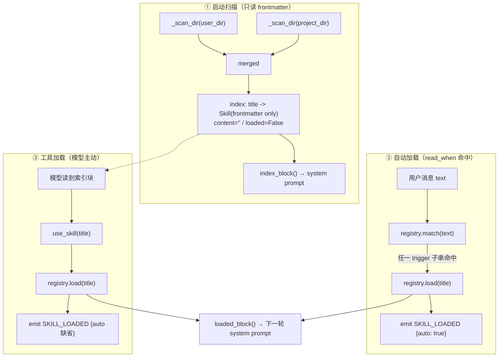
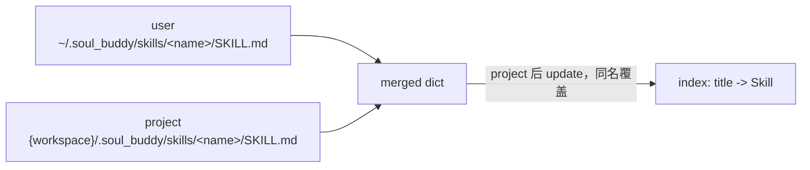

# 18 · Skills（技能系统）

> 代码包：`soul_buddy/skills/`
> 功能模块：M3 工具执行层（专题）｜阶段：P5｜风险：中
> 关联：[09-tools.md](./09-tools.md)（工具执行层）· [06-agent.md](./06-agent.md)（主循环注入）· [08-permissions.md](./08-permissions.md)（权限治理）· [10-context.md](./10-context.md)（token 预算）
> 关联条款：D1（技能只能「收窄」权限）· INV-5（tool_use/tool_result 成对）
> 状态：🟢 已实现

---

## 1. 一句话总览

Skill 就是**一个装着 `SKILL.md` 的目录**。`SKILL.md` = YAML frontmatter（元数据 + 声明式权限清单）+ Markdown 正文（真正的操作指南）。

设计目标是**「领域知识懒加载」**：

> 启动时只读 frontmatter（几十 token / 个），拼成一份紧凑索引塞进 system prompt；正文**默认不进上下文**，等真正需要时才加载。

两句话概括取舍：

| 做法 | 代价 |
|---|---|
| 全量内联所有 skill 正文 | system prompt 爆炸，每轮都付费，且大部分与当前任务无关 |
| 只放索引 + 按需加载 | 多一次 `use_skill` 工具调用往返（可接受） |

第二条就是当前实现。

---

## 2. 代码文件清单

`skills/` 包共 **4 个文件**：

| 文件 | 规模 | 职责 |
|---|---|---|
| `skills/__init__.py` | ~25 | 包门面，导出 `Skill` / `SkillRegistry` / `SKILL_TOOL_SPEC` / `run_use_skill` 等 |
| `skills/model.py` | ~177 | **数据模型 + frontmatter 解析 + 声明式权限清单校验** |
| `skills/registry.py` | ~154 | **发现 / 索引 / 懒加载 / trigger 匹配 / D1 权限判定** |
| `skills/tool.py` | ~33 | `use_skill` 工具的 schema 与 handler |

外围涉及：

| 文件 | 关键内容 | 职责 |
|---|---|---|
| `agent.py` | `run()` 中的自动加载（`:125-132`）、`_system_prompt()` 注入（`:671-680`）、`_skill_authorize()`（`:501-515`）、`SKILL_LOADED` 事件 | 注入点 + 权限收窄 + 事件 |
| `tools/registry.py` | `SKILL_TOOL_SPEC` 注册（`:213`）、`_TOOL_HANDLERS["use_skill"]`（`:52`） | 工具装配 |
| `config.py` | `SKILLS_DIR`（`:96`） | user 级目录常量 |
| `api/runtime.py` | `SkillRegistry(workspace_root=..., user_dir=SKILLS_DIR)`（`:330-332`） | 生产 wiring |
| `api/routers/skills.py` | `GET /api/v1/skills`（`:31-56`）、`_serialize()`（`:21-28`） | 前端列表接口 |
| `models.py` | `EventType.SKILL_LOADED`（`:90`） | 事件类型 |
| `desktop/.../SkillsPanel.tsx` | 技能面板（已安装 / SkillHub 两个 tab） | 前端展示 |
| `desktop/.../MessageList.tsx` | `skill_loaded` → 对话流提示行（`:170-175`） | 加载留痕 |
| `tests/test_p5.py` | D1 权限 4 例 + 注册表懒加载 2 例 | 测试 |

---

## 3. SKILL.md 格式规范

### 3.1 最小可用样例

```markdown
---
title: git-commit
summary: 规范地提交代码
read_when:
  - 提交
  - commit
permissions:
  tools: [bash, read_file]
  network: false
  read_paths: ["src/**"]
  write_paths: []
---
## 提交流程
1. git status 查看改动
2. ...
```

### 3.2 frontmatter 字段

| 字段 | 类型 | 必填 | 缺省 | 说明 |
|---|---|---|---|---|
| `title` | str | 否 | 父目录名（`path.parent.name`） | **技能的全局唯一键**，`use_skill` 按它查找 |
| `summary` | str | 否 | `""` | 索引块里的一行摘要，模型据此判断要不要加载 |
| `read_when` | str \| list[str] | 否 | `[]` | 自动加载触发词；字符串会被归一成单元素列表（`model.py:164-166`） |
| `permissions.tools` | list[str] | 否 | `()` | 允许调用的工具白名单 |
| `permissions.network` | bool | 否 | `false` | **必须是 bool**，给字符串会抛 `SkillPermissionError` |
| `permissions.read_paths` | list[str] | 否 | `()` | 允许读取的 glob；拒绝空串、拒绝含 `..` 的向上遍历 |
| `permissions.write_paths` | list[str] | 否 | `()` | 允许写入的 glob，同上 |
| `agent_created` | bool | 否 | `false` | 标记该技能由 agent 自己创建 |

### 3.3 解析实现

```129:146:soul_buddy/skills/model.py
def parse_frontmatter(text: str) -> tuple[dict, str]:
    """Split YAML frontmatter from body. Returns (frontmatter_dict, body)."""
    if not text.startswith("---"):
        return {}, text
    parts = text.split("---", 2)
    if len(parts) < 3:
        return {}, text
    if yaml:
        fm = yaml.safe_load(parts[1]) or {}
        if not isinstance(fm, dict):
            raise SkillPermissionError("frontmatter must be a mapping")
    else:  # minimal fallback so skills still work without pyyaml
        fm = {}
        for line in parts[1].strip().splitlines():
            if ":" in line:
                key, val = line.split(":", 1)
                fm[key.strip()] = val.strip()
    return fm, parts[2].strip()
```

三个细节：

1. **按 `---` 切两刀**（`split("---", 2)`）→ 得到 `["", frontmatter, body]`，所以正文里出现 `---` 分隔线不会破坏解析。
2. **无 pyyaml 也能跑**：降级成极简 `key: value` 逐行解析（但此时不支持列表，属于保命而非等价实现）。
3. **畸形 frontmatter 静默跳过**（`parse_skill_md` 的 `except` 分支，`model.py:158-163`）：一个坏文件不会让整个注册表扫描崩掉。代价是**错误被吞掉了**，排查时只能靠文件名逐个试。

`_unique_strings` 还有个防呆：`tools: bash`（写成字符串而非列表）会**直接报错**而不是被逐字符拆成 `['b','a','s','h']`（`model.py:57-69`）。

---

## 4. 如何注入到提示词

### 4.1 注入位置

skills 不走 `ContextLayer` 的 `PromptPlanner.register(priority=...)` 段机制，而是**在 planner 组装完之后手动字符串拼接**（`agent.py:671-680`）：

```671:680:soul_buddy/agent.py
        if self.skills is not None:
            index = self.skills.index_block() or ""
            loaded = self.skills.loaded_block() or ""
            if index:
                text = f"{text}\n\n{index}"
            if loaded:
                text = f"{text}\n\n{loaded}"
            skill_text = (index + "\n" + loaded).strip()
            if skill_text:
                parts["skills"] = skill_text
```

注入顺序（`_system_prompt` 全貌）：

```
role / memory / durable …（planner 段）
  → 【skills 索引块 + 已加载正文块】      ← 这里
  → subagents 索引块
  → expert overlay（replace_core 时跳过）
  → MCP connectors 摘要
  → Workspace root: ...
```

`parts["skills"]` 这个 key 是给 `ContextUsageCalculator` 做 per-category token 统计用的，让 `context_usage` 事件里能单独看到 skills 占了多少 token。

### 4.2 索引块格式

```66:72:soul_buddy/skills/registry.py
    def index_block(self) -> str:
        """Compact index for the system prompt (empty when no skills)."""
        if not self.index:
            return ""
        lines = ["## 可用技能（需要时调用 use_skill 加载全文）"]
        lines += [s.index_line() for s in self.index.values()]
        return "\n".join(lines)
```

`index_line()` 就是一行（`model.py:120-122`）：

```python
def index_line(self) -> str:
    return f"- **{self.title}**: {self.summary}"
```

渲染出来长这样：

```markdown
## 可用技能（需要时调用 use_skill 加载全文）
- **git-commit**: 规范地提交代码
- **pytest-debug**: 定位 pytest 失败用例
```

**只有 title + summary**，没有路径、没有 read_when、没有正文——这就是「几十 token / 个」的来源。没有技能时返回 `""`，不产生空标题垃圾。

### 4.3 全文块格式

已加载技能的正文块（`model.py:124-126`）：

```python
def full_block(self) -> str:
    return f"## 技能: {self.title}\n{self.content}"
```

`loaded_block()` 把所有已加载的块用空行拼起来（`registry.py:74-76`）。

### 4.4 每轮重组 —— 关键设计

`_system_prompt()` 在**每一轮 turn** 都被重新调用（`agent.py:150`），所以：

> 用户在**第 5 轮**通过 `use_skill` 加载的技能，其正文会自动出现在**第 6 轮及之后**的请求里，无需任何额外处理。

这是「加载即入上下文」的实现方式——skill 正文不进 `messages`，而是每次拼 system prompt 时从 registry 现取。好处是**不污染消息历史、不参与压缩裁剪**；代价是每轮多一次字符串拼接（可忽略）。

---

## 5. 如何使用 Skills

### 5.1 `use_skill` 工具

```11:32:soul_buddy/skills/tool.py
SKILL_TOOL_SPEC = {
    "name": "use_skill",
    "description": ("Load a skill's full instructions by title. Use when a task "
                    "matches a skill in the available-skills index. Returns the "
                    "skill body."),
    "parameters": {
        "type": "object",
        "properties": {
            "title": {"type": "string",
                      "description": "the skill title to load"},
        },
        "required": ["title"],
    },
}


def run_use_skill(args: dict, ctx) -> ToolResult:
    registry = getattr(ctx, "skill_registry", None)
    if registry is None:
        return ToolResult(content="技能系统未启用。", is_error=False)
    title = args.get("title", "")
    return ToolResult(content=registry.load(title))
```

注册在 `tools/registry.py:213`（spec）与 `:52`（handler）。工具**显式说明「先看 available-skills 索引再调用」**，把「什么时候该加载」的决策权交给模型。

### 5.2 加载逻辑

```87:104:soul_buddy/skills/registry.py
    def load(self, title: str) -> str:
        """Load a skill's full body. Returns the content or an error message."""
        skill = self.index.get(title)
        if skill is None:
            return (f"未找到技能 '{title}'。可用: "
                    f"{sorted(self.index)}")
        if skill.loaded:
            return f"技能 '{title}' 已在上下文中。"
        # lazy: read the body now
        try:
            from .model import parse_frontmatter
            body = parse_frontmatter(Path(skill.path).read_text(encoding="utf-8"))[1]
            skill.content = body
        except Exception as exc:
            return f"加载技能 '{title}' 失败：{exc}"
        skill.loaded = True
        self.loaded[title] = skill
        return f"技能 '{title}' 已加载。\n{skill.full_block()}"
```

四种返回值，**全部是 `ToolResult` 而非异常**（保证 INV-5 成对）：

| 情况 | 返回 |
|---|---|
| 标题不存在 | `未找到技能 'x'。可用: [...]` —— 顺带把候选列表给模型，便于自我纠正 |
| 已加载 | `技能 'x' 已在上下文中。` —— **幂等**，重复调用不重复付费 |
| 读盘/解析失败 | `加载技能 'x' 失败：<exc>` |
| 成功 | `技能 'x' 已加载。\n## 技能: x\n<正文>` |

同一个返回既进入 `messages`（作为 `tool_result`，模型立刻看到正文），又被 `loaded` 字典记录（下一轮进 system prompt）。

### 5.3 加载成功后的 SSE 事件

```493:498:soul_buddy/soul_buddy/agent.py
        if self.skills is not None and call.name == "use_skill":
            # surface freshly loaded skill content as a dedicated event
            await self._aemit(session, EventType.SKILL_LOADED, {
                "title": call.arguments.get("title", ""),
                "loaded": sorted(self.skills.loaded),
            })
```

前端 `MessageList.tsx:170-175` 把它渲染成一条对话流提示：

```
已加载技能：git-commit
```

自动加载时多一个「（自动匹配）」后缀。

---

## 6. Skills 如何按需加载

### 6.1 三条加载路径



三条路径最终都落到 `registry.load()`，共享幂等性与错误处理。

### 6.2 自动加载（`read_when` 触发）

`agent.py:125-132`，**在 system prompt 组装之前**执行：

```125:132:soul_buddy/soul_buddy/agent.py
        # P5: auto-load a skill whose read_when trigger matches the request,
        # BEFORE the system prompt is assembled so its body is in context.
        if self.skills is not None:
            auto = self.skills.match(text)
            if auto:
                self.skills.load(auto)
                await self._aemit(session, EventType.SKILL_LOADED,
                                  {"title": auto, "auto": True})
```

**位置很关键**：必须在 `_system_prompt()` 之前，否则本轮请求拿不到刚加载的正文，要等下一轮才生效。

匹配实现（`registry.py:79-85`）：

```python
def match(self, user_input: str) -> str | None:
    text = (user_input or "").lower()
    for title, skill in self.index.items():
        for trigger in skill.read_when:
            if trigger and trigger.lower() in text:
                return title
    return None
```

要点：

- **大小写不敏感**、**子串匹配**（非分词、非正则）。
- **只返回第一个命中**——按 `index` 的插入顺序（即 `_scan_dir` 的 `sorted(glob)` 顺序，先 user 后 project 覆盖）。
- 想一次命中多个技能，得靠模型自己从索引块里再调 `use_skill`。这是刻意的：自动加载只做「明显的意图识别」，不做激进猜测。
- 中文没有词边界，所以 `read_when: [提交]` 能匹配「帮我提交代码」——子串匹配对中文反而比英文更自然。副作用是**短触发词容易误伤**（`read_when: [a]` 几乎必中），写 `read_when` 时要选有区分度的词。

### 6.3 懒加载的实现要点

「懒」体现在两个层面：

**① 扫描时只读 frontmatter，但正文其实已经读进内存了。**

`parse_skill_md` 会把 `content=body` 一并填入（`model.py:172`），也就是说 `index` 里的 `Skill` 对象**已经持有正文**，只是 `loaded=False`。`load()` 时又**重新读了一次文件**（`registry.py:98`）。

> 这是一个可以优化的点：既然正文已在内存，`load()` 直接 `skill.content = skill.content or reread` 即可省掉一次磁盘 IO。当前写法保证了「文件改动后重新加载能拿到新内容」，属于正确性优先。

**② 省下的主要是 token，不是 IO。**

真正的成本差异在 system prompt 体积：索引是一行摘要，正文可能几百上千行。

### 6.4 `refresh()` 保留已加载状态

```51:63:soul_buddy/skills/registry.py
    def refresh(self) -> None:
        """Re-scan frontmatter (cheap) and rebuild the index."""
        merged = _scan_dir(self.user_dir) if self.user_dir else {}
        # project-level skills take priority on title collision
        merged.update(_scan_dir(self.project_dir) if self.project_dir else {})
        # preserve loaded state across refreshes
        for title, skill in merged.items():
            prior = self.loaded.get(title)
            if prior is not None and prior.content:
                skill.content = prior.content
                skill.loaded = True
        self.index = merged
        self.loaded = {t: s for t, s in merged.items() if s.loaded}
```

重扫后**把已加载的正文搬回新对象**，避免一次 `refresh()` 把上下文里的技能内容清空。这是「索引重建」与「上下文状态」解耦的关键。

---

## 7. 两层目录与优先级



| 层级 | 路径 | 常量 | 用途 |
|---|---|---|---|
| user | `~/.soul_buddy/skills/*/SKILL.md` | `SKILLS_DIR`（`config.py:96` = `HOME / "skills"`） | 个人、跨项目复用 |
| project | `{workspace_root}/.soul_buddy/skills/*/SKILL.md` | `project_dir` 属性（`registry.py:45-49`） | 随仓库走的项目专属技能 |

- **project 覆盖 user**（`registry.py:55` 的 `merged.update(...)`，后写胜出），同名时项目级生效。
- 扫描用 `sorted(glob(f"*/SKILL.md"))`——**必须放在同名子目录里**，`skills/foo.md` 不会被发现。
- ⚠️ **没有 builtin 层**（与 subagents 的三层不同，subagents 有 `builtin < user < project`），技能目前全靠用户/项目自备。

`api/routers/skills.py` 重新独立扫两个目录来**给每个技能打上 `source: user|project` 标签**（注册表本身是合并后的，丢失了来源信息），前端 `SkillsPanel` 据此分组为「用户级 / 项目级」。

---

## 8. 与权限的关系：D1 收窄

### 8.1 D1 不变式

> **技能清单只能「收窄」权限，永远不能「放大」。**

`permissions/` 层是「天花板中的天花板」，skill manifest 是它下面的另一层天花板：

```
harness policy（permissions/）    ← 天花板
      ↓ 只能往下压
skill manifest（permissions.tools / read_paths / write_paths）
      ↓
实际放行
```

### 8.2 判定实现

```126:153:soul_buddy/skills/registry.py
def authorize_skill_tool(tool: str, path: str | None,
                         skill: Skill | None, harness_allows: bool) -> tuple[bool, str]:
    """D1 — authorize a tool call made while a skill is active.

    The skill manifest can only **narrow** the harness policy: a call is allowed
    only when the harness allows it AND the loaded skill declared the capability.
    With no skill loaded the harness policy alone decides.
    """
    if not harness_allows:
        return False, f"已拒绝：权限层不允许 {tool}"
    if skill is None:
        return True, "ok"
    perms = skill.permissions
    if perms.tools and tool not in perms.tools:
        return False, (f"已拒绝：技能 '{skill.title}' 未声明工具 {tool}"
                       f"（声明：{list(perms.tools)}）")
    if path:
        from pathlib import PurePosixPath
        rel = str(path).replace("\\", "/")
        if tool in ("write_file", "edit_file") and perms.write_paths:
            if not any(fnmatch(rel, p) or rel.startswith(p.rstrip("*"))
                       for p in perms.write_paths):
                return False, (f"已拒绝：技能 '{skill.title}' 未声明写入路径 {path}")
        elif perms.read_paths and tool in ("read_file", "glob", "grep"):
            if not any(fnmatch(rel, p) or rel.startswith(p.rstrip("*"))
                       for p in perms.read_paths):
                return False, (f"已拒绝：技能 '{skill.title}' 未声明读取路径 {path}")
    return True, "ok"
```

三条规则：

1. `harness_allows=False` → 直接拒（收窄不能反超）。
2. `perms.tools` 非空时，工具必须在白名单里。
3. 路径类工具按 `write_paths` / `read_paths` 做 glob 校验（`fnmatch` 或前缀匹配）。

**空集合 = 不限**：`tools: []` 或 `write_paths: []` 意味着不施加额外约束，而不是「禁止一切」。这是有意为之——写 skill 时只声明需要收紧的维度即可。

### 8.3 调用点：多技能取「或」

```501:515:soul_buddy/soul_buddy/agent.py
    def _skill_authorize(self, call: ToolCall) -> tuple[bool, str]:
        """P5/D1: enforce the loaded skills' declarative manifest."""
        if self.skills is None:
            return True, "ok"
        loaded = list(self.skills.loaded.values())
        if not loaded:
            return True, "ok"          # no skill loaded -> harness policy alone
        path = call.arguments.get("path")
        reasons: list[str] = []
        for skill in loaded:
            ok, reason = authorize_skill_tool(call.name, path, skill, True)
            if ok:
                return True, "ok"
            reasons.append(reason)
        return False, reasons[0] if reasons else "已拒绝：技能未声明该操作"
```

注意这里的语义是 **「任一已加载技能声明了即可」**（`if ok: return True`），而不是「所有技能都必须声明」。

> ⚠️ 这是一个**宽松的并集语义**：同时加载 A、B 两个技能后，A 声明的 `bash` 权限对 B 的上下文也生效，实际权限是两者的**并集**。与 `active_permissions()`（`registry.py:110-123`，也是并集）保持一致，但严格说比「应该取交集」更宽松。若将来要收紧，改成 `all(...)` 即可。

### 8.4 执行顺序中的位置

`_execute_governed()` 的判定链：

```
1. 重复调用保护（REPEAT_CALL_LIMIT）
2. permissions.decide() → DENY 直接返回 / ASK 走权限门
3. _skill_authorize()   ← 【D1 在这里，ASUP 之后】
4. 执行工具（anyio 线程池）
```

**在权限门之后**：用户手动批准也**跳不过**技能清单的收窄（因为 ASK 通过后还会走到第 3 步）。这保证了 D1 的「只收窄」不会被人工授权绕过。

---

## 9. 配置与装配

| 项 | 值 | 位置 |
|---|---|---|
| `SKILLS_DIR` | `~/.soul_buddy/skills` | `config.py:96` |
| project 目录 | `{workspace}/.soul_buddy/skills` | `registry.py:45-49` |
| 文件名 | `SKILL.md`（大写，固定） | `registry.py:20` |
| 每会话实例 | 每次 `build_agent()` 新建一个 `SkillRegistry` | `api/runtime.py:330-332` |

```330:332:soul_buddy/api/runtime.py
        # P5: skills — user-level (~/.soul_buddy/skills) + project-level
        skills = SkillRegistry(workspace_root=session.workspace_root,
                               user_dir=SKILLS_DIR)
```

**每会话一个 registry**（不是全局单例），所以 `loaded` 状态天然按会话隔离——A 会话加载的技能不会污染 B 会话。

`SkillRegistry.__init__` 里直接调 `refresh()`，构造即完成扫描。

---

## 10. 前端展示

| 位置 | 行为 |
|---|---|
| `SkillsPanel.tsx` | 「已安装 / SkillHub」双 tab；搜索过滤；按 `source` 分组为「用户级 / 项目级」；卡片显示 title + summary |
| `MessageList.tsx:170-175` | `skill_loaded` 事件 → 对话流提示行「已加载技能：x（自动匹配）」 |
| `api.ts:250-258` | SSE 订阅类型列表中包含 `skill_loaded` |
| `types.ts:16` | `'skill_loaded'` 加入 `EventType` 联合类型 |
| `SkillsPanel` 空态文案 | 「将 SKILL.md 放入 `~/.soul_buddy/skills/` 或项目 `.soul_buddy/skills/` 目录」 |

`GET /api/v1/skills?workspace_root=...` 返回：

```json
{
  "skills": [
    {
      "title": "git-commit",
      "summary": "规范地提交代码",
      "read_when": ["提交", "commit"],
      "source": "project",
      "permissions": {"tools": ["bash"], "network": false,
                      "read_paths": ["src/**"], "write_paths": []}
    }
  ]
}
```

> ⚠️ 前端 `SkillsPanel` 的「启用/禁用」开关（`toggleSkill`）目前**只改本地 state**，没有后端接口支撑——禁用不会真正让技能失效。这是一个**未接线的 UI 占位**。

---

## 11. 事件

| 事件 | 触发点 | 载荷 |
|---|---|---|
| `skill_loaded` | 自动匹配（`agent.py:131-132`） | `{"title": ..., "auto": true}` |
| `skill_loaded` | `use_skill` 执行后（`agent.py:495-498`） | `{"title": ..., "loaded": [已加载 title 列表]}` |

事件会持久化进 transcript，所以历史回放时能看到「某个技能在某一轮被加载」。

---

## 12. 常见疑问

**Q1：为什么用工具而不是直接把技能塞进 system prompt？**
技能的正文可能很长（几百行 SOP），而大部分对话用不到。用工具调用做闸门，让模型**为它真正要用的知识付费**。这也是 Claude Skills 等同类设计的共同选择。

**Q2：`read_when` 自动加载和 `use_skill` 手动加载会不会重复？**
不会。`load()` 有 `if skill.loaded: return "...已在上下文中。"` 的幂等保护，自动加载过的技能再被 `use_skill` 调用不会重复计入。

**Q3：加载的技能正文会进 `messages` 吗？**
两条路都有：`use_skill` 的返回是 `tool_result`，会进 `messages`（当轮模型立刻看到）；同时 `loaded_block()` 每轮拼进 system prompt（后续轮次生效）。**这是一份内容出现在两处**，有轻微 token 重复。好处是既保证当轮可见，又保证跨轮可见。

**Q4：压缩（compact）会裁掉技能正文吗？**
`messages` 里的那份 `tool_result` 可能被 L1 截断/L3 剪枝裁掉，但 **system prompt 里的那份不受影响**——压缩只动 `messages`。这是把技能内容放 system prompt 而非 messages 的一个隐性收益。

**Q5：技能加载后 `Workspace root` 会被覆盖吗？**
不会。skills 块在 `Workspace root:` 那行**之前**拼接（`agent.py:671-680` vs `:704`），顺序是固定的。

**Q6：技能能改自己的权限清单吗？**
不能。清单在 `parse_skill_md` 时解析为 `frozen=True` 的 `SkillPermissions`，运行期只读。

**Q7：一个坏 SKILL.md 会导致整个技能系统挂掉吗？**
不会。`parse_skill_md` 捕获所有解析异常返回 `None`（`model.py:158-163`），该文件被静默跳过，其余技能正常工作。代价是**没有错误提示**，排查时只能手动验证文件格式。

**Q8：技能正文里可以引用其他技能吗？**
没有内置的引用机制。可以在正文里写「调用 `use_skill` 加载 xxx」，模型会照做，但这是纯提示词层面的约定，没有任何机制保证。

---

## 13. 测试覆盖

`tests/test_p5.py`：

| 用例 | 验证点 |
|---|---|
| `test_d1_harness_denies_blocks_skill` | harness 拒绝时技能声明也无效（收窄不能反超） |
| `test_d1_no_skill_harness_decides` | 未加载技能时由 harness 单独决定 |
| `test_d1_skill_narrows_tool_set` | 技能工具白名单生效 |
| `test_d1_skill_narrows_write_path` | `write_paths` glob 收窄生效 |
| `test_registry_scan_and_lazy_load` | 扫描后 `loaded is False`（正文懒加载）、索引块含 title、`load()` 后权限可读 |
| `test_registry_match_trigger` | `read_when` 子串匹配命中「帮我提交代码」、不命中无关文本 |

---

## 14. 设计约束小结（改动前必读）

1. **技能清单只能收窄，不能放大**（D1）——`authorize_skill_tool` 的第一个判断必须是 `harness_allows`。
2. **`_skill_authorize` 必须在权限门之后调用**，否则人工授权会绕过技能收窄。
3. **自动加载必须在 `_system_prompt()` 之前**（`agent.py:125` vs `:150`），否则当轮不生效。
4. **索引块只放 title + summary**，任何额外字段都会乘以「技能总数」放大 system prompt。
5. **`load()` 必须幂等**，且失败只能返回 `ToolResult` 文本，不能抛异常（INV-5）。
6. **坏 SKILL.md 静默跳过**，单文件错误不能影响注册表整体扫描。
7. **`refresh()` 必须保留已加载状态**，否则一次重扫会清空上下文里的技能。
8. **每会话一个 registry**，不要提升为全局单例（会串会话）。
9. **`SKILL.md` 必须放在同名子目录中**，`glob("*/SKILL.md")` 只匹配一层。
10. **空权限集合 = 不限**，不是「禁止一切」；写清单时只声明需要收紧的维度。

---

## 15. 已知缺口

| 缺口 | 说明 |
|---|---|
| 前端「启用/禁用」开关未接线 | `SkillsPanel.toggleSkill` 只改本地 state，无后端接口 |
| 多技能权限取并集 | `_skill_authorize` 是「任一技能声明即可」，严格说应取交集 |
| `load()` 重复读盘 | 正文在扫描时已入内存，`load()` 又读一次文件（正确性优先的取舍）|
| 无 builtin 技能层 | 只有 user / project 两层；subagents 是三层 |
| 解析错误无提示 | frontmatter 畸形的技能被静默丢弃，用户无感知 |
| 无 `SKILL.md` schema 校验命令 | 没有 lint / validate 子命令，只能靠运行期观察 |
| SkillHub tab | 前端有入口，后端无对应实现 |

---

## 16. 关联文档

- [09-tools.md](./09-tools.md) — M3 工具执行层（`use_skill` 的装配）
- [06-agent.md](./06-agent.md) — M2 主循环（`_system_prompt` 注入与执行链）
- [08-permissions.md](./08-permissions.md) — M4 权限治理层（D1 的上层天花板）
- [10-context.md](./10-context.md) — token 预算（`parts["skills"]` 的用途）
- [../skills-and-mcp.md](../architecture-design/skills-and-mcp.md) — 技能生命周期与连接器信任模型（跨模块深度文档）
