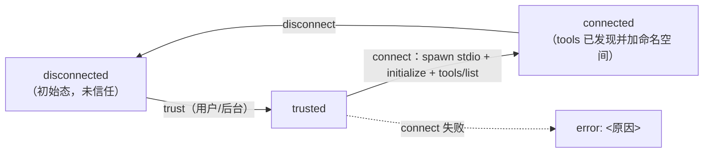
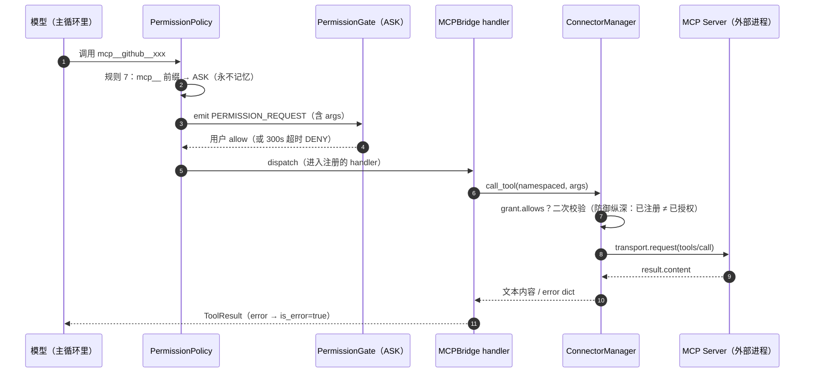

# 19 · MCP 连接器（mcp）

> 代码包：`soul_buddy/mcp/` + `api/routers/mcp.py` + `agent.py::_mcp_block`
> 功能模块：M15 MCP 外部工具接入 ｜ 阶段：P5（2026-09） ｜ 风险：中
> 关联：[18-skills.md](./18-skills.md)（Skills 系统，同为扩展机制）· [09-tools.md](./09-tools.md)（工具注册表）· [08-permissions.md](./08-permissions.md)（权限治理）· [10-context.md](./10-context.md)（token 预算）
> **状态：🟢 已实现** —— 连接器生命周期 + 命名空间隔离 + 双层权限 + 工具注册 + 提示词注入 + 管理 API + 桌面面板。

---

## 1. 职责定位

MCP（Model Context Protocol）把**外部进程**提供的工具接进 SoulBuddy 的**同一条受控派发路径**。
它不是一条旁路：MCP 工具和内置工具一样，要过 `policy.decide` → 权限门 → 注册表 handler，
唯一区别是 handler 最终把调用转发给外部 MCP server（stdio JSON-RPC）。

三个核心设计：

- **命名空间隔离**：外部工具 `search` 在连接器 `brave` 上，对模型暴露为
  `mcp__brave__search`。连接器之间永不冲突，且每个远端调用天然可审计（前缀即标签）。
- **trust ≠ grant**：`trust`（连接器进程能不能跑）由用户决策；`grant`（它的哪些工具可被调用）
  由 `refresh_grant` 逐工具枚举，**绝无通配符**。
- **后台自动连接**：启动时起守护线程做 trust→connect→refresh_grant→bind，
  不挡 Electron 15s READY 关键路径。

---

## 2. 代码文件清单

`mcp/` 包共 **4 个文件**：

| 文件 | 职责 |
|---|---|
| `mcp/__init__.py` | 包导出：`ConnectorManager` / `MCPBridge` / `MCPPermissionGrant` / transport |
| `mcp/connector.py` | `Transport`（接口）/ `StdioTransport`（真实 stdio）/ `FakeTransport`（测试）/ `MCPConnector`（生命周期）/ `ConnectorManager`（编排 + 闸门）/ `namespace()` / `split_namespace()` |
| `mcp/grant.py` | `MCPPermissionGrant`（冻结 dataclass，`network` 布尔 + `tools` frozenset）+ `MCPPermissionError` + `NO_MCP_PERMISSIONS` |
| `mcp/bridge.py` | `MCPBridge.bind/unbind_connector/unbind_all`：把发现的工具注册进共享 `ToolRegistry` |

外围涉及：

| 文件 | 关键内容 | 职责 |
|---|---|---|
| `agent.py` | `_mcp_block()`（`:721-750`）、`_system_prompt()` 注入（`:696-703`） | 提示词注入 |
| `api/runtime.py` | `ConnectorManager` 装配（`:127`）、`_load_mcp_config`（`:137-154`）、`_auto_connect_mcp`（`:156-189`） | 生产 wiring + 后台连接 |
| `api/routers/mcp.py` | list / trust / connect / disconnect | 管理接口 |
| `permissions/policy.py` | 规则 7：`mcp__` 前缀 → ASK（`:278-285`） | 权限门 |
| `config.py` | `MCP_CONFIG_PATH = ~/.soul_buddy/mcp.json`（`:97`） | 配置路径常量 |
| `context/usage.py` | `connectors` 分段统计字段 | token 计入 |
| `desktop/.../McpPanel.tsx` | 桌面 MCP 面板（开关 = trust+connect / disconnect） | 前端 |
| `tests/test_p5.py` | grant 校验 4 例 + 命名空间隔离 | 测试 |

---

## 3. mcp.json 配置格式

标准 `mcpServers` 形状，支持 `${VAR}` 环境变量占位替换：

```json
{
  "mcpServers": {
    "github": {
      "command": "npx",
      "args": ["-y", "@modelcontextprotocol/server-github"],
      "env": { "GITHUB_PERSONAL_ACCESS_TOKEN": "${GITHUB_TOKEN}" }
    }
  }
}
```

- **加载时机**：`Runtime.__init__` 调 `_load_mcp_config()`，读 `~/.soul_buddy/mcp.json`（utf-8-sig）。
- **ENV 展开**：`_expand_env()` 递归把 `"${VAR}"` 替换成 `os.environ["VAR"]`；变量缺失替换为空串，
  **不崩溃**（连接器大概率连接失败，错误在 UI 上可见）。
- **配置损坏**：读/解析失败写 `mcp_config_error` 审计，返回 `{}`（零连接器，应用照常启动）。

---

## 4. 连接器生命周期



| 状态 | 含义 | 工具可否被模型看到 |
|---|---|---|
| `disconnected` | 未信任，什么都没 spawn | 否 |
| `trusted` | 用户已授权该连接器**进程**可运行 | 否 |
| `connected` | 握手完成，`tools/list` 已发现工具 | 是（注册进 registry 后） |
| `connecting` | 握手中（过渡态） | 否 |
| `error: <msg>` | 连接失败，原因存 status 字符串（UI 展示） | 否 |

关键代码：

```12:20:soul_buddy/mcp/__init__.py
Lifecycle: disconnected → trusted (user action) → connected (tools discovered).
Tool names are namespaced `mcp__<connector>__<tool>` so connectors can never
collide and every remote call is auditable.
```

### 4.1 握手细节（`MCPConnector.connect`）

1. 未 `trusted` → 直接返回 `False`（**信任是 spawn 的前置门**）。
2. `transport is None` 时构造 `StdioTransport(command, args, env)`；`env` 若配置了就
   **merge 到 `os.environ` 之上**（保留 PATH 等，仅覆盖用户指定变量）。
3. `transport.start()` → `initialize` → `tools/list`。
4. 把每个远端工具转成含命名空间名字的 spec：
   `{"name": "mcp__<conn>__<tool>", "description", "input_schema", "_connector", "_original_name"}`。
5. 成功 → `status="connected"`；异常 → `status=f"error: {exc}"`，返回 `False`。

> **Windows 坑（已处理）**：`subprocess.Popen(shell=False)` 不会自己找 `.cmd`。
> `StdioTransport.start()` 用 `shutil.which(command)` 解析出 `npx.cmd` / `npm.cmd` 的真实路径，
> 否则裸 `npx` 会 `[WinError 2]`。

### 4.2 命名空间工具函数

```124:133:soul_buddy/mcp/connector.py
def namespace(connector: str, tool: str) -> str:
    return f"mcp__{connector}__{tool}"


def split_namespace(name: str) -> tuple[str, str] | None:
    """`mcp__brave__search` -> ('brave', 'search'); None if malformed."""
    parts = name.split("__")
    if len(parts) < 3 or parts[0] != "mcp":
        return None
    return parts[1], "__".join(parts[2:])
```

工具名本身含 `__` 也能正确还原（`"__".join(parts[2:])`）。

---

## 5. 双层权限模型（trust vs grant）

这是整个 MCP 层最重要的一条设计。**trust 与 grant 故意分开**：

| 问题 | 谁决定 | 粒度 | 载体 |
|---|---|---|---|
| trust——连接器进程**能不能跑**？ | 用户（UI 开关或启动自动信任） | 整个连接器 | `MCPConnector.trusted` |
| grant——它的哪个工具**可被调用**？ | `refresh_grant` 枚举 + 调用时二次校验 | 单个工具名（frozenset，无通配符） | `MCPPermissionGrant` |

```20:39:soul_buddy/mcp/grant.py
@dataclass(frozen=True)
class MCPPermissionGrant:
    tools: frozenset[str] = field(default_factory=frozenset)
    network: bool = False

    def __post_init__(self):
        if not isinstance(self.network, bool):
            raise MCPPermissionError("MCP permission network must be true or false")
        if isinstance(self.tools, (str, bytes)):
            raise MCPPermissionError("MCP permission tools must be a collection")
        normalized = frozenset(self.tools)
        bad = [t for t in normalized
               if not isinstance(t, str) or not t.startswith("mcp__")]
        if bad:
            raise MCPPermissionError(
                f"MCP permission tools must use namespaced mcp__ names: {bad}")
        object.__setattr__(self, "tools", normalized)

    def allows(self, tool_name: str) -> bool:
        return self.network and tool_name in self.tools
```

约束：

- **构造即校验**：非 `mcp__` 前缀的名字直接抛 `MCPPermissionError`（防止用 `read_file` 之类混入）。
- **`allows` 是 AND**：`network=true` **且** 工具名在枚举清单里。未显式枚举的 MCP 工具永远不可达。
- `NO_MCP_PERMISSIONS = MCPPermissionGrant()`：默认 `network=False` + 空集合 → **全部拒绝**。

`refresh_grant` 从**当前已连接**的连接器重建清单：

```274:283:soul_buddy/mcp/connector.py
    def refresh_grant(self) -> MCPPermissionGrant:
        """Rebuild the allowlist from currently connected connectors.

        Trusting a connector is the user's explicit decision to let it run; the
        grant then enumerates its tools one by one (never a wildcard).
        """
        tools = [t["name"] for t in self.discovered_tools()]
        grant = MCPPermissionGrant(tools=frozenset(tools), network=bool(tools))
        self.set_permission_grant(grant)
        return grant
```

---

## 6. MCP 是如何加载的

### 6.1 装配（`Runtime.__init__`）

```126:135:soul_buddy/api/runtime.py
        # --- P5: MCP connectors (untrusted + disconnected by default) -------
        self.mcp = ConnectorManager(self._load_mcp_config())
        self.mcp_bridge = MCPBridge(self.mcp)        # Auto-connect every configured connector so the model can use MCP
        # tools without a manual UI toggle — but in the BACKGROUND: an npx
        # stdio connector takes 20-30s to spawn/handshake (observed 22-31s
        # for github), far past Electron's 15s SOULBUDDY_READY budget, so
        # this must not sit on the startup critical path. Tools appear once
        # the thread binds them; per-connect failures are logged, non-fatal.
        threading.Thread(target=self._auto_connect_mcp, daemon=True,
                         name="mcp-auto-connect").start()
```

`ConnectorManager.__init__` 只做一件事：遍历 `config["mcpServers"]`，为每个条目建一个
**未信任、未连接**的 `MCPConnector`。**此阶段不 spawn 任何进程。**

### 6.2 后台自动连接（为什么是后台）

`npx stdio` 连接器 spawn + 握手实测 **20–30 秒**（github 连接器观测 22–31s），远超
Electron 的 **15 秒 READY 预算**。所以必须放到守护线程，绝不能挡在启动关键路径上：

```156:189:soul_buddy/api/runtime.py
    def _auto_connect_mcp(self) -> None:
        """Trust + connect every configured connector (runs in a daemon thread).

        Failures are logged and swallowed — a single bad connector must never
        prevent the rest of the app from booting. Connected tools are bound
        into the shared registry so the model sees them on the next turn.
        """
        import logging
        log = logging.getLogger("soul_buddy.runtime")
        bound_total = 0
        for name in list(self.mcp.connectors.keys()):
            try:
                self.mcp.trust(name)
                ok = self.mcp.connect(name)
                if ok:
                    self.mcp.refresh_grant()
                    bound = self.mcp_bridge.bind(self.registry)
                    bound_total += bound
                    log.info("auto-connected MCP %s (%d tools)", name, bound)
                    self.audit.append("mcp_auto_connected",
                                      {"connector": name, "tools": bound})
                else:
                    log.warning("MCP %s connect returned False — check config", name)
                    self.audit.append("mcp_auto_connect_failed",
                                      {"connector": name, "reason": "connect_false"})
            except Exception as exc:
                log.warning("MCP %s auto-connect failed: %s", name, exc)
                self.audit.append("mcp_auto_connect_failed",
                                  {"connector": name, "error": str(exc)})
```

顺序固定为 **trust → connect → refresh_grant → bind**：

| 步骤 | 动作 | 失败后果 |
|---|---|---|
| `trust(name)` | 标记 `trusted=True`（自动信任，因已配置即意图明确） | — |
| `connect(name)` | spawn + 握手 + `tools/list` | 记 `mcp_auto_connect_failed` 审计，**非致命** |
| `refresh_grant()` | 从已连接连接器重建 allowlist | — |
| `bind(registry)` | 把发现的工具注册进共享 registry | 返回绑定数量 |

**失败不阻断启动**：单个坏连接器不影响其余连接器与应用启动。工具是「某一轮突然出现」的——
模型每轮重新查 `registry.specs()`，连上后的下一轮就能看到（见 §7）。

### 6.3 注册进共享 registry（`MCPBridge`）

```27:40:soul_buddy/mcp/bridge.py
    def bind(self, registry) -> int:
        """Register every discovered MCP tool. Returns how many were bound."""
        bound = 0
        for tool in self.manager.discovered_tools():
            name = tool["name"]
            spec = {
                "name": name,
                "description": tool.get("description") or f"MCP tool {name}",
                "parameters": tool.get("input_schema")
                              or {"type": "object", "properties": {}},
            }
            registry.register(spec, _make_handler(self.manager, name))
            bound += 1
        return bound
```

handler 负责把 `manager.call_tool` 的结果转成 `ToolResult`（错误 → `is_error=True`，**不 raise**）：

```13:20:soul_buddy/mcp/bridge.py
def _make_handler(manager: ConnectorManager, tool_name: str):
    def _handler(args: dict, ctx) -> ToolResult:
        result = manager.call_tool(tool_name, args or {})
        if "error" in result:
            return ToolResult(content=f"MCP 调用被拒绝：{result['error']}",
                              is_error=True)
        return ToolResult(content=result.get("content", ""))
    return _handler
```

**按连接器卸载**（disconnect 时只摘掉该连接器的工具）：

```42:54:soul_buddy/mcp/bridge.py
    def unbind_connector(self, registry, connector_name: str) -> int:
        """Remove all tools belonging to *connector_name* from the registry.

        Uses the ``mcp__<connector>__`` naming prefix so only that connector's
        tools are touched — other connectors remain registered.
        Returns how many were removed.
        """
        prefix = f"mcp__{connector_name}__"
        return registry.unregister_matching(prefix)

    def unbind_all(self, registry) -> int:
        """Remove every MCP tool from the registry. Returns count."""
        return registry.unregister_matching("mcp__")
```

---

## 7. MCP 是如何注入提示词的

注入分**两条线**，是理解 MCP 生效机制的关键：

### 7.1 工具 spec（模型真正「看到」的可调用能力）

注册表就是 prompt 里工具列表的来源。`agent.run()` 每轮现查：

```142:147:soul_buddy/agent.py
            tools_specs = self.tools.specs()
            # search_knowledge 只对「专家绑定了资料库且检索链路可用」的会话暴露;
            # 其余会话不看到该工具,handler 里的校验只是兜底。
            if self.knowledge is None or not self.kb_ids:
                tools_specs = [s for s in tools_specs
                               if s.name != "search_knowledge"]
```

`registry.specs()` 把每个 spec 转成 `ToolSpec(name, description, parameters)`。
**MCP 工具因此和内置工具在模型眼里完全同级**——差异只在 handler 内部（转发 vs 本地执行）。

### 7.2 自然语言描述块（告诉模型「何时用」）

纯工具列表不足以让模型理解「哪些是联网能力、什么时候优先用」。`_mcp_block()` 扫描注册表里
`mcp__` 前缀的工具，按连接器分组，渲染成一段 Markdown 注入 system prompt：

```720:750:soul_buddy/agent.py
    # --- MCP connector prompt block -----------------------------------------
    def _mcp_block(self) -> str:
        """Describe connected MCP connectors so the model uses them.

        Scans the registry for tools starting with ``mcp__`` and groups them
        by connector. Returns an empty string if none are bound.
        """
        names = [n for n in self.tools.names() if n.startswith("mcp__")]
        if not names:
            return ""

        # Group by connector: mcp__github__xxx -> github
        by_conn: dict[str, list[str]] = {}
        for n in names:
            parts = n.split("__", 2)  # ['mcp', 'github', 'xxx']
            if len(parts) >= 3:
                by_conn.setdefault(parts[1], []).append(parts[2])

        lines = ["## MCP 外部工具（联网能力）"]
        lines.append("你已连接以下 MCP 服务器，可以调用它们的工具：\n")
        for conn_name, tool_names in by_conn.items():
            # Try to find human-readable descriptions from specs
            spec_map = {s.name: s.description for s in self.tools.specs()}
            lines.append(f"### {conn_name}")
            for tn in tool_names:
                full = f"mcp__{conn_name}__{tn}"
                desc = spec_map.get(full, "")
                lines.append(f"- `{full}` — {desc}" if desc else f"- `{full}`")
            lines.append("")
        lines.append("当用户需要联网操作（查 GitHub、搜索网页、调用外部 API 等）时，优先使用对应的 mcp__ 工具。")
        return "\n".join(lines)
```

渲染结果示例：

```markdown
## MCP 外部工具（联网能力）
你已连接以下 MCP 服务器，可以调用它们的工具：

### github
- `mcp__github__list_repos` — List repositories for the authenticated user
- `mcp__github__create_issue` — Create a new issue

当用户需要联网操作（查 GitHub、搜索网页、调用外部 API 等）时，优先使用对应的 mcp__ 工具。
```

### 7.3 注入位置（system prompt 拼装顺序）

`_system_prompt()` 每轮重组（压缩、中途 `use_skill` 加载都需在后续轮次可见），
MCP 块位于**最后、Workspace root 之前**：

```696:705:soul_buddy/agent.py
        # P5: MCP connector summary — injects a short block so the model
        # knows *what* external tools are available and when to use them.
        mcp_block = self._mcp_block()
        if mcp_block:
            text = f"{text}\n\n{mcp_block}"
            parts["connectors"] = mcp_block
        else:
            parts["connectors"] = ""
        text = text + f"\nWorkspace root: {session.workspace_root}"
        return text, parts
```

完整拼装顺序：

```
role（用户可改的 system prompt）+ memory / durable …（planner 段）
  → skills 索引块 + 已加载技能全文
  → subagents 索引块
  → expert 叠加块（replace_core 专家已替换 role，不再追加）
  → 【MCP 外部工具块】          ← 本模块
  → Workspace root: <path>
```

`parts["connectors"]` 会交给 `ContextUsageCalculator` 做分段 token 统计
（`context/usage.py` 里 `connectors` 字段早期预留，现已由该块填充）。

### 7.4 分段 token 计入压缩阈值

MCP 块很大时，若压缩只数 messages，真实请求会先于阈值撞上窗口。因此触发阈值**计入
system + tools 固定开销**：

```152:160:soul_buddy/agent.py
            if self.context is not None:
                # P0-3: 触发阈值计入 system + tools 开销,否则 skills/MCP
                # 块很大时真实请求会先于 messages 阈值撞上窗口。
                overhead = self._fixed_overhead(system, tools_specs)
                # L4 摘要内嵌一次 provider 调用,放到线程池避免阻塞 SSE
                # 事件循环(与工具派发同理由);compact 本身绝不 raise。
                await anyio.to_thread.run_sync(
                    self.context.compact_if_needed,
                    messages, self.provider.name, overhead)
```

### 7.5 设置面板看到的「有效 prompt」

`GET /api/v1/prompt` 返回的是**用户 prompt + MCP 连接块合并后**的有效文本，
而 `PUT` 只持久化用户那一份——MCP 块是 agent runtime 动态注入的，不落盘：

```5:7:soul_buddy/api/routers/prompt.py
On read we merge **user prompt + MCP connector block** so the settings UI shows
the *effective* text the agent will actually use. On save, only the user prompt
portion is persisted; the MCP block is injected dynamically at agent runtime.
```

---

## 8. 一次 MCP 调用的完整路径



### 8.1 权限规则 7（ASK，永不记忆）

MCP 调用是**远端**的，一律要用户逐次批准，且**不提供「始终允许」**（防一次放行后永久打开）：

```278:285:soul_buddy/permissions/policy.py
        # 5. P5 MCP — namespaced mcp__<connector>__<tool> calls are remote:
        # ask the user, and the MCP grant allowlist is enforced again in the
        # handler (defence in depth — a declared tool is still not callable
        # until the connector is trusted and the grant enumerates it).
        if req.tool.startswith("mcp__"):
            return PermissionDecision(PermissionAction.ASK, "mcp_remote_call",
                                     "MCP remote tool call requires approval",
                                     allow_remember=False)
```

### 8.2 二次校验（防御纵深）

**注册表里有这个工具（连接器已连接）≠ 当前 grant 允许调用**。`call_tool` 里再查一遍：

```285:300:soul_buddy/mcp/connector.py
    def call_tool(self, tool_name: str, params: dict) -> dict:
        """Namespaced call, gated by the active permission grant."""
        if not split_namespace(tool_name):
            return {"error": f"malformed MCP tool name: {tool_name}",
                    "code": "bad_name"}
        if not self.allows(tool_name):
            return self._denial(tool_name)
        parts = split_namespace(tool_name)
        connector = self.connectors.get(parts[0]) if parts else None
        if connector is None:
            return {"error": f"unknown connector for {tool_name}",
                    "code": "unknown_connector"}
        if connector.status != "connected":
            return {"error": f"connector '{parts[0]}' is not connected",
                    "code": "not_connected"}
        return {"content": connector.call_tool(tool_name, params or {})}
```

两道门由不同代码路径维护：`policy.decide` 的规则 7（agent 层）与 `grant.allows`（MCP 层），
**一道失效另一道还在**。

### 8.3 结果归一化（`MCPConnector.call_tool`）

```199:215:soul_buddy/mcp/connector.py
    def call_tool(self, namespaced: str, params: dict) -> str:
        if self.transport is None:
            return "Error: connector not connected"
        original = next((t["_original_name"] for t in self.tools
                         if t["name"] == namespaced),
                        (split_namespace(namespaced) or ("", namespaced))[1])
        resp = self.transport.request(
            "tools/call", {"name": original, "arguments": params})
        if "error" in resp:
            return f"Error: {resp['error']}"
        result = resp.get("result") or {}
        content = result.get("content")
        if isinstance(content, list):
            return "\n".join(
                c.get("text", "") for c in content if isinstance(c, dict))
        return str(content) if content is not None else json.dumps(
            result, ensure_ascii=False)
```

要点：命名空间名字 → 还原成**原始工具名**再发 `tools/call`；MCP 的 `content` 数组
（`[{"type": "text", "text": ...}]`）拼成纯文本；任何错误都转成字符串，**不抛异常**。

---

## 9. 管理 API（`/api/v1/mcp`）

| 方法 | 路径 | 作用 |
|---|---|---|
| GET | `/connectors` | 列出连接器（name / status / trusted / tools） |
| POST | `/connectors/{name}/trust` | 信任（写 `mcp_trusted` 审计） |
| POST | `/connectors/{name}/connect` | 连接 + `refresh_grant` + `bind`（**未信任 → 409**） |
| POST | `/connectors/{name}/disconnect` | 断开 + `refresh_grant` + `unbind_connector` |

```32:51:soul_buddy/api/routers/mcp.py
@router.post("/connectors/{name}/connect", dependencies=[Depends(require_auth)])
async def connect_connector(name: str, runtime=Depends(get_runtime)):
    conn = runtime.mcp.connectors.get(name)
    if conn is None:
        raise HTTPException(status_code=404, detail="connector not found")
    if not conn.trusted:
        # Trust is an explicit user action — never auto-trust a connector.
        raise HTTPException(status_code=409,
                            detail={"status": "not_trusted",
                                    "detail": "trust the connector first"})
    ok = runtime.mcp.connect(name)
    if not ok:
        raise HTTPException(status_code=502, detail="connect failed")
    grant = runtime.mcp.refresh_grant()
    bound = runtime.mcp_bridge.bind(runtime.registry)
    runtime.audit.append("mcp_connected", {
        "connector": name, "tools": [t["name"] for t in conn.tools]})
    return {"status": "connected", "connector": name,
            "tools": [t["name"] for t in conn.tools],
            "granted": sorted(grant.tools), "bound": bound}
```

**HTTP 语义很明确**：未信任连接 → 409；连接失败 → 502；不存在 → 404。
disconnect 会调 `unbind_connector`，模型下一轮就**看不到**该连接器的工具了。

桌面端 `McpPanel.tsx` 的开关即对应这一串：开启 = 先 `trust`（若未信任）再 `connect`；
关闭 = `disconnect`。

---

## 10. 使用速查

| 操作 | 做法 |
|---|---|
| 接一个连接器 | 编辑 `~/.soul_buddy/mcp.json`（标准 `mcpServers` 格式，支持 `${VAR}`），重启 sidecar |
| 自动连接 | 启动后台线程自动 trust + connect 全部已配置连接器；失败只记审计 |
| 手动控制 | 设置 → MCP 面板开关；或 `POST /api/v1/mcp/connectors/{name}/trust|connect|disconnect` |
| 看已连接工具 | `GET /api/v1/mcp/connectors`，或 MCP 面板展开行 |
| 让模型用上 | 连接成功即自动注册；模型下一轮的工具列表里出现 `mcp__<连接器>__<工具>` |
| 想撤销 | disconnect（同时从 registry 摘除工具）；MCP 调用**永不记忆**，无授权残留 |
| 排错 | 连接器 `status="error: <原因>"` 字符串在面板可见；审计表查 `mcp_*` 事件 |

---

## 11. 设计决策与约束

- **命名空间强制前缀 `mcp__`**：`MCPPermissionGrant.__post_init__` 直接拒绝非 `mcp__` 名字，
  从构造层杜绝「内置工具名混入 MCP 授权」。
- **无通配符**：`grant.tools` 是逐工具枚举的 `frozenset`，`refresh_grant` 明确「never a wildcard」。
- **trust 与 grant 分离**：trust 管进程能否跑（用户决策）；grant 管工具能否调（枚举 + 二次校验）。
- **失败即数据，不抛异常**：连接失败存 status 字符串，调用失败转 `ToolResult(is_error=True)`，
  绝不穿透崩 loop（与 BR-19 一致）。
- **后台自动连接**：npx 握手 20–30s，必须离开 15s READY 关键路径；工具「某轮突然出现」是可接受的，
  因为每轮现查注册表。
- **env merge 而非替换**：配置的 `env` 覆盖在 `os.environ` 之上，保留 PATH（否则 `npx` 都可能找不到）。
- **`FakeTransport` 可注入**：整个 MCP 层无需真实 server 即可测试（见 `tests/test_p5.py`）。
- **信任不自动**（API 层）：`connect` 端点要求 `trusted`，未信任返回 409；只有启动自连接是自动 trust。

---

## 12. 与 Skills 的对照

两者都是「扩展机制」，共同原则是**扩展只能收窄权限，永远不能放大**：

| 维度 | Skills | MCP |
|---|---|---|
| 扩展什么 | 领域知识（提示词）+ 声明式权限清单 | 外部工具（可执行能力） |
| 加载时机 | 懒加载（索引常驻，全文按需） | 启动后台连接 + 逐轮现查 |
| prompt 注入 | `index_block` + `loaded_block` | `_mcp_block()` 描述块 + 工具 spec |
| 权限闸门 | `authorize_skill_tool`（AND 收窄） | `MCPPermissionGrant.allows`（network 且枚举） |
| 权限记忆 | — | MCP 调用 **永不记忆**（`allow_remember=False`） |
| 卸载 | 无（只读知识） | `unbind_connector`（真正移出注册表） |

---

## 13. 关联文档

- Skills 系统：[18-skills.md](./18-skills.md)（同为扩展机制，注入顺序相邻）
- 设计总览：[Skills 与 MCP 系统](../architecture-design/skills-and-mcp.md)（信任模型 / D1 窄化 / 汇合点）
- 注入位置：`agent.py::_system_prompt`（skills/subagents/expert 之后、Workspace root 之前）
- 权限层：[08-permissions.md](./08-permissions.md)（规则 7：`mcp__` → ASK）
- 工具层：[09-tools.md](./09-tools.md)（`registry.register` / `unregister_matching`）
- 上下文层：[10-context.md](./10-context.md)（`_fixed_overhead` 计入 connectors 分段）
- API 层：[12-api.md](./12-api.md)（`api/routers/mcp.py`）
- 桌面端：[13-desktop.md](./13-desktop.md)（`McpPanel.tsx` 面板）
- 测试：`tests/test_p5.py`（grant 校验 / 命名空间隔离 / network 门）
