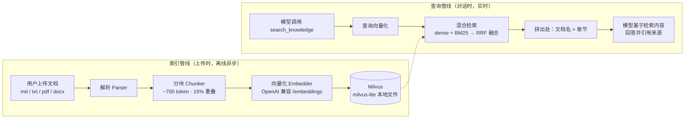
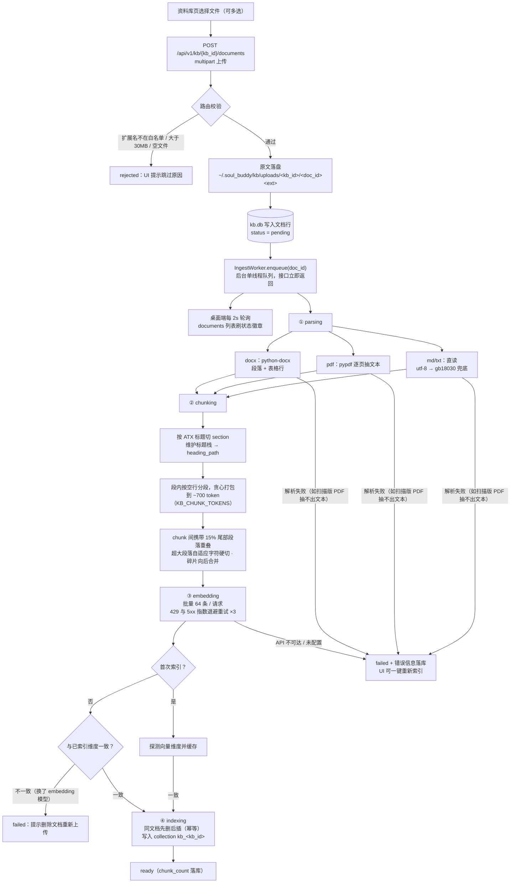
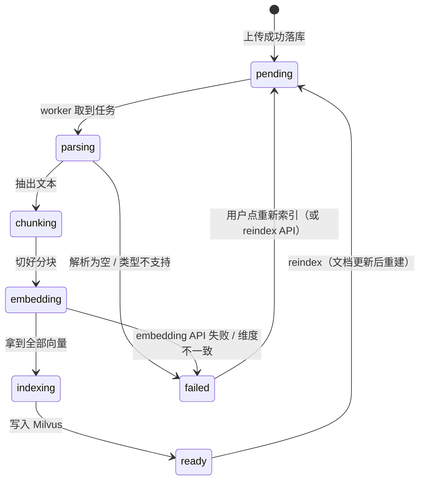
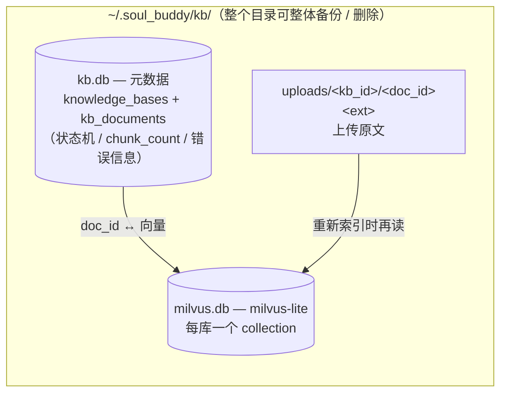
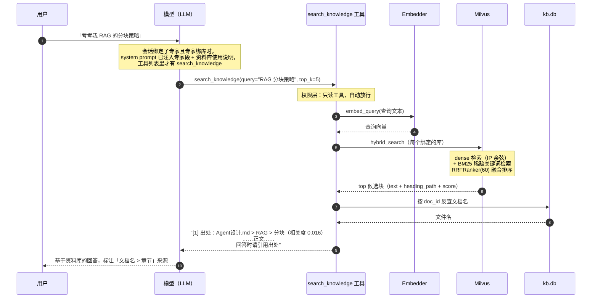

# RAG 管线全景（资料库如何工作）

> 对应代码：`soul_buddy/knowledge/`（模块文档见 [14-knowledge.md](modules/14-knowledge.md)）、
> 会话侧接线见 [15-experts.md](modules/15-experts.md)。
> 本文用 4 张图讲清两件事：**文档怎么变成向量入库**（索引管线），**提问时怎么查出相关片段**（查询管线）。

## 1. 全景：两条独立的管线

两条管线只在 Milvus 处相遇：索引管线**写**，查询管线**读**。索引是后台线程异步做的
（上传立刻返回，状态轮询刷新），查询是对话中模型自主触发的工具调用。

## 2. 索引管线：从文件到向量

### 2.1 流程

要点：

- **上传与索引解耦**：HTTP 请求只做校验 + 存原文 + 落 `pending` + 入队，重活全在后台
  线程（`knowledge/ingest.py`），不会阻塞 FastAPI 事件循环，上传大文件也不卡 UI。
- **状态机实时落库**：`pending → parsing → chunking → embedding → indexing → ready / failed`，
  每一步迁移都写 `kb.db`，所以桌面端轮询能看到卡在哪一步、失败为什么。
- **幂等**：`replace_doc` 同一文档先删旧向量再插新向量，重复索引/重新索引不翻倍。
- **重启自愈**：sidecar 启动时 `enqueue_pending()` 把卡在中间状态的文档重新入队。

### 2.2 文档状态机

### 2.3 落盘资产与 Milvus collection 结构

每个知识库一个 collection（`kb_<kb_id>`），schema：

| 字段 | 类型 | 说明 |
|---|---|---|
| `chunk_id` | INT64 主键 | auto_id，外部不依赖 |
| `doc_id` | VARCHAR(64) | 指回 kb.db 的文档行，删除/重索引按它过滤 |
| `chunk_index` | INT64 | 块在文档内的序号 |
| `heading_path` | VARCHAR(512) | `文档名 > 章节 > 小节`，引用定位用 |
| `text` | VARCHAR(16384)，`enable_analyzer` | 块正文；BM25 Function 据此自动生成稀疏向量 |
| `sparse` | SPARSE_FLOAT_VECTOR | 由内置 BM25 Function 在插入时自动产出 |
| `dense` | FLOAT_VECTOR(dims) | embedding 向量，FLAT + IP（内积=余弦） |

`text` 上的 BM25 Function 是建 collection 时声明的：**插入时 Milvus 自动分词产稀疏向量，
查询时只需给原文**，不需要自己跑分词器。

## 3. 查询管线：从提问到带出处的回答

关键设计：

- **agentic 检索，不是全量注入**。检索是一个普通工具，由模型判断什么时候查
  （考官出题前查、回答依据类问题时查）；没用到的会话零开销。
- **工具可见性按绑定过滤**：未绑专家 / 专家没绑库 / embedding 未配置的会话，
  `tools_specs` 里根本没有这个工具（handler 里还有一层兜底校验）。
- **混合检索**：dense 抓语义相近（换说法也能中），BM25 抓关键词精确命中
  （术语、函数名、编号），RRF 融合两类排序对轻量库规模足够稳；
  milvus-lite 版本不支持 BM25 时自动降级纯 dense 并打日志。
- **出处三元组**：`文档名（kb.db 反查，改名后引用仍正确）> heading_path（分块时
  从标题栈带出来）> score（RRF 融合分）`，拼进工具结果，模型照着引用。
- **空结果也是信息**：工具明确回"资料库中没有找到相关内容"，考官的提示词要求它
  此时声明"这不在你的资料库范围内"，避免假装读过你的文档。

## 4. 降级与失败路径一览

| 环节 | 故障 | 行为 |
|---|---|---|
| pymilvus 未安装 | import 失败 | 惰性客户端，启动不受影响；检索/索引时报可操作提示 |
| EMBEDDING_* 未配置 | 无 embedding 服务 | 上传/管理可用；索引 failed（提示填配置）；检索预览 503 |
| embedding API 429/5xx | 限流/故障 | 指数退避重试 3 次，仍失败 → 文档 failed，可重新索引 |
| 换了 embedding 模型 | 维度不一致 | 该文档 failed，提示删除后重新上传（向量维度不可混） |
| milvus-lite 不支持 BM25 | hybrid 报错 | 自动降级纯 dense 检索，结果标记 `hybrid_fallback` |
| 进程重启 | 任务中断在中间状态 | 启动时把非 ready/failed 的文档重新入队 |

## 5. 关键参数（`.env` 可调）

| 环境变量 | 默认 | 说明 |
|---|---|---|
| `EMBEDDING_BASE_URL` / `EMBEDDING_API_KEY` / `EMBEDDING_MODEL` | 空 | OpenAI 兼容 `/embeddings`；不配则检索链路不可用 |
| `EMBEDDING_DIMS` | 自动探测 | 首次调用从响应读，之后缓存 |
| `MILVUS_URI` | 本地 lite 文件 | 填 `http://localhost:19530` 即切 standalone，代码零改动 |
| `KB_CHUNK_TOKENS` | 700 | 分块目标 token 数 |
| `KB_TOP_K` | 5 | 工具检索默认返回条数（单次调用上限 10） |

## 6. 关联文档

- 模块细节：[modules/14-knowledge.md](modules/14-knowledge.md) · 会话/专家侧：[modules/15-experts.md](modules/15-experts.md)
- 存储全景（含 kb 资产）：[data-and-storage.md](data-and-storage.md)
